/*
 * -----------------------------------------------------------------------------
 * @author      Ashraf Morningstar
 * @github      https://github.com/AshrafMorningstar
 * @repository  Project Graveyard - The Ultimate Archive
 * @quote       "Code that defines the future. Designed to inspire."
 * -----------------------------------------------------------------------------
*/

# 🌌 Eigenfolio Quantum

> **The Ultimate macOS-Style Interactive Portfolio Framework**


[](https://vercel.com/new/clone?repository-url=https%3A%2F%2Fgithub.com%2FAshrafMorningstar%2FEigenfolio-Quantum)


[](https://vercel.com/new/clone?repository-url=https%3A%2F%2Fgithub.com%2FAshrafMorningstar%2FEigenfolio-Quantum)
[](https://gitpod.io/#https://github.com/AshrafMorningstar/Eigenfolio-Quantum)

**Developed by [Ashraf Morningstar](https://github.com/AshrafMorningstar)**

---

## 🚀 Overview

**Eigenfolio Quantum** is not just a portfolio; it's a **fully functional, browser-based operating system simulation**. Built with the latest web technologies, it features a robust window management system, a virtual file system, real-time applications, and a premium "Glassmorphism" UI that pushes the boundaries of what's possible in a web browser.

### ✨ Key Features | Why This is The Best Portfolio on GitHub?

- **🖥️ Ultimate Desktop Environment**: Experience a fully draggable, resizable, and minimizable window system with **advanced Z-index management**.
- **🚀 Nebula Dock**: A pixel-perfect, interactive, magnifying dock inspired by macOS, powered by **Framer Motion spring physics**.
- **📂 Virtual File System (VFS)**: A real in-browser file system. Create `files`, edit `content`, delete to `Trash`, and restore.
- **⚠️ Real-Time AI Integration**: Interact with **NeuroAI**, a chatbot powered by Gemini that can analyze images and suggest code.
- **☀️ Dynamic Weather Engine**: Fetches real-time weather data for any city on Earth with stunning CSS-based atmospheric effects.
- **🎨 Glassmorphism & Neomorphism**: State-of-the-art UI design using backdrop-filters and complex gradients for a **Premium** feel.
- **🔐 Biometric Lock Screen**: Secure entry point with facial recognition simulation.
- **🔍 Global Spotlight Search**: Press `Cmd + Space` to search files, apps, and even web queries instantly.
- **📱 100% Responsive**: Works perfectly on Desktop, Tablet, and Mobile.

---

## ðŸ› ï¸ Tech Stack

- **Core**: React 19, TypeScript, Vite
- **Styling**: Tailwind CSS, PostCSS
- **State Management**: Zustand (Global Store)
- **Animations**: Framer Motion, GSAP
- **Icons**: Lucide React

---

---

## 🔮 Quantum Architecture (3D Structure)


The system is built on a **Hyper-Modular Neural Architecture**, designed to scale infinitely.

```mermaid
graph TD
    User((👨‍💻 User)) -->|Interacts| NeuralInterface[🧠 Neural Interface]
    NeuralInterface -->|Dispatches| SystemKernel[⚙️ OS Kernel]

    subgraph "🌌 Quantum Core"
        SystemKernel --> WindowManager[🖥️ Window Manager]
        SystemKernel --> FileSystem[📂 Virtual File System]
        SystemKernel --> NebulaDock[🚀 Nebula Dock]
    end

    subgraph "📦 Application Layer"
        WindowManager --> Portfolio[💼 Portfolio]
        WindowManager --> NeuroAI[🤖 Neuro AI]
        WindowManager --> Terminal[📟 Chronos Terminal]
        WindowManager --> Media[🎬 Media Suite]
    end

    FileSystem -->|Persists| LocalStorage[(💾 Local Storage)]
    NeuroAI -->|Connects| GeminiAPI[⚡ Gemini Ultra API]
```



### 🧱 File System Hologram

```text
EIGENFOLIO-QUANTUM
│
├── 📂 system/               # 🧠 THE BRAIN (Kernel & Logic)
│   ├── 📜 NeuralInterface   #    → Handling User Inputs
│   ├── 📜 BootSequence      #    → Bios & Login Animations
│   └── 📜 WindowManager     #    → Z-Index & Drag Physics
│
├── 📂 apps/                 # 🚀 THE GALAXY (Feature Rich Apps)
│   ├── 📂 productivity/     #    [Notes, Mail, Calendar, Calculator]
│   ├── 📂 creative/         #    [Photos, Canvas, Music Studio]
│   ├── 📂 developer/        #    [VS Code, Terminal, GitHub Pro]
│   └── 📂 system/           #    [Settings, Trash, Finder]
│
├── 📂 hooks/                # ⚡ QUANTUM HOOKS (Reusables)
│   ├── 🔮 useFileSystem     #    → Virtual Disk Operations
│   ├── 🌊 useWindow         #    → Physics & Animations
│   └── 🔋 useBattery        #    → Hardware Simulation
│
└── 💎 assets/               # 🎨 HIGH-FIDELITY ASSETS
```

---

## 💻 Getting Started

### Prerequisites

- Node.js (v18 or higher)
- npm or yarn

### Installation

1.  **Clone the repository**

    ```bash
    git clone https://github.com/AshrafMorningstar/Eigenfolio-Quantum.git
    cd Eigenfolio-Quantum
    ```

2.  **Install dependencies**

    ```bash
    npm install
    # or
    yarn install
    ```

3.  **Start the Development Server**
    ```bash
    npm run dev
    ```
    Open `http://localhost:5173` to view it in the browser.

---

## 📸 Screenshots

_(Add screenshots of the Desktop, Lock Screen, and multiple apps open here)_

---

## 💡 The Philosophy

> "The future is unwritten, but the code is compiled."

Eigenfolio Quantum represents the convergence of design and engineering. It's a statement that a portfolio shouldn't just _show_ your work—it should _be_ your best work.

---

## 👤 Author

**Ashraf Morningstar**

- **GitHub**: [github.com/AshrafMorningstar](https://github.com/AshrafMorningstar)
- **Email**: contact@eigenfolio.dev

---

## 📜 License

This project is licensed under the MIT License - see the [LICENSE](LICENSE) file for details.

---

_© 2025 Ashraf Morningstar. All Rights Reserved._
