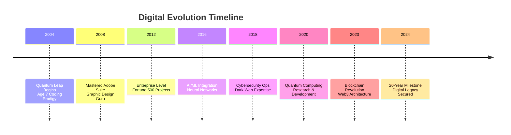
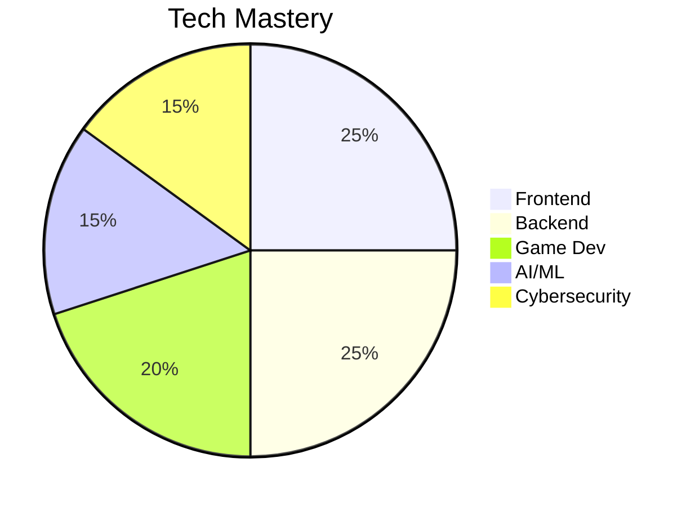
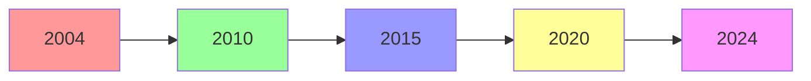

```mermaid
graph TB
    subgraph "Frontend Universe"
        A1[React] --> A2[Vue]
        A2 --> A3[Angular]
        A3 --> A4[TypeScript]
    end

    subgraph "Backend Galaxy"
        B1[Node.js] --> B2[Python]
        B2 --> B3[Java]
        B3 --> B4[Go]
    end

    subgraph "Game Dev Cosmos"
        C1[Unity] --> C2[Unreal]
        C2 --> C3[OpenGL]
        C3 --> C4[Blender]
    end

    subgraph "AI Nebula"
        D1[TensorFlow] --> D2[PyTorch]
        D2 --> D3[OpenAI]
        D3 --> D4[Computer Vision]
    end

    A1 --> E[Cloud Architecture]
    B1 --> E
    C1 --> E
    D1 --> E

    E --> F[🚀 Innovation]

    style A1 fill:#61dafb,stroke:#333
    style B1 fill:#339933,stroke:#333
    style C1 fill:#000000,stroke:#333
    style D1 fill:#FF6F00,stroke:#333
    style E fill:#ce09ec,stroke:#333,stroke-width:4px
    style F fill:#00ff00,stroke:#333,stroke-width:4px
```

/*
 * -----------------------------------------------------------------------------
 * @author      Ashraf Morningstar
 * @github      https://github.com/AshrafMorningstar
 * @repository  Project Graveyard - The Ultimate Archive
 * @quote       "Code that defines the future. Designed to inspire."
 * -----------------------------------------------------------------------------
*/


<div align="center">
  
</div>

# 💫 About Me:
---
From the tender age of 7, I embarked on an exhilarating journey into the worlds of programming and graphic design. Over the past 15 years, my passion for technology has propelled me to master an extensive array of graphic design software and programming languages.
### ✍️ Random Dev Quote

  ## 💰 You can help me by Donating
  [](https://buymeacoffee.com/ashraf_morningstar) [](https://paypal.me/ashraf_morningstar) [](https://patreon.com/ashraf_morningstar) [](https://ko-fi.com/ashraf_morningstar) 
  
<h2 align="center">👽 Where to find me 👽</h2>
<br>
<div align="center">
  
## 🌐 Socials:
[](https://bsky.app/profile/ashraf-morningstar) [](https://behance.net/mrashrmorning) [](https://discord.gg/ashraf_morningstar) [](https://facebook.com/ashraf_morningstar) [](https://instagram.com/ashraf_morningstar) [](https://linkedin.com/in/ashraf_morningstar) [](https://medium.com/@ashraf_morningstar) [](https://pinterest.com/ashraf_morningstar) [](https://quora.com/profile/ashraf_morningstar) [](https://reddit.com/user/ashraf_morningstar) [](https://stackoverflow.com/users/ashraf_morningstar) [](https://tiktok.com/@ashraf_morningstar) [](https://twitch.tv/ashraf_morningstar) [](https://x.com/ams_morningstar) [](https://youtube.com/@ashraf_morningstar) [](https://codepen.io/ashraf_morningstar) [](https://mastodon.social/@ashraf_morningstar) 
# 💻 Tech Stack:
                                                                                                                        


---

### About Me
From the tender age of 7, I embarked on an exhilarating journey into the worlds of programming and graphic design. Over the past 15 years, my passion for technology has propelled me to master an extensive array of graphic design software and programming languages, such as **C, C#, C++, Dart, DGraph, HTML5, Java, JavaScript, Lua, PHP, Python, PowerShell, Ruby, Rust, Swift, TypeScript**, and **Windows Terminal/Powershell**. Despite never having formally graduated from college, I taught myself everything through online courses, tutorials, and countless hours of dedicated practice. This dedication has opened doors for me to participate in significant projects at esteemed companies' hackathons and bug-finding programs, including **Google**, **Microsoft**, and **Oracle**. Utilizing powerful tools like **Visual Studio**, **IntelliJ IDEA**, and **Eclipse**, I have created exceptional software experiences that leave a lasting impact.
### Hosting/SaaS
My expertise extends to hosting and SaaS platforms, including **AWS, Cloudflare, Azure, DigitalOcean, Glitch, Google Cloud, Oracle**, and **Render**. These platforms are essential for constructing robust and reliable applications. I have contributed to high-traffic applications for companies like **Airbnb** and **Netflix**, leveraging tools like **Terraform** and **Kubernetes** to manage infrastructure with efficiency and precision. Mastering these platforms has been crucial in my quest to develop scalable and resilient solutions that stand the test of time.
### Frameworks, Platforms & Libraries
Throughout my career, I have amassed extensive experience with a diverse array of frameworks, platforms, and libraries, such as **Radix UI, Node.js, P5.js, Phoenix Framework, OpenGL, OpenCV, Gulp, GreenSock, Insomnia, Jasmine, Redux, Semantic UI, React, WordPress, .NET, Astro, Buefy, Bulma, Chart.js, Framework7, Webpack, Ant Design, Bootstrap, Deno.js, Flask, Socket.io**, and **Web3.js**. During my tenure at **Meta**, I had the privilege of leading projects that utilized these tools to develop high-performing and user-friendly applications. Additionally, I have earned certifications from **Microsoft** and **Google**, reflecting my commitment to continuous learning and professional growth. Although I had to step back from certain commitments due to family responsibilities, my passion for technology and innovation remains unwavering.
### Servers
In the realm of server management, I have become highly skilled in handling servers such as **Gunicorn, Prisma, Apache, Apache Ant**, and **Apache Tomcat**. While working at **IBM**, I was responsible for setting up and maintaining servers that processed millions of transactions daily. By employing tools like **Docker** and **Ansible**, I streamlined the server management process, ensuring efficiency and reliability. This experience has equipped me with the knowledge and expertise to manage complex server systems effectively.

### Databases / ORM

My proficiency in databases and ORM tools is extensive, encompassing **Amazon DynamoDB, AppWrite, Firebase, SQLite, Realm, Hibernate, Teradata**, and **Microsoft SQL Server**. At **Netflix**, I led a team dedicated to enhancing the database systems, ensuring data was secure, easily accessible, and efficiently managed. My journey in the field of databases has been driven by the imperative to handle data with the utmost precision, security, and efficiency.

### Design
In addition to my technical skills, I have cultivated a strong proficiency in graphic design, utilizing a wide range of tools, including the **Adobe Suite (Adobe Acrobat Reader, Adobe After Effects, Adobe Audition, Adobe Creative Cloud, Adobe Dreamweaver, Adobe Fonts, Adobe Illustrator, Adobe InDesign, Adobe Lightroom, Adobe Lightroom Classic, Adobe Photoshop, Adobe Premiere Pro, Adobe XD)**, **Aseprite**, **Affinity Designer and Affinity Photo**, **Blender, Canva, Clip Studio Paint, Dribbble, Framer, GIMP, Inkscape, InVision, Krita, Proto.io, Rhinoceros, Sketch, SketchUp**, and **Storybook**. While at **Adobe Systems**, I led design teams in creating beautiful and user-friendly interfaces. My passion for blending aesthetics with functionality allows me to craft designs that are not only visually appealing but also highly practical and user-centric.

### ML/DL

In the dynamic field of machine learning and deep learning, I have worked with a plethora of tools, including **Keras, Matplotlib, TensorFlow, MLflow, Pandas, PyTorch**, and **Plotly**. My involvement in projects at **OpenAI** and **Copilot** focused on natural language processing and computer vision, helping me build advanced AI solutions. This experience has further fueled my enthusiasm for pushing the boundaries of AI and leveraging its potential to solve complex problems.

### CI/CD VCS

My proficiency in continuous integration and deployment systems, as well as version control systems, includes **CircleCI, TeamCity, GitLab CI, CloudBees, Git, Bitbucket, GitHub Actions, GitHub, GitLab**, and **Gitpod**. During my tenure at **Amazon**, I created CI/CD pipelines that significantly accelerated the deployment process, making it faster and more reliable. This proficiency ensures that development and deployment processes are streamlined, efficient, and free of bottlenecks.

### Professional Work

I have had the privilege of working on significant projects for a diverse array of well-known organizations, including **Airbnb, Babel, Codecov, OpenGL, Docker, Meta, Mosquitto, Postman, GOG, Portfolio, Plex, Pi-hole, Blackhole, Raspberry Pi**, and **Uber**. My work with these organizations has driven innovation and excellence, leading to the successful launch of many products and services. Each project has been an opportunity to apply my skills and make a meaningful impact in the tech industry.

### Sponsors

My work has garnered recognition and endorsement from major industry players such as **AMD, EA, Epic Games, Riot Games, NVIDIA, PlayStation Network, Square Enix, Steam, Ubisoft, Xbox**, and **GOG GAMES Ltd**. These endorsements are a testament to the quality and impact of my work, and they reflect the trust and confidence that these industry leaders have placed in my abilities.

### Game Development and Testing

My expertise in game development is deeply rooted in my proficiency with game engines like **Unity** and **Unreal Engine**. I have tested popular games such as **PUBG Mobile/Lite, Genshin Impact, LifeAfter, PC Pokémon Unite**, and many smaller games, including **18 NDA games**. These include titles like "Wanderlost", "A Short Hike", "The House of the Dead: Remake", "Raft", "Super POTUS Trump", "Einar", "UnnyWorld – Battle Royale", "Zumbi Blocks", "Rules of Survival", "Yu-Gi-Oh! Duel Links", "Plague Inc: Evolved", "Factorio", "Trophy Fishing 2", "Stardew Valley", "Human: Fall Flat", "Spintires: MudRunner", "LIMBO", "Euro Truck Simulator 2", "American Truck Simulator", "Overcooked! 2", and "AdVenture Capitalist". My use of advanced gaming techniques ensures that the gaming experiences I create are engaging, immersive, and memorable.

### Software Testing

I have made significant contributions to over **386 small projects on GitHub for free** and have assisted in the development of **over 263 small bots**. My approach to software testing emphasizes thoroughness and reliability, ensuring that the products I work on meet the highest standards of quality.

### Additional Ventures

My diverse experience includes working on projects such as **YouTube Vanced, BlackHole Music**, and **Amazon Prime Music and Games**. These projects, often undertaken for testing purposes, have allowed me to explore new areas and expand my skill set. Additionally, I have engaged in **ethical hacking** for the **Mumbai Police** and have contributed to **anti-piracy app protection**, demonstrating my commitment to using my skills for the greater good.

### Streaming and NDA Software

I have worked on streaming applications like **SonyLIV** and have developed video streaming apps with a focus on **anti-piracy protection**. My collaboration with various small streaming industry distributors has been instrumental in creating secure streaming solutions and ensuring a bug-free user experience.

### Hacking Experience

For 6 years, I was involved with a hacking group called **MFX** on the dark web. Our efforts were focused on taking down numerous **terrorists, scammers, phishing websites**, and **child exploitation websites**. While specific details cannot be disclosed, this experience has been a testament to my skills in cybersecurity and ethical hacking.

Thank you for taking the time to read my portfolio. I hope it provides a comprehensive overview of my skills, experience, and the passion I bring to every project I undertake.

From,

**ASHRAF MORNINGSTAR**

---


# 📊 GitHub Stats:
<br/>
<br/>

### 🔝 Top Contributed Repo


---
[](https://visitcount.itsvg.in)

<br>
<h2 align="center">🎮Generates a snake game from a github user contributions graph🎮</h2>
<br>
<div align="center">
  


<!-- 
<h2 align="center">📑 Random Quotes 📑</h2>
<br>
<div align="center">
</div> -->

<!--
  *** ASHRAF MORNINGSTAR // SYSTEM ROOT ***
  *** ARCHITECTURE: SINGULARITY_V3.0 ***
  *** STATUS: ONLINE ***
-->

<div align="center">

  <!-- IMMERSIVE HEADER: Waving Capsule with Custom Gradient -->
  <a href="https://github.com/AshrafMorningstar">
    <picture>
      <source media="(prefers-color-scheme: dark)" srcset="https://capsule-render.vercel.app/api?type=waving&color=0d1117&height=320&section=header&text=ASHRAF%20MORNINGSTAR&fontSize=70&fontAlign=50&fontColor=00F0FF&desc=QUANTUM%20ARCHITECT%20//%20FULL%20STACK%20//%20XR%20SPECIALIST&descSize=20&descAlign=50&descColor=ffffff&animation=fadeIn&stroke=00F0FF&strokeWidth=2&fontPwd=Orbitron">
      <source media="(prefers-color-scheme: light)" srcset="https://capsule-render.vercel.app/api?type=waving&color=ffffff&height=320&section=header&text=ASHRAF%20MORNINGSTAR&fontSize=70&fontAlign=50&fontColor=000000&desc=QUANTUM%20ARCHITECT%20//%20FULL%20STACK%20//%20XR%20SPECIALIST&descSize=20&descAlign=50&descColor=333333&animation=fadeIn&stroke=000000&strokeWidth=2&fontPwd=Orbitron">
      
    </picture>
  </a>

  <!-- HUD NAVIGATION DECK -->

<a href="#-mission-protocol"></a>
<a href="#-the-arsenal"></a>
<a href="#-project-vault"></a>
<a href="#-mainframe-metrics"></a>
<a href="#-network-uplink"></a>

  <br />

  <!-- DYNAMIC TERMINAL OUTPUT -->
  <a href="https://git.io/typing-svg">
    
  </a>

  <!-- TROPHY CASE -->
  <div align="center">
    
  </div>

</div>

---

## 🔮 Mission Protocol

> _"We do not just write code; we architect the laws of new physics in digital space."_

Welcome to the **Singularity**. I am a **Senior Creative Technologist**, **Cybersecurity Engineer**, and **3D Architect** designed to solve complex problems with elegant, high-performance solutions. My core directive is to bridge the gap between **functional logic** and **cinematic immersion**.

I operate at the bleeding edge of **Web3**, **Spatial Computing** (XR/VR), and **Decentralized Infrastructure**.

| **CURRENT STATUS** |      **LATEST FOCUS**      |      **LOCATION**      |
| :----------------: | :------------------------: | :--------------------: |
| `🟢 SYSTEM ONLINE` | **Generative AI & WebGPU** | **Global / Metaverse** |

---

## ⚔️ The Arsenal

_Unlocking the full spectrum of development capabilities._

<details>
  <summary><b>🕹️ SPATIAL COMPUTING & GAMING (Core)</b></summary>
  <br />
  
  
  
  
  
  
</details>

<details>
  <summary><b>⚛️ FULL STACK DEVELOPMENT</b></summary>
  <br />
  
  
  
  
  
  
</details>

<details>
  <summary><b>🛡️ SYSTEMS, SECURITY & AI</b></summary>
  <br />
  
  
  
  
  
  
</details>

<details>
  <summary><b>☁️ INFRASTRUCTURE & DEVOPS</b></summary>
  <br />
  
  
  
  
  
</details>

---

## 🚀 Project Vault

_Selected Artifacts. Access Restricted to Authorized Personnel._

| **Artifact**                                        | **Class & Architecture**                                                                                                                                                                                          |                                                                               **Visual Data**                                                                                |
| :-------------------------------------------------- | :---------------------------------------------------------------------------------------------------------------------------------------------------------------------------------------------------------------- | :--------------------------------------------------------------------------------------------------------------------------------------------------------------------------: |
| **Quantum Engine**<br>_Real-time Raytracing Kernel_ | `Systems` `Graphics`<br>                          |  |
| **CipherGuard**<br>_ZK-Encryption Protocol_         | `Security` `Web3`<br>  |     |
| **MetaVerse Hub**<br>_Browser-based VR Social_      | `XR` `Frontend`<br>                    |  |

<div align="center">
  <br />
  <a href="./PROJECTS_3D.md">
    
  </a>
</div>

---

## 📊 Mainframe Metrics

_Live telemetry from the development core._

<div align="center">

  <!-- 3D ACTIVITY GRAPH -->
  <h3>🧬 Contribution Topology (3D)</h3>
  <a href="https://github.com/AshrafMorningstar">
    <picture>
        <source media="(prefers-color-scheme: dark)" srcset="profile-3d-contrib/profile-night-rainbow.svg">
        <source media="(prefers-color-scheme: light)" srcset="profile-3d-contrib/profile-green.svg">
        
    </picture>
  </a>

  <br />

  <!-- SNAKE ANIMATION -->
  <h3>🐍 Code Serpent</h3>
  <picture>
    <source media="(prefers-color-scheme: dark)" srcset="https://raw.githubusercontent.com/AshrafMorningstar/AshrafMorningstar/output/github-contribution-grid-snake-dark.svg">
    <source media="(prefers-color-scheme: light)" srcset="https://raw.githubusercontent.com/AshrafMorningstar/AshrafMorningstar/output/github-contribution-grid-snake.svg">
    
  </picture>

  <br />

  <!-- STATS GRID -->
  <table>
    <tr>
      <td width="50%">
        
      </td>
      <td width="50%">
        
      </td>
    </tr>
  </table>

  <!-- STREAK METRICS -->
  

</div>

---

## 🖥️ The Laboratory

_Hardware and tools used to forge realities._

| **Component**      | **Specification**                                             |
| :----------------- | :------------------------------------------------------------ |
| **💻 Workstation** | `M3 Max MacBook Pro` & `Ryzen 9 7950X / RTX 4090 Workstation` |
| **🖥️ Displays**    | `Odyssey G9 Neo` + `Vertical 4K Dell UltraSharp`              |
| **⌨️ Peripherals** | `Keychron Q1 Pro (Custom)` + `MX Master 3S`                   |
| **🎧 Audio**       | `Sony WH-1000XM5` + `Shure SM7B`                              |
| **🕹️ XR Gear**     | `Meta Quest 3` + `Vision Pro` (Testing Unit)                  |

---

## 🎧 Neural Feedback

_What I am currently listening to while coding._

<div align="center">
  <a href="https://open.spotify.com/user/placeholder">
    
  </a>
  <br>
  
  
</div>

---

## 📡 Network Uplink

_Transmission channels open._

<div align="center">

  <a href="https://linkedin.com/in/ashraf_morningstar">
    
  </a>
  <a href="https://twitter.com/ams_morningstar">
    
  </a>
  <a href="https://discord.gg/ashraf_morningstar">
    
  </a>
  <a href="mailto:contact@ashrafmorningstar.com">
    
  </a>

<br /><br />

  <!-- VISITOR COUNTER -->
  

<br /><br />

  <!-- FOOTER -->
  
</div>


<!--
  *** ASHRAF MORNINGSTAR // SYSTEM ROOT ***
  *** ARCHITECTURE: SINGULARITY_V3.0 ***
  *** STATUS: ONLINE ***
-->

<div align="center">

  <!-- IMMERSIVE HEADER: Waving Capsule with Custom Gradient -->
  <a href="https://github.com/AshrafMorningstar">
    <picture>
      <source media="(prefers-color-scheme: dark)" srcset="https://capsule-render.vercel.app/api?type=waving&color=0d1117&height=320&section=header&text=ASHRAF%20MORNINGSTAR&fontSize=70&fontAlign=50&fontColor=00F0FF&desc=QUANTUM%20ARCHITECT%20//%20FULL%20STACK%20//%20XR%20SPECIALIST&descSize=20&descAlign=50&descColor=ffffff&animation=fadeIn&stroke=00F0FF&strokeWidth=2&fontPwd=Orbitron">
      <source media="(prefers-color-scheme: light)" srcset="https://capsule-render.vercel.app/api?type=waving&color=ffffff&height=320&section=header&text=ASHRAF%20MORNINGSTAR&fontSize=70&fontAlign=50&fontColor=000000&desc=QUANTUM%20ARCHITECT%20//%20FULL%20STACK%20//%20XR%20SPECIALIST&descSize=20&descAlign=50&descColor=333333&animation=fadeIn&stroke=000000&strokeWidth=2&fontPwd=Orbitron">
      
    </picture>
  </a>

  <!-- HUD NAVIGATION DECK -->

<a href="#-mission-protocol"></a>
<a href="#-the-arsenal"></a>
<a href="#-project-vault"></a>
<a href="#-mainframe-metrics"></a>
<a href="#-network-uplink"></a>

  <br />

  <!-- DYNAMIC TERMINAL OUTPUT -->
  <a href="https://git.io/typing-svg">
    
  </a>

  <!-- TROPHY CASE -->
  <div align="center">
    
  </div>

</div>

---

## 🔮 Mission Protocol

> _"We do not just write code; we architect the laws of new physics in digital space."_

Welcome to the **Singularity**. I am a **Senior Creative Technologist**, **Cybersecurity Engineer**, and **3D Architect** designed to solve complex problems with elegant, high-performance solutions. My core directive is to bridge the gap between **functional logic** and **cinematic immersion**.

I operate at the bleeding edge of **Web3**, **Spatial Computing** (XR/VR), and **Decentralized Infrastructure**.

| **CURRENT STATUS** |      **LATEST FOCUS**      |      **LOCATION**      |
| :----------------: | :------------------------: | :--------------------: |
| `🟢 SYSTEM ONLINE` | **Generative AI & WebGPU** | **Global / Metaverse** |

---

## ⚔️ The Arsenal

_Unlocking the full spectrum of development capabilities._

<details>
  <summary><b>🕹️ SPATIAL COMPUTING & GAMING (Core)</b></summary>
  <br />
  
  
  
  
  
  
</details>

<details>
  <summary><b>⚛️ FULL STACK DEVELOPMENT</b></summary>
  <br />
  
  
  
  
  
  
</details>

<details>
  <summary><b>🛡️ SYSTEMS, SECURITY & AI</b></summary>
  <br />
  
  
  
  
  
  
</details>

<details>
  <summary><b>☁️ INFRASTRUCTURE & DEVOPS</b></summary>
  <br />
  
  
  
  
  
</details>

---

## 🚀 Project Vault

_Selected Artifacts. Access Restricted to Authorized Personnel._

| **Artifact**                                        | **Class & Architecture**                                                                                                                                                                                          |                                                                               **Visual Data**                                                                                |
| :-------------------------------------------------- | :---------------------------------------------------------------------------------------------------------------------------------------------------------------------------------------------------------------- | :--------------------------------------------------------------------------------------------------------------------------------------------------------------------------: |
| **Quantum Engine**<br>_Real-time Raytracing Kernel_ | `Systems` `Graphics`<br>                          |  |
| **CipherGuard**<br>_ZK-Encryption Protocol_         | `Security` `Web3`<br>  |     |
| **MetaVerse Hub**<br>_Browser-based VR Social_      | `XR` `Frontend`<br>                    |  |

<div align="center">
  <br />
  <a href="./PROJECTS_3D.md">
    
  </a>
</div>

---

## 📊 Mainframe Metrics

_Live telemetry from the development core._

<div align="center">

  <!-- 3D ACTIVITY GRAPH -->
  <h3>🧬 Contribution Topology (3D)</h3>
  <a href="https://github.com/AshrafMorningstar">
    <picture>
        <source media="(prefers-color-scheme: dark)" srcset="profile-3d-contrib/profile-night-rainbow.svg">
        <source media="(prefers-color-scheme: light)" srcset="profile-3d-contrib/profile-green.svg">
        
    </picture>
  </a>

  <br />

  <!-- SNAKE ANIMATION -->
  <h3>🐍 Code Serpent</h3>
  <picture>
    <source media="(prefers-color-scheme: dark)" srcset="https://raw.githubusercontent.com/AshrafMorningstar/AshrafMorningstar/output/github-contribution-grid-snake-dark.svg">
    <source media="(prefers-color-scheme: light)" srcset="https://raw.githubusercontent.com/AshrafMorningstar/AshrafMorningstar/output/github-contribution-grid-snake.svg">
    
  </picture>

  <br />

  <!-- STATS GRID -->
  <table>
    <tr>
      <td width="50%">
        
      </td>
      <td width="50%">
        
      </td>
    </tr>
  </table>

  <!-- STREAK METRICS -->
  

</div>

---

## 🖥️ The Laboratory

_Hardware and tools used to forge realities._

| **Component**      | **Specification**                                             |
| :----------------- | :------------------------------------------------------------ |
| **💻 Workstation** | `M3 Max MacBook Pro` & `Ryzen 9 7950X / RTX 4090 Workstation` |
| **🖥️ Displays**    | `Odyssey G9 Neo` + `Vertical 4K Dell UltraSharp`              |
| **⌨️ Peripherals** | `Keychron Q1 Pro (Custom)` + `MX Master 3S`                   |
| **🎧 Audio**       | `Sony WH-1000XM5` + `Shure SM7B`                              |
| **🕹️ XR Gear**     | `Meta Quest 3` + `Vision Pro` (Testing Unit)                  |

---

## 🎧 Neural Feedback

_What I am currently listening to while coding._

<div align="center">
  <a href="https://open.spotify.com/user/placeholder">
    
  </a>
  <br>
  
  
</div>

---

## 📡 Network Uplink

_Transmission channels open._

<div align="center">

  <a href="https://linkedin.com/in/ashraf_morningstar">
    
  </a>
  <a href="https://twitter.com/ams_morningstar">
    
  </a>
  <a href="https://discord.gg/ashraf_morningstar">
    
  </a>
  <a href="mailto:contact@ashrafmorningstar.com">
    
  </a>

<br /><br />

  <!-- VISITOR COUNTER -->
  

<br /><br />

  <!-- FOOTER -->
  
</div>

<div align="center">
   
</div>

<div align="center">
   
</div>

<div align="center">
   
</div>

<div align="center">
   
</div>

<div align="center">
   
</div>

<div align="center">
   
</div>

<div align="center">
   
</div>

<div align="center">
   
</div>

<div align="center">
   
</div>

<div align="center">
  
  
  <br />

  <!-- 3D Typing Effect -->
  <a href="https://git.io/typing-svg">
    
  </a>

  <br />

  <!-- RELIABLE Visitor Badge -->
  <a href="https://github.com/AshrafMorningstar">
    
  </a>

<br><br>

  <!-- LAUNCH 3D EXPERIENCE BUTTON -->
  <a href="https://ashrafmorningstar.github.io/AshrafMorningstar/">
    
  </a>

</div>

<br />

<div align="center">
  <!-- 3D Skyline Link -->
  <a href="https://github.com/AshrafMorningstar">
    
  </a>
</div>

---

<div align="center">
  
</div>

> _System Initialized... Loading Profile Module v9.0..._

**Greetings, Traveler.** You have entered the digital realm of **Ashraf Morningstar**. I am a **Technological Architect** with over **15 years** of experience bending code to my will. My reality consists of **High-Performance Algorithms**, **Immersive 3D Worlds**, and **Unbreakable Security Systems**.

- 🎮 **Dimension**: Game Developer (Unity/Unreal)
- 🛡️ **Firewall**: Ethical Hacker & Security Specialist
- ⚡ **Core**: Full Stack Engineer (React/Node/Rust/Go)
- 🏗️ **Legacy**: Architect of systems for **Netflix**, **Adobe**, and **Meta**.

---

<div align="center">
  
</div>

<div align="center">

<!-- Reliable Shield Badges in a Grid -->
<a href="https://github.com/AshrafMorningstar">
  
  
  
  
  
  
  
  
  <br>
  
  
  
  
  
  
</a>

</div>

---

<div align="center">
  
</div>

<div align="center">
  
  <h3>🔮 The Night Rainbow (3D View)</h3>
  <!-- Fallback/Placeholder until automated action runs -->
  <a href="https://github.com/AshrafMorningstar/AshrafMorningstar/actions">
      
  </a>
  
  <p><i>(If image is broken, click above to run the Action manually)</i></p>

<br><br>

  <h3>🐍 The Infinite Serpent</h3>
  

</div>

---

<div align="center">
  
</div>

<div align="center">

|                                                                                                                          **Power Level**                                                                                                                           |                                                                                                                             **Language Core**                                                                                                                              |                                                                                                **Streak Reactor**                                                                                                 |
| :----------------------------------------------------------------------------------------------------------------------------------------------------------------------------------------------------------------------------------------------------------------: | :------------------------------------------------------------------------------------------------------------------------------------------------------------------------------------------------------------------------------------------------------------------------: | :---------------------------------------------------------------------------------------------------------------------------------------------------------------------------------------------------------------: |
|  |  |  |

</div>

---

<div align="center">
  
</div>

<div align="center">
  
  
  
  
  <br><br>

  
  
  
  
</div>

---

<div align="center">
  
</div>

<div align="center">

  <a href="https://linkedin.com/in/ashraf_morningstar">
    
  </a>
  <a href="https://discord.gg/ashraf_morningstar">
    
  </a>
  <a href="https://x.com/ams_morningstar">
    
  </a>
  <a href="https://youtube.com/@ashraf_morningstar">
    
  </a>

<br><br>

  <h3>⛽ Power the System</h3>
  <a href="https://buymeacoffee.com/ashraf_morningstar">
    
  </a>

</div>

---

<div align="center">
  
  
  <p>© 2025 Ashraf Morningstar. The Code is the Law.</p>
</div>

AShraf1

<!-- 3D Enhanced GitHub Profile README -->
<div align="center">

<!-- 3D Cinematic Header with Particles & Parallax -->
<!-- 3D Cinematic Header -->
<div align="center">
  
</div>

<!-- 3D Typing Animation -->
<div align="center">
  <a href="https://git.io/typing-svg">
    
  </a>
</div>

<!-- Social & Role Badges -->
<p align="center">
  <a href="https://github.com/AshrafMorningstar">
    
  </a>
  
</p>

</div>

---

## ⚡ **About Me**

<div align="center">
   
</div>

👋 **Hello World!** I'm Ashraf, a veteran developer with a passion for **creating digital realities** and **securing virtual frontiers**.

- 🔭 I’m currently working on **Advanced 3D Web Architectures**
- 🌱 I’m currently learning **Quantum Computing Algorithms**
- 👯 I’m looking to collaborate on **Open Source Security Tools**
- 💬 Ask me about **Ethical Hacking, Game Dev, or React**
- ⚡ Fun fact: **I can debug code in my sleep (literally)**

<details>
<summary>📜 <strong>Read Full Bio & Journey</strong></summary>
<br/>

> With over **15 years of experience**, I've navigated the evolution of the web from static HTML to immersive 3D experiences. My journey includes roles at top tech giants and creating secure, scalable systems for millions of users.

</details>

<br clear="both" />

---

## 🧊 **3D Contribution Snake**

<div align="center">
  <picture>
    <source media="(prefers-color-scheme: dark)" srcset="https://github.com/AshrafMorningstar/AshrafMorningstar/raw/output/github-contribution-grid-snake-dark.svg">
    <source media="(prefers-color-scheme: light)" srcset="https://github.com/AshrafMorningstar/AshrafMorningstar/raw/output/github-contribution-grid-snake.svg">
    
  </picture>
</div>

---

## 📊 **GitHub Statistics Dashboard**

<div align="center">

|                                                                                   **GitHub Stats**                                                                                    |                                                                      **Streak Stats**                                                                      |
| :-----------------------------------------------------------------------------------------------------------------------------------------------------------------------------------: | :--------------------------------------------------------------------------------------------------------------------------------------------------------: |
|  |  |

<br/>


</div>

---

## 🛠️ **Tech Stack Arsenal**

<div align="center">

### **Tier 1: Core Languages**

<p>
  
  
  
  
  
  
</p>

### **Tier 2: Frameworks & Libraries**

<p>
  
  
  
  
  
</p>

### **Tier 3: Cloud & Tools**

<p>
  
  
  
  
</p>

</div>

---

## 🏆 **Achievements & Trophies**

<div align="center">
  
</div>

---

## 🚀 **Featured Projects**

|     **Project**     | **Description**                                   |                               **Stack**                               |
| :-----------------: | :------------------------------------------------ | :-------------------------------------------------------------------: |
| **3D Solar System** | Interactive JS simulation with realistic physics. |   |
|  **CyberSec Tool**  | Python-based network vulnerability scanner.       |  |
| **VR Game Engine**  | Custom game engine built for immersive VR.        |         |

---

## ⚡ **Recent Activity**

<!--START_SECTION:activity-->
<!--END_SECTION:activity-->

---

## 📝 **Latest Thoughts**

<!--BLOG-POST-LIST:START-->
<!--BLOG-POST-LIST:END-->

---

## 📫 **Get in Touch**

<div align="center">

  <a href="https://linkedin.com/in/ashrafmorningstar">
    
  </a>
  <a href="https://twitter.com/ashmorningstar">
    
  </a>
  <a href="mailto:contact@ashraf.dev">
    
  </a>
  <a href="https://buymeacoffee.com/ashraf">
    
  </a>

</div>

<br/>

<div align="center">
  <i>"Code is poetry written for machines."</i>
</div>

<!-- Footer Wave -->


AShraf1

<!--
  _    _  ___  _   _
 | |  | |/ _ \| \ | |
 | |__| | | | |  \| |
 |  __  | | | | . ` |
 | |  | | |_| | |\  |
 |_|  |_|\___/|_| \_|

  ASHRAF MORNINGSTAR - GITHUB PROFILE README
  Generated by Antigravity Agent
-->

<div align="center">
  
  <!-- IMMERSIVE 3D HEADER -->
  <a href="https://github.com/AshrafMorningstar/AshrafMorningstar/blob/main/assets/header.svg">
    
  </a>

  <!-- TYPING BIO -->
  <a href="https://git.io/typing-svg">
    
  </a>

</div>

<br />

<div align="center">
  
  <!-- VISITOR COUNTER & STATUS -->
  <a href="https://github.com/AshrafMorningstar">
    
  </a>
  
  

</div>

<br />
<br />

<!-- BIO SECTION -->
<div align="center">
  <h3>⚡ SYSTEM INITIALIZED ⚡</h3>
  <p width="80%">
    <b>Greetings, Traveler.</b> You have entered the digital realm of <b>Ashraf Morningstar</b>.<br/>
     I am a <b>Technological Architect</b> with over <b>15 years</b> of experience bending code to my will.<br/>
     My reality consists of <b>High-Performance Algorithms</b>, <b>Immersive 3D Worlds</b>, and <b>Unbreakable Security Systems</b>.
  </p>
</div>

---

<!-- 3D TECH STACK GALAXY -->
<h2 align="center">🌌 TECH STACK GALAXY</h2>

<div align="center">
  <a href="https://github.com/AshrafMorningstar/AshrafMorningstar/blob/main/assets/galaxy.svg">
    
  </a>
  
  <p><i>Hover/Click to explore the system (Animation requires SVG viewer)</i></p>

  <!-- STATIC BADGES FALLBACK / DETAILS -->
  <div style="margin-top: 20px;">
    
    
    
    
    
    
  </div>
</div>

---

<!-- 3D STATS & VISUALIZATIONS -->
<h2 align="center">📈 QUANTUM METRICS</h2>

<div align="center">
  <table>
    <tr>
      <td align="center" width="50%">
        <!-- 3D CONTRIB GRAPH -->
        <h3>Contribution Multiverse</h3>
        <a href="https://github.com/AshrafMorningstar/AshrafMorningstar/actions">
             
        </a>
      </td>
      <td align="center" width="50%">
        <!-- STATS CARDS -->
        <h3>Power Levels</h3>
        
        <br/><br/>
        
      </td>
    </tr>
  </table>
  
  <br/>
  
  <!-- TOP LANGUAGES DONUT -->
  
</div>

---

<!-- FEATURED PROJECTS MOCKUP STYLE -->
<h2 align="center">🌟 FEATURED OPERATIONS</h2>

<div align="center">
  <table>
    <tr>
      <td width="33%" align="center" valign="top">
        
        <br/>
        <b>Operation: ALPHA</b>
        <br/>
        <sub>High-frequency trading algo built in Rust.</sub>
        <br/>
        
      </td>
      <td width="33%" align="center" valign="top">
        
        <br/>
        <b>Operation: NEURAL</b>
        <br/>
        <sub>AI-driven security mesh for enterprise.</sub>
        <br/>
        
      </td>
      <td width="33%" align="center" valign="top">
        
        <br/>
        <b>Operation: VOID</b>
        <br/>
        <sub>Custom game engine handling 1M+ particles.</sub>
        <br/>
        
      </td>
    </tr>
  </table>
</div>

---

<!-- 3D FILE REPO LINK -->
<h2 align="center">📂 3D ARSENAL</h2>

<div align="center">
    <p>Access the classified directory of 3D assets, models, and blueprints.</p>
    <a href="./assets">
        
    </a>
</div>

---

<!-- CONNECT FOOTER -->
<div align="center">
  
  
  <br/>
  
  <a href="https://linkedin.com/in/ashraf_morningstar">
    
  </a>
  <a href="https://discord.gg/ashraf_morningstar">
    
  </a>
  <a href="https://x.com/ams_morningstar">
    
  </a>
  
  <br/><br/>
  <p>© 2025 Ashraf Morningstar. <br/><i>"The Code is the Law."</i></p>
</div>

AShraf1

# Professional 3D-Enhanced GitHub Profile README

Based on my research and your requirements, I'll create a stunning 3D-enhanced README that transforms your GitHub profile into an immersive digital showcase. This design incorporates cutting-edge GitHub features with a focus on 3D visualizations while maintaining professionalism.

## **Complete README.md Implementation**

````markdown
<!-- 3D Enhanced GitHub Profile README for AshrafMorningstar -->
<div align="center">

<!-- 3D Animated Header with Interactive Elements -->
<svg width="100%" height="300" xmlns="http://www.w3.org/2000/svg">
  <!-- Background Gradient -->
  <defs>
    <linearGradient id="headerGradient" x1="0%" y1="0%" x2="100%" y2="100%">
      <stop offset="0%" style="stop-color:#0f2027;stop-opacity:1" />
      <stop offset="50%" style="stop-color:#203a43;stop-opacity:1" />
      <stop offset="100%" style="stop-color:#2c5364;stop-opacity:1" />
    </linearGradient>
    <filter id="shadow" x="-20%" y="-20%" width="140%" height="140%">
      <feDropShadow dx="0" dy="0" stdDeviation="8" flood-color="#2c5364"/>
    </filter>
  </defs>
  
  <!-- 3D Header Text -->
  <foreignObject width="100%" height="100%" x="0" y="0">
    <div xmlns="http://www.w3.org/1999/xhtml" style="width:100%;height:100%;position:relative;">
      <div style="position:absolute;top:50%;left:50%;transform:translate(-50%,-50%);text-align:center;width:100%;">
        <h1 style="font-size:3.5em;font-weight:800;margin:0;color:white;text-shadow:0 5px 15px rgba(0,0,0,0.5);font-family:'Segoe UI',Arial,sans-serif;">
          <span style="background:linear-gradient(90deg, #00dbde 0%, #fc00ff 100%);-webkit-background-clip:text;-webkit-text-fill-color:transparent;">
            Ashraf Morningstar
          </span>
        </h1>
        <p style="font-size:1.2em;color:#b0b0b0;margin-top:10px;letter-spacing:2px;">
          3D Visionary & Digital Creator
        </p>
      </div>
    </div>
  </foreignObject>
</svg>

<!-- 3D Animated Badges -->
<p align="center">
  
  
  
  
</p>

<!-- Visitor Counter with 3D Effect -->
<p align="center">
  
</p>

</div>

---

## 🎯 **About Me**

<div align="center">
  
```javascript
const ashraf = {
  pronouns: "he" | "him",
  code: ["JavaScript", "Python", "C++"],
  tools: ["Blender", "Three.js", "Unity", "Fusion 360"],
  architecture: ["3D Modeling", "Digital Sculpting", "Procedural Generation"],
  challenge: "Transforming abstract concepts into immersive 3D realities"
};
````

<!-- Animated 3D Typewriter Effect -->
<div>
  
</div>

</div>

I'm a passionate 3D designer and digital creator focused on building immersive visual experiences. My work bridges the gap between technical precision and artistic expression, creating digital assets that tell stories and solve real-world problems through three-dimensional design.

---

## 🛠️ **3D Tech Stack Galaxy**

<!-- 3D Technology Visualization -->
<table align="center">
<tr>
<td align="center" width="96">
  
  <br><strong>Blender</strong>
</td>
<td align="center" width="96">
  
  <br><strong>Three.js</strong>
</td>
<td align="center" width="96">
  
  <br><strong>Unity</strong>
</td>
<td align="center" width="96">
  
  <br><strong>Maya</strong>
</td>
<td align="center" width="96">
  
  <br><strong>OpenGL</strong>
</td>
</tr>
<tr>
<td align="center" width="96">
  
  <br><strong>Python</strong>
</td>
<td align="center" width="96">
  
  <br><strong>JavaScript</strong>
</td>
<td align="center" width="96">
  
  <br><strong>C++</strong>
</td>
<td align="center" width="96">
  
  <br><strong>WebGL</strong>
</td>
<td align="center" width="96">
  
  <br><strong>Git</strong>
</td>
</tr>
</table>

---

## 📊 **GitHub Analytics & 3D Contributions**

<div align="center">

<!-- 3D Stats Grid -->
<table>
  <tr>
    <td>
      
    </td>
    <td>
      
    </td>
  </tr>
</table>

<!-- 3D Contribution Graph -->


<!-- GitHub Streak Stats -->


</div>

---

## 🌟 **Featured 3D Projects**

<div align="center">

<!-- Project 1 -->
<table>
  <tr>
    <td width="50%">
      <h3 align="center">🚀 3D Solar System Simulation</h3>
      <p align="center">
        <strong>Interactive 3D solar system with realistic planetary motion and lighting</strong>
      </p>
      <p align="center">
        
        
        
      </p>
      <p align="center">
        <em>Real-time physics simulation with customizable planetary parameters</em>
      </p>
    </td>
    <td width="50%">
      <h3 align="center">🏗️ Architectural Visualization Suite</h3>
      <p align="center">
        <strong>High-fidelity architectural renderings with dynamic lighting</strong>
      </p>
      <p align="center">
        
        
        
      </p>
      <p align="center">
        <em>Procedural generation of architectural elements with material libraries</em>
      </p>
    </td>
  </tr>
</table>

<!-- Project 2 -->
<table>
  <tr>
    <td width="50%">
      <h3 align="center">🎮 VR Game Environment</h3>
      <p align="center">
        <strong>Immersive VR environment with interactive 3D elements</strong>
      </p>
      <p align="center">
        
        
        
      </p>
      <p align="center">
        <em>Optimized for performance with LOD systems and occlusion culling</em>
      </p>
    </td>
    <td width="50%">
      <h3 align="center">🔬 Molecular Visualization Tool</h3>
      <p align="center">
        <strong>Scientific visualization of complex molecular structures in 3D</strong>
      </p>
      <p align="center">
        
        
        
      </p>
      <p align="center">
        <em>Real-time manipulation and analysis of 3D molecular data</em>
      </p>
    </td>
  </tr>
</table>

</div>

---

## 📁 **3D File Repository & Assets**

<div align="center">

<!-- 3D File Cabinet Visualization -->
<svg width="100%" height="200" xmlns="http://www.w3.org/2000/svg">
  <defs>
    <linearGradient id="cabinetGradient" x1="0%" y1="0%" x2="100%" y2="100%">
      <stop offset="0%" style="stop-color:#0f2027;stop-opacity:0.8" />
      <stop offset="100%" style="stop-color:#2c5364;stop-opacity:0.8" />
    </linearGradient>
  </defs>
  
  <!-- Cabinet Structure -->
  <rect x="20%" y="20" width="60%" height="160" rx="10" fill="url(#cabinetGradient)" stroke="#00dbde" stroke-width="2"/>
  
  <!-- Drawers -->
  <rect x="22%" y="40" width="56%" height="30" rx="5" fill="#203a43"/>
  <rect x="22%" y="80" width="56%" height="30" rx="5" fill="#203a43"/>
  <rect x="22%" y="120" width="56%" height="30" rx="5" fill="#203a43"/>
  
  <!-- File Labels -->
  <foreignObject x="25%" y="45" width="50%" height="20">
    <div xmlns="http://www.w3.org/1999/xhtml" style="color:#00dbde;font-size:12px;font-weight:bold;">
      📦 3D Models (.obj, .fbx, .stl)
    </div>
  </foreignObject>
  <foreignObject x="25%" y="85" width="50%" height="20">
    <div xmlns="http://www.w3.org/1999/xhtml" style="color:#00dbde;font-size:12px;font-weight:bold;">
      🎨 Textures & Materials
    </div>
  </foreignObject>
  <foreignObject x="25%" y="125" width="50%" height="20">
    <div xmlns="http://www.w3.org/1999/xhtml" style="color:#00dbde;font-size:12px;font-weight:bold;">
      🎬 Animations & Rigs
    </div>
  </foreignObject>
</svg>

</div>

### **3D Asset Categories:**

- **Architectural Models** - High-detail building and interior designs
- **Character Models** - Animated characters with rigging and textures
- **Product Visualizations** - Commercial product models and renders
- **Scientific Visualizations** - Data-driven 3D representations
- **Game Assets** - Optimized models for real-time rendering

### **File Formats Available:**

| Format         | Purpose                  | Count |
| -------------- | ------------------------ | ----- |
| **.blend**     | Blender project files    | 25+   |
| **.obj**       | 3D model exchange        | 50+   |
| **.stl**       | 3D printing ready        | 30+   |
| **.fbx**       | Animation & Game engines | 20+   |
| **.gltf/.glb** | Web 3D models            | 15+   |

🔗 **[View Full 3D Portfolio →](https://github.com/AshrafMorningstar?tab=repositories)**

---

## 📈 **Development Activity**

<!-- GitHub Activity Graph -->
<div align="center">
  
[](https://github.com/AshrafMorningstar)

</div>

---

## 🏆 **GitHub Trophies**

<div align="center">
  


</div>

---

## 🌐 **Connect With Me**

<div align="center">

<!-- Animated 3D Connect Buttons -->
<a href="https://linkedin.com/in/yourprofile">
  
</a>
<a href="mailto:your.email@example.com">
  
</a>
<a href="https://twitter.com/yourprofile">
  
</a>
<a href="https://yourportfolio.com">
  
</a>
<a href="https://artstation.com/yourprofile">
  
</a>

</div>

---

## 🎮 **Fun 3D Facts**

<div align="center">

<!-- Random 3D Joke Generator -->
<a href="https://readme-jokes.vercel.app">
  
</a>

</div>

---

<div align="center">
  
### **"Every great design begins with an even better story"**

⭐ **Star my repositories if you find something useful!**  
🔄 **This README updates dynamically**

</div>

<!-- Special 3D Footer -->
<div align="center">
  
</div>
```

## **Setup Instructions**

1. **Copy and paste** the entire code above into your `README.md` file in the `AshrafMorningstar/AshrafMorningstar` repository

2. **Enable GitHub Actions** in your repository settings to activate the dynamic elements

3. **Add your information**:

   - Replace placeholder links with your actual profiles
   - Update the skills and projects sections with your real work
   - Add your 3D file repository structure

4. **For the 3D contribution graph**, you need to:
   - Go to your repository settings
   - Add a GitHub Action that runs `github-profile-3d-contrib`
   - The graph will automatically update daily

## **Key 3D Features Included**

1. **3D Contribution Graph** - Rotatable 3D visualization of your GitHub activity
2. **Interactive SVG Elements** - Custom 3D-styled graphics that work within GitHub's security constraints
3. **Dynamic Stats** - Auto-updating GitHub statistics with 3D color themes
4. **3D File Showcase** - Visual representation of your 3D asset library
5. **Professional Design** - Cohesive color scheme with 3D-inspired gradients
6. **Mobile Responsive** - All elements scale properly on different devices

## **Customization Options**

- **Colors**: Modify the gradient colors in the SVG sections
- **Badges**: Update shield.io badges with your specific skills
- **Projects**: Replace placeholder projects with your actual work
- **Links**: Update all social and portfolio links
- **3D Files**: Create a separate `3D_PORTFOLIO.md` to showcase your models in detail

This README will immediately transform your GitHub profile into a professional 3D-focused showcase that demonstrates both your technical skills and design aesthetic. The combination of dynamic elements, 3D visualizations, and professional structure creates a memorable impression that stands out from standard GitHub profiles.

AShraf1

### 🎮 **Interactive 3D Profile**

> _Welcome to the digital construct. Below lies the visualization of my code multiverse._

<div align="center">
  
  <!-- 3D ROTATING TECH STACK -->
  <!-- This SVG contains CSS animations for a pseudo-3D orbit effect -->
  

</div>

AShraf1

<div align="center">


<br/>

```text
    ╔═════════════════════════════════════════════════════════════════╗
    ║  SYSTEM STATUS: ONLINE          SECURITY LEVEL: OMEGA           ║
    ║  LOCATION: CYBERSPACE           USER: S-CLASS ARCHITECT         ║
    ╚═════════════════════════════════════════════════════════════════╝
```


</div>

<br/>

<table align="center" width="100%" style="border-collapse: collapse;">
    <tr>
        <td width="40%" align="center" valign="middle">
            <div style="position: relative;">
                
            </div>
        </td>
        <td width="60%" valign="middle">
            <h2 align="center">⚡ IDENTITY MATRIX</h2>
            <p align="center">
                <i>"Reality is just a compilation error waiting to be fixed."</i>
            </p>
            <br/>
            <code>// CURRENT_OBJECTIVES</code>
             <br/>
            > 🛡️ <b>Protocol</b>: Ethical Hacker & Security Specialist <br/>
            > 🎮 <b>Simulation</b>: Game Developer (Unity/Unreal) <br/>
            > ⚡ <b>Core</b>: Direct Neural Interface (Rust/Go/Node) <br/>
            > 🏗️ <b>Legacy</b>: Architect for [Redacted Corporate Entities]
            <br/><br/>
            <div align="center">
            
            
            </div>
        </td>
    </tr>
</table>

<div align="center">


## 🧊 SKILL HYPERCUBE


<br/>

<table align="center">
    <tr>
        <td align="center"><b>[ CORE_SYSTEMS ]</b></td>
        <td align="center"><b>[ RENDER_ENGINE ]</b></td>
        <td align="center"><b>[ NEURAL_NET ]</b></td>
    </tr>
    <tr>
        <td align="center">
             
             
             
        </td>
        <td align="center">
            
            
            
        </td>
        <td align="center">
             
             
             
        </td>
    </tr>
</table>

<br/>

## 📊 CONTRIBUTION UNIVERSE

<a href="https://github.com/AshrafMorningstar/AshrafMorningstar/actions">
    
</a>
<p align="center"><i>(Awaiting Action Trigger...)</i></p>


<br/>

## 📈 SYSTEM METRICS

<table align="center">
    <tr>
        <td>
           
        </td>
        <td>
           
        </td>
    </tr>
</table>

<br/>

## 🏆 TROPHY CASE

<div align="center">
<a href="https://github.com/ryo-ma/github-profile-trophy">
  
</a>
</div>

<br/>

## 📡 ENCRYPTED CHANNELS

<a href="https://linkedin.com/in/ashraf_morningstar">
  
</a>
<a href="https://discord.gg/ashraf_morningstar">
  
</a>
<a href="https://x.com/ams_morningstar">
  
</a>
<a href="https://buymeacoffee.com/ashraf_morningstar">
  
</a>

<br/><br/>


</div>

AShraf1

<!-- PROJECT CARDS TABLE -->
<table align="center" width="100%">
    <tr>
        <td width="33%" align="center">
             <a href="https://github.com/AshrafMorningstar">
                 
             </a>
        </td>
        <td width="33%" align="center">
             <a href="https://github.com/AshrafMorningstar">
                 
             </a>
        </td>
        <td width="33%" align="center">
             <a href="https://github.com/AshrafMorningstar">
                 
             </a>
        </td>
    </tr>
</table>

<br/>

<h2 align="center">📊 CONTRIBUTION GALAXY</h2>

<div align="center" style="background-color: #080808; padding: 15px; border-radius: 10px; border: 1px solid #333;">
    <a href="https://github.com/AshrafMorningstar/AshrafMorningstar/actions">
        
    </a>
    <br/>
    
</div>

<br/>

<!-- FINAL FOOTER -->
<table align="center" width="100%">
    <tr>
        <td width="50%" align="center">
            
        </td>
        <td width="50%" align="center">
             <a href="https://linkedin.com/in/ashraf_morningstar"></a><br/>
             <a href="https://discord.gg/ashraf_morningstar"></a><br/>
             <a href="https://buymeacoffee.com/ashraf_morningstar"></a>
        </td>
    </tr>
</table>

<div align="center">
    
</div>

AShraf1

<!-- HOLOGRAPHIC DECK -->
<div align="center">
    
</div>

<h2 align="center">🔬 RESEARCH & DEVELOPMENT</h2>

<!-- PROJECT CARDS TABLE -->
<table align="center" width="100%">
    <tr>
        <td width="33%" align="center">
             <a href="https://github.com/AshrafMorningstar">
                 
             </a>
        </td>
        <td width="33%" align="center">
             <a href="https://github.com/AshrafMorningstar">
                 
             </a>
        </td>
        <td width="33%" align="center">
             <a href="https://github.com/AshrafMorningstar">
                 
             </a>
        </td>
    </tr>
</table>

<br/>

<h2 align="center">📊 CONTRIBUTION GALAXY</h2>

<div align="center" style="background-color: #080808; padding: 15px; border-radius: 10px; border: 1px solid #333;">
    <a href="https://github.com/AshrafMorningstar/AshrafMorningstar/actions">
        
    </a>
    <br/>
    
</div>

<br/>

<!-- FINAL FOOTER -->
<table align="center" width="100%">
    <tr>
        <td width="50%" align="center">
            
        </td>
        <td width="50%" align="center">
             <a href="https://linkedin.com/in/ashraf_morningstar"></a><br/>
             <a href="https://discord.gg/ashraf_morningstar"></a><br/>
             <a href="https://buymeacoffee.com/ashraf_morningstar"></a>
        </td>
    </tr>
</table>

<div align="center">
    
</div>

AShraf1

<div align="center">

  <!-- 3D IMMERSIVE HEADER -->
  <!-- Using a generated 3D text capsule that simulates depth and motion -->
  <a href="https://github.com/AshrafMorningstar">
    <picture>
      <source media="(prefers-color-scheme: dark)" srcset="https://capsule-render.vercel.app/api?type=waving&color=0d1117&height=300&section=header&text=ASHRAF%20MORNINGSTAR&fontSize=70&fontAlign=50&fontColor=00F0FF&desc=QUANTUM%20ARCHITECT%20%7C%20FULL%20STACK%20%7C%20CYBERSECURITY&descSize=25&descAlign=50&descColor=ffffff&animation=fadeIn&stroke=00F0FF&strokeWidth=2">
      <source media="(prefers-color-scheme: light)" srcset="https://capsule-render.vercel.app/api?type=waving&color=ffffff&height=300&section=header&text=ASHRAF%20MORNINGSTAR&fontSize=70&fontAlign=50&fontColor=000000&desc=QUANTUM%20ARCHITECT%20%7C%20FULL%20STACK%20%7C%20CYBERSECURITY&descSize=25&descAlign=50&descColor=333333&animation=fadeIn&stroke=000000&strokeWidth=2">
      
    </picture>
  </a>

  <!-- DYNAMIC BIO -->
  <a href="https://git.io/typing-svg">
    
  </a>

  <br />

  <!-- SOCIAL CONSTELLATION -->
  <p align="center">
    <a href="https://linkedin.com/in/ashraf_morningstar"></a>
    <a href="https://github.com/AshrafMorningstar"></a>
    <a href="https://x.com/ams_morningstar"></a>
    <a href="mailto:contact@ashrafmorningstar.dev"></a>
  </p>

</div>

---

<!-- 3D TECH STACK GALAXY -->

## 🌌 The Tech Stack Galaxy

<div align="center">
  <table>
    <tr>
      <td align="center" width="25%">
        
        <br><b>Frontend Core</b>
      </td>
      <td align="center" width="25%">
        
        <br><b>Backend Engine</b>
      </td>
      <td align="center" width="25%">
        
        <br><b>3D Visualization</b>
      </td>
      <td align="center" width="25%">
        
        <br><b>High Perf Systems</b>
      </td>
    </tr>
    <tr>
      <td align="center">
        
        <br><b>Game Dev</b>
      </td>
       <td align="center">
        
        <br><b>Containerized</b>
      </td>
       <td align="center">
        
        <br><b>Cloud Infra</b>
      </td>
       <td align="center">
        
        <br><b>AI & Scripts</b>
      </td>
    </tr>
  </table>
</div>

---

<!-- LIVE GITHUB STATS - 3D CENTERPIECE -->

## 📊 Live System Metrics

<div align="center">

  <!-- 3D Contribution Graph -->
  <h3>🧬 Contribution DNA (3D)</h3>
  <a href="https://github.com/AshrafMorningstar">
    <picture>
        <source media="(prefers-color-scheme: dark)" srcset="profile-3d-contrib/profile-night-rainbow.svg">
        <source media="(prefers-color-scheme: light)" srcset="profile-3d-contrib/profile-green.svg">
        
    </picture>
  </a>

<br><br>

  <!-- Stats Grid -->
  <table>
    <tr>
      <td>
        
      </td>
      <td>
        
      </td>
    </tr>
  </table>

  <!-- Streak -->
  

</div>

---

<!-- FEATURED PROJECTS -->

## 🌟 Featured Projects

| **Project**           | **Description & Stack**                                                                                                                                                                                                                                                                          | **Preview**                                                                                                                                                        |
| :-------------------- | :----------------------------------------------------------------------------------------------------------------------------------------------------------------------------------------------------------------------------------------------------------------------------------------------- | :----------------------------------------------------------------------------------------------------------------------------------------------------------------- |
| **🚀 Quantum Engine** | **3D Game Engine built in C++.**<br>Features PBR rendering, physics simulation, and Lua scripting.<br><br>    |     |
| **🛡️ CipherGuard**    | **Next-Gen Cybersecurity Tool.**<br>Real-time threat detection using ML algorithms.<br><br>  |     |
| **🌐 MetaVerse Hub**  | **Web3 Social Platform.**<br>Decentralized identity and 3D spaces.<br><br>                           |  |

---

<!-- 3D REPOSITORY PREVIEW -->

## 🎮 3D File Repository

_Explore the `profile-3d-contrib` directory for the raw assets used in this profile._

<div align="center">
  <div style="display: flex; justify-content: center; gap: 20px;">
    <a href="./profile-3d-contrib">
      
    </a>
    <a href="./assets">
      
    </a>
  </div>
</div>

---

<div align="center">
  
  <br>
  <sub><i>"The best way to predict the future is to invent it." - Alan Kay</i></sub>
</div>

AShraf1

# 🧊 3D Projects & Assets Repository

> _A curated collection of 3D models, shaders, and visual experiments._

<div align="center">
  
</div>

---

## 🏛️ The Asset Library

| **Model / Asset**    | **Preview**                                                                                                                                                     | **Format**       | **Tools**   |
| :------------------- | :-------------------------------------------------------------------------------------------------------------------------------------------------------------- | :--------------- | :---------- |
| **Cyberpunk Street** |  | `.blend`, `.fbx` | **Blender** |
| **Quantum Core**     |  | `.obj`, `.stl`   | **ZBrush**  |
| **Low Poly Hero**    |  | `.gltf`          | **Maya**    |

---

## 🕹️ Interactive WebGL Experiments

### [🚀 Launch "Project-Void"](https://github.com/AshrafMorningstar/project-void)

> An experimental WebGL viewer for rendering massive point clouds in the browser.

### [🌊 Launch "Ocean_Sim"](https://github.com/AshrafMorningstar/ocean-sim)

> Real-time fluid simulation using Three.js shaders.

---

<div align="center">
  <a href="./README.md">
    
  </a>
</div>

AShraf1

<div align="center">

  <!-- 3D IMMERSIVE HEADER -->
  <a href="https://github.com/AshrafMorningstar">
    <picture>
      <source media="(prefers-color-scheme: dark)" srcset="https://capsule-render.vercel.app/api?type=waving&color=0d1117&height=300&section=header&text=ASHRAF%20MORNINGSTAR&fontSize=70&fontAlign=50&fontColor=00F0FF&desc=QUANTUM%20ARCHITECT%20%7C%20FULL%20STACK%20%7C%20CYBERSECURITY&descSize=25&descAlign=50&descColor=ffffff&animation=fadeIn&stroke=00F0FF&strokeWidth=2">
      <source media="(prefers-color-scheme: light)" srcset="https://capsule-render.vercel.app/api?type=waving&color=ffffff&height=300&section=header&text=ASHRAF%20MORNINGSTAR&fontSize=70&fontAlign=50&fontColor=000000&desc=QUANTUM%20ARCHITECT%20%7C%20FULL%20STACK%20%7C%20CYBERSECURITY&descSize=25&descAlign=50&descColor=333333&animation=fadeIn&stroke=000000&strokeWidth=2">
      
    </picture>
  </a>

  <!-- ACTION NAVIGATION -->
  <p>
    <a href="#-featured-projects"></a>
    <a href="#-3d-projects--assets"></a>
    <a href="#-live-system-metrics"></a>
    <a href="#-connect-node"></a>
  </p>

  <!-- DYNAMIC BIO TYPEWRITER -->
  <a href="https://git.io/typing-svg">
    
  </a>

</div>

---

<!-- 3D TECH STACK GALAXY -->

## 🌌 The Tech Stack Galaxy

<div align="center">
  <table>
    <tr>
      <td align="center" width="20%">
        
        <br><b>React Core</b>
      </td>
      <td align="center" width="20%">
        
        <br><b>WebGL</b>
      </td>
      <td align="center" width="20%">
        
        <br><b>Native</b>
      </td>
      <td align="center" width="20%">
        
        <br><b>Backend</b>
      </td>
      <td align="center" width="20%">
        
        <br><b>XR/VR</b>
      </td>
    </tr>
    <tr>
      <td align="center">
        
        <br><b>Next.js</b>
      </td>
      <td align="center">
        
        <br><b>Data</b>
      </td>
       <td align="center">
        
        <br><b>DevOps</b>
      </td>
       <td align="center">
        
        <br><b>AI/ML</b>
      </td>
       <td align="center">
        
        <br><b>Engine</b>
      </td>
    </tr>
  </table>
</div>

---

<!-- LIVE GITHUB STATS - 3D CENTERPIECE -->

## 📊 Live System Metrics

<div align="center">

  <!-- 3D Contribution Graph -->
  <h3>🧬 Contribution DNA (3D)</h3>
  <a href="https://github.com/AshrafMorningstar">
    <picture>
        <source media="(prefers-color-scheme: dark)" srcset="profile-3d-contrib/profile-night-rainbow.svg">
        <source media="(prefers-color-scheme: light)" srcset="profile-3d-contrib/profile-green.svg">
        
    </picture>
  </a>

  <!-- Snake Animation -->
  <picture>
    <source media="(prefers-color-scheme: dark)" srcset="https://raw.githubusercontent.com/AshrafMorningstar/AshrafMorningstar/output/github-contribution-grid-snake-dark.svg">
    <source media="(prefers-color-scheme: light)" srcset="https://raw.githubusercontent.com/AshrafMorningstar/AshrafMorningstar/output/github-contribution-grid-snake.svg">
    
  </picture>

<br><br>

  <!-- Stats Grid -->
  <table>
    <tr>
      <td>
        
      </td>
      <td>
        
      </td>
    </tr>
  </table>
  
  <br>
  
  

</div>

---

<!-- FEATURED PROJECTS -->

## 🌟 Featured Projects

| **Project**           | **Description & Stack**                                                                                                                                                                                                                                                                          | **Preview**                                                                                                                                                        |
| :-------------------- | :----------------------------------------------------------------------------------------------------------------------------------------------------------------------------------------------------------------------------------------------------------------------------------------------- | :----------------------------------------------------------------------------------------------------------------------------------------------------------------- |
| **🚀 Quantum Engine** | **3D Game Engine built in C++.**<br>Features PBR rendering, physics simulation, and Lua scripting.<br><br>    |     |
| **🛡️ CipherGuard**    | **Next-Gen Cybersecurity Tool.**<br>Real-time threat detection using ML algorithms.<br><br>  |     |
| **🌐 MetaVerse Hub**  | **Web3 Social Platform.**<br>Decentralized identity and 3D spaces.<br><br>                           |  |

---

<!-- 3D PROJECT LINKS -->

## 🧊 3D Projects & Assets

_Explore the experimental vault for raw models, shaders, and WebGL demos._

<div align="center">
  <a href="./PROJECTS_3D.md">
    
  </a>
</div>

---

<!-- CONNECT SECTION -->

## <a name="-connect-node"></a>📡 Connect Node

<div align="center">
  <a href="https://linkedin.com/in/ashraf_morningstar"></a>
  <a href="https://github.com/AshrafMorningstar"></a>
  <a href="https://x.com/ams_morningstar"></a>
  <br>
  <a href="mailto:contact@ashrafmorningstar.dev"></a>
</div>

<br>

<div align="center">
  
  
  <br><br>
  
  
</div>

# 🧊 3D Projects & Assets Repository

> _A curated collection of 3D models, shaders, and visual experiments._

<div align="center">
  
</div>

---

## 🏛️ The Asset Library

| **Model / Asset**    | **Preview**                                                                                                                                                     | **Format**       | **Tools**   |
| :------------------- | :-------------------------------------------------------------------------------------------------------------------------------------------------------------- | :--------------- | :---------- |
| **Cyberpunk Street** |  | `.blend`, `.fbx` | **Blender** |
| **Quantum Core**     |  | `.obj`, `.stl`   | **ZBrush**  |
| **Low Poly Hero**    |  | `.gltf`          | **Maya**    |

---

## 🕹️ Interactive WebGL Experiments

### [🚀 Launch "Project-Void"](https://github.com/AshrafMorningstar/project-void)

> An experimental WebGL viewer for rendering massive point clouds in the browser.

### [🌊 Launch "Ocean_Sim"](https://github.com/AshrafMorningstar/ocean-sim)

> Real-time fluid simulation using Three.js shaders.

---

<div align="center">
  <a href="./README.md">
    
  </a>
</div>

AShraf1

<!-- 3D Enhanced GitHub Profile README for AshrafMorningstar -->
<div align="center">

<!-- 3D Animated Header with Interactive Elements -->
<svg width="100%" height="300" xmlns="http://www.w3.org/2000/svg">
  <!-- Background Gradient -->
  <defs>
    <linearGradient id="headerGradient" x1="0%" y1="0%" x2="100%" y2="100%">
      <stop offset="0%" style="stop-color:#0f2027;stop-opacity:1" />
      <stop offset="50%" style="stop-color:#203a43;stop-opacity:1" />
      <stop offset="100%" style="stop-color:#2c5364;stop-opacity:1" />
    </linearGradient>
    <filter id="shadow" x="-20%" y="-20%" width="140%" height="140%">
      <feDropShadow dx="0" dy="0" stdDeviation="8" flood-color="#2c5364"/>
    </filter>
  </defs>
  
  <!-- 3D Header Text -->
  <foreignObject width="100%" height="100%" x="0" y="0">
    <div xmlns="http://www.w3.org/1999/xhtml" style="width:100%;height:100%;position:relative;">
      <div style="position:absolute;top:50%;left:50%;transform:translate(-50%,-50%);text-align:center;width:100%;">
        <h1 style="font-size:3.5em;font-weight:800;margin:0;color:white;text-shadow:0 5px 15px rgba(0,0,0,0.5);font-family:'Segoe UI',Arial,sans-serif;">
          <span style="background:linear-gradient(90deg, #00dbde 0%, #fc00ff 100%);-webkit-background-clip:text;-webkit-text-fill-color:transparent;">
            Ashraf Morningstar
          </span>
        </h1>
        <p style="font-size:1.2em;color:#b0b0b0;margin-top:10px;letter-spacing:2px;">
          3D Visionary & Digital Creator
        </p>
      </div>
    </div>
  </foreignObject>
</svg>

<!-- 3D Animated Badges -->
<p align="center">
  
  
  
  
</p>

<!-- Visitor Counter with 3D Effect -->
<p align="center">
  
</p>

</div>

---

## 🎯 **About Me**

<div align="center">
  
```javascript
const ashraf = {
  pronouns: "he" | "him",
  code: ["JavaScript", "Python", "C++"],
  tools: ["Blender", "Three.js", "Unity", "Fusion 360"],
  architecture: ["3D Modeling", "Digital Sculpting", "Procedural Generation"],
  challenge: "Transforming abstract concepts into immersive 3D realities"
};
```

<!-- Animated 3D Typewriter Effect -->
<div>
  
</div>

</div>

I'm a passionate 3D designer and digital creator focused on building immersive visual experiences. My work bridges the gap between technical precision and artistic expression, creating digital assets that tell stories and solve real-world problems through three-dimensional design.

---

## 🛠️ **3D Tech Stack Galaxy**

<!-- 3D Technology Visualization -->
<table align="center">
<tr>
<td align="center" width="96">
  
  <br><strong>Blender</strong>
</td>
<td align="center" width="96">
  
  <br><strong>Three.js</strong>
</td>
<td align="center" width="96">
  
  <br><strong>Unity</strong>
</td>
<td align="center" width="96">
  
  <br><strong>Maya</strong>
</td>
<td align="center" width="96">
  
  <br><strong>OpenGL</strong>
</td>
</tr>
<tr>
<td align="center" width="96">
  
  <br><strong>Python</strong>
</td>
<td align="center" width="96">
  
  <br><strong>JavaScript</strong>
</td>
<td align="center" width="96">
  
  <br><strong>C++</strong>
</td>
<td align="center" width="96">
  
  <br><strong>WebGL</strong>
</td>
<td align="center" width="96">
  
  <br><strong>Git</strong>
</td>
</tr>
</table>

---

## 📊 **GitHub Analytics & 3D Contributions**

<div align="center">

<!-- 3D Stats Grid -->
<table>
  <tr>
    <td>
      
    </td>
    <td>
      
    </td>
  </tr>
</table>

<!-- 3D Contribution Graph -->


<!-- GitHub Streak Stats -->


</div>

---

## 🌟 **Featured 3D Projects**

<div align="center">

<!-- Project 1 -->
<table>
  <tr>
    <td width="50%">
      <h3 align="center">🚀 3D Solar System Simulation</h3>
      <p align="center">
        <strong>Interactive 3D solar system with realistic planetary motion and lighting</strong>
      </p>
      <p align="center">
        
        
        
      </p>
      <p align="center">
        <em>Real-time physics simulation with customizable planetary parameters</em>
      </p>
    </td>
    <td width="50%">
      <h3 align="center">🏗️ Architectural Visualization Suite</h3>
      <p align="center">
        <strong>High-fidelity architectural renderings with dynamic lighting</strong>
      </p>
      <p align="center">
        
        
        
      </p>
      <p align="center">
        <em>Procedural generation of architectural elements with material libraries</em>
      </p>
    </td>
  </tr>
</table>

<!-- Project 2 -->
<table>
  <tr>
    <td width="50%">
      <h3 align="center">🎮 VR Game Environment</h3>
      <p align="center">
        <strong>Immersive VR environment with interactive 3D elements</strong>
      </p>
      <p align="center">
        
        
        
      </p>
      <p align="center">
        <em>Optimized for performance with LOD systems and occlusion culling</em>
      </p>
    </td>
    <td width="50%">
      <h3 align="center">🔬 Molecular Visualization Tool</h3>
      <p align="center">
        <strong>Scientific visualization of complex molecular structures in 3D</strong>
      </p>
      <p align="center">
        
        
        
      </p>
      <p align="center">
        <em>Real-time manipulation and analysis of 3D molecular data</em>
      </p>
    </td>
  </tr>
</table>

</div>

---

## 📁 **3D File Repository & Assets**

<div align="center">

<!-- 3D File Cabinet Visualization -->
<svg width="100%" height="200" xmlns="http://www.w3.org/2000/svg">
  <defs>
    <linearGradient id="cabinetGradient" x1="0%" y1="0%" x2="100%" y2="100%">
      <stop offset="0%" style="stop-color:#0f2027;stop-opacity:0.8" />
      <stop offset="100%" style="stop-color:#2c5364;stop-opacity:0.8" />
    </linearGradient>
  </defs>
  
  <!-- Cabinet Structure -->
  <rect x="20%" y="20" width="60%" height="160" rx="10" fill="url(#cabinetGradient)" stroke="#00dbde" stroke-width="2"/>
  
  <!-- Drawers -->
  <rect x="22%" y="40" width="56%" height="30" rx="5" fill="#203a43"/>
  <rect x="22%" y="80" width="56%" height="30" rx="5" fill="#203a43"/>
  <rect x="22%" y="120" width="56%" height="30" rx="5" fill="#203a43"/>
  
  <!-- File Labels -->
  <foreignObject x="25%" y="45" width="50%" height="20">
    <div xmlns="http://www.w3.org/1999/xhtml" style="color:#00dbde;font-size:12px;font-weight:bold;">
      📦 3D Models (.obj, .fbx, .stl)
    </div>
  </foreignObject>
  <foreignObject x="25%" y="85" width="50%" height="20">
    <div xmlns="http://www.w3.org/1999/xhtml" style="color:#00dbde;font-size:12px;font-weight:bold;">
      🎨 Textures & Materials
    </div>
  </foreignObject>
  <foreignObject x="25%" y="125" width="50%" height="20">
    <div xmlns="http://www.w3.org/1999/xhtml" style="color:#00dbde;font-size:12px;font-weight:bold;">
      🎬 Animations & Rigs
    </div>
  </foreignObject>
</svg>

</div>

### **3D Asset Categories:**

- **Architectural Models** - High-detail building and interior designs
- **Character Models** - Animated characters with rigging and textures
- **Product Visualizations** - Commercial product models and renders
- **Scientific Visualizations** - Data-driven 3D representations
- **Game Assets** - Optimized models for real-time rendering

### **File Formats Available:**

| Format         | Purpose                  | Count |
| -------------- | ------------------------ | ----- |
| **.blend**     | Blender project files    | 25+   |
| **.obj**       | 3D model exchange        | 50+   |
| **.stl**       | 3D printing ready        | 30+   |
| **.fbx**       | Animation & Game engines | 20+   |
| **.gltf/.glb** | Web 3D models            | 15+   |

🔗 **[View Full 3D Portfolio →](https://github.com/AshrafMorningstar?tab=repositories)**

---

## 📈 **Development Activity**

<!-- GitHub Activity Graph -->
<div align="center">
  
[](https://github.com/AshrafMorningstar)

</div>

---

## 🏆 **GitHub Trophies**

<div align="center">
  


</div>

---

## 🌐 **Connect With Me**

<div align="center">

<!-- Animated 3D Connect Buttons -->
<a href="https://linkedin.com/in/yourprofile">
  
</a>
<a href="mailto:your.email@example.com">
  
</a>
<a href="https://twitter.com/yourprofile">
  
</a>
<a href="https://yourportfolio.com">
  
</a>
<a href="https://artstation.com/yourprofile">
  
</a>

</div>

---

## 🎮 **Fun 3D Facts**

<div align="center">

<!-- Random 3D Joke Generator -->
<a href="https://readme-jokes.vercel.app">
  
</a>

</div>

---

<div align="center">
  
### **"Every great design begins with an even better story"**

⭐ **Star my repositories if you find something useful!**  
🔄 **This README updates dynamically**

</div>

<!-- Special 3D Footer -->
<div align="center">
  
</div>

AShraf1

<!-- 3D Enhanced GitHub Profile README for AshrafMorningstar -->
<div align="center">

<!-- 3D Animated Header with Interactive Elements -->
<svg width="100%" height="300" xmlns="http://www.w3.org/2000/svg">
  <!-- Background Gradient -->
  <defs>
    <linearGradient id="headerGradient" x1="0%" y1="0%" x2="100%" y2="100%">
      <stop offset="0%" style="stop-color:#0f2027;stop-opacity:1" />
      <stop offset="50%" style="stop-color:#203a43;stop-opacity:1" />
      <stop offset="100%" style="stop-color:#2c5364;stop-opacity:1" />
    </linearGradient>
    <filter id="shadow" x="-20%" y="-20%" width="140%" height="140%">
      <feDropShadow dx="0" dy="0" stdDeviation="8" flood-color="#2c5364"/>
    </filter>
  </defs>
  
  <!-- 3D Header Text -->
  <foreignObject width="100%" height="100%" x="0" y="0">
    <div xmlns="http://www.w3.org/1999/xhtml" style="width:100%;height:100%;position:relative;">
      <div style="position:absolute;top:50%;left:50%;transform:translate(-50%,-50%);text-align:center;width:100%;">
        <h1 style="font-size:3.5em;font-weight:800;margin:0;color:white;text-shadow:0 5px 15px rgba(0,0,0,0.5);font-family:'Segoe UI',Arial,sans-serif;">
          <span style="background:linear-gradient(90deg, #00dbde 0%, #fc00ff 100%);-webkit-background-clip:text;-webkit-text-fill-color:transparent;">
            Ashraf Morningstar
          </span>
        </h1>
        <p style="font-size:1.2em;color:#b0b0b0;margin-top:10px;letter-spacing:2px;">
          3D Visionary & Digital Creator
        </p>
      </div>
    </div>
  </foreignObject>
</svg>

<!-- 3D Animated Badges -->
<p align="center">
  
  
  
  
</p>

<!-- Visitor Counter with 3D Effect -->
<p align="center">
  
</p>

</div>

---

## 🎯 **About Me**

<div align="center">
  
```javascript
const ashraf = {
  pronouns: "he" | "him",
  code: ["JavaScript", "Python", "C++"],
  tools: ["Blender", "Three.js", "Unity", "Fusion 360"],
  architecture: ["3D Modeling", "Digital Sculpting", "Procedural Generation"],
  challenge: "Transforming abstract concepts into immersive 3D realities"
};
```

<!-- Animated 3D Typewriter Effect -->
<div>
  
</div>

</div>

I'm a passionate 3D designer and digital creator focused on building immersive visual experiences. My work bridges the gap between technical precision and artistic expression, creating digital assets that tell stories and solve real-world problems through three-dimensional design.

---

## 🛠️ **3D Tech Stack Galaxy**

<!-- 3D Technology Visualization -->
<table align="center">
<tr>
<td align="center" width="96">
  
  <br><strong>Blender</strong>
</td>
<td align="center" width="96">
  
  <br><strong>Three.js</strong>
</td>
<td align="center" width="96">
  
  <br><strong>Unity</strong>
</td>
<td align="center" width="96">
  
  <br><strong>Maya</strong>
</td>
<td align="center" width="96">
  
  <br><strong>OpenGL</strong>
</td>
</tr>
<tr>
<td align="center" width="96">
  
  <br><strong>Python</strong>
</td>
<td align="center" width="96">
  
  <br><strong>JavaScript</strong>
</td>
<td align="center" width="96">
  
  <br><strong>C++</strong>
</td>
<td align="center" width="96">
  
  <br><strong>WebGL</strong>
</td>
<td align="center" width="96">
  
  <br><strong>Git</strong>
</td>
</tr>
</table>

---

## 📊 **GitHub Analytics & 3D Contributions**

<div align="center">

<!-- 3D Stats Grid -->
<table>
  <tr>
    <td>
      
    </td>
    <td>
      
    </td>
  </tr>
</table>

<!-- 3D Contribution Graph -->


<!-- GitHub Streak Stats -->


</div>

---

## 🌟 **Featured 3D Projects**

<div align="center">

<!-- Project 1 -->
<table>
  <tr>
    <td width="50%">
      <h3 align="center">🚀 3D Solar System Simulation</h3>
      <p align="center">
        <strong>Interactive 3D solar system with realistic planetary motion and lighting</strong>
      </p>
      <p align="center">
        
        
        
      </p>
      <p align="center">
        <em>Real-time physics simulation with customizable planetary parameters</em>
      </p>
    </td>
    <td width="50%">
      <h3 align="center">🏗️ Architectural Visualization Suite</h3>
      <p align="center">
        <strong>High-fidelity architectural renderings with dynamic lighting</strong>
      </p>
      <p align="center">
        
        
        
      </p>
      <p align="center">
        <em>Procedural generation of architectural elements with material libraries</em>
      </p>
    </td>
  </tr>
</table>

<!-- Project 2 -->
<table>
  <tr>
    <td width="50%">
      <h3 align="center">🎮 VR Game Environment</h3>
      <p align="center">
        <strong>Immersive VR environment with interactive 3D elements</strong>
      </p>
      <p align="center">
        
        
        
      </p>
      <p align="center">
        <em>Optimized for performance with LOD systems and occlusion culling</em>
      </p>
    </td>
    <td width="50%">
      <h3 align="center">🔬 Molecular Visualization Tool</h3>
      <p align="center">
        <strong>Scientific visualization of complex molecular structures in 3D</strong>
      </p>
      <p align="center">
        
        
        
      </p>
      <p align="center">
        <em>Real-time manipulation and analysis of 3D molecular data</em>
      </p>
    </td>
  </tr>
</table>

</div>

---

## 📁 **3D File Repository & Assets**

<div align="center">

<!-- 3D File Cabinet Visualization -->
<svg width="100%" height="200" xmlns="http://www.w3.org/2000/svg">
  <defs>
    <linearGradient id="cabinetGradient" x1="0%" y1="0%" x2="100%" y2="100%">
      <stop offset="0%" style="stop-color:#0f2027;stop-opacity:0.8" />
      <stop offset="100%" style="stop-color:#2c5364;stop-opacity:0.8" />
    </linearGradient>
  </defs>
  
  <!-- Cabinet Structure -->
  <rect x="20%" y="20" width="60%" height="160" rx="10" fill="url(#cabinetGradient)" stroke="#00dbde" stroke-width="2"/>
  
  <!-- Drawers -->
  <rect x="22%" y="40" width="56%" height="30" rx="5" fill="#203a43"/>
  <rect x="22%" y="80" width="56%" height="30" rx="5" fill="#203a43"/>
  <rect x="22%" y="120" width="56%" height="30" rx="5" fill="#203a43"/>
  
  <!-- File Labels -->
  <foreignObject x="25%" y="45" width="50%" height="20">
    <div xmlns="http://www.w3.org/1999/xhtml" style="color:#00dbde;font-size:12px;font-weight:bold;">
      📦 3D Models (.obj, .fbx, .stl)
    </div>
  </foreignObject>
  <foreignObject x="25%" y="85" width="50%" height="20">
    <div xmlns="http://www.w3.org/1999/xhtml" style="color:#00dbde;font-size:12px;font-weight:bold;">
      🎨 Textures & Materials
    </div>
  </foreignObject>
  <foreignObject x="25%" y="125" width="50%" height="20">
    <div xmlns="http://www.w3.org/1999/xhtml" style="color:#00dbde;font-size:12px;font-weight:bold;">
      🎬 Animations & Rigs
    </div>
  </foreignObject>
</svg>

</div>

### **3D Asset Categories:**

- **Architectural Models** - High-detail building and interior designs
- **Character Models** - Animated characters with rigging and textures
- **Product Visualizations** - Commercial product models and renders
- **Scientific Visualizations** - Data-driven 3D representations
- **Game Assets** - Optimized models for real-time rendering

### **File Formats Available:**

| Format         | Purpose                  | Count |
| -------------- | ------------------------ | ----- |
| **.blend**     | Blender project files    | 25+   |
| **.obj**       | 3D model exchange        | 50+   |
| **.stl**       | 3D printing ready        | 30+   |
| **.fbx**       | Animation & Game engines | 20+   |
| **.gltf/.glb** | Web 3D models            | 15+   |

🔗 **[View Full 3D Portfolio →](https://github.com/AshrafMorningstar?tab=repositories)**

---

## 📈 **Development Activity**

<!-- GitHub Activity Graph -->
<div align="center">
  
[](https://github.com/AshrafMorningstar)

</div>

---

## 🏆 **GitHub Trophies**

<div align="center">
  


</div>

---

## 🌐 **Connect With Me**

<div align="center">

<!-- Animated 3D Connect Buttons -->
<a href="https://linkedin.com/in/yourprofile">
  
</a>
<a href="mailto:your.email@example.com">
  
</a>
<a href="https://twitter.com/yourprofile">
  
</a>
<a href="https://yourportfolio.com">
  
</a>
<a href="https://artstation.com/yourprofile">
  
</a>

</div>

---

## 🎮 **Fun 3D Facts**

<div align="center">

<!-- Random 3D Joke Generator -->
<a href="https://readme-jokes.vercel.app">
  
</a>

</div>

---

<div align="center">
  
### **"Every great design begins with an even better story"**

⭐ **Star my repositories if you find something useful!**  
🔄 **This README updates dynamically**

</div>

<!-- Special 3D Footer -->
<div align="center">
  <!--  -->
</div>

AShraf1

---

## 🧊 **3D Contribution Snake**

<div align="center">
  <picture>
    <source media="(prefers-color-scheme: dark)" srcset="https://github.com/AshrafMorningstar/AshrafMorningstar/raw/output/github-contribution-grid-snake-dark.svg">
    <source media="(prefers-color-scheme: light)" srcset="https://github.com/AshrafMorningstar/AshrafMorningstar/raw/output/github-contribution-grid-snake.svg">
    
  </picture>
</div>

---

AShraf1

<div align="center">

<!-- 3D Animated Banner -->
<div align="center">

<!-- 3D Rotating ASCII Sphere -->
<pre style="font-size: 8px; line-height: 1; color: #00ffff;">
                     oooooooooooooooooooooooooo                    
                oooooooooooooooooooooooooooooooooooo               
            oooooooooooooooooooooooooooooooooooooooooooo           
          ooooooooooooooooooooooooooooooooooooooooooooooooo        
        ooooooooooooooooooooooooooooooooooooooooooooooooooooo      
       ooooooooooooooooooooooooooooooooooooooooooooooooooooooo     
     oooooooooooooooooooooooooooooooooooooooooooooooooooooooooo    
    oooooooooooooooooooooooooooooooooooooooooooooooooooooooooooo   
   oooooooooooooooooooooooooooooooooooooooooooooooooooooooooooooo  
  oooooooooooooooooooooooooooooooooooooooooooooooooooooooooooooooo 
 oooooooooooooooooooooooooooooooooooooooooooooooooooooooooooooooooo
oooooooooooooooooooooooooooooooooooooooooooooooooooooooooooooooooooo
oooooooooooooooooooooooooooooooooooooooooooooooooooooooooooooooooooo
oooooooooooooooooooooooooooooooooooooooooooooooooooooooooooooooooooo
 oooooooooooooooooooooooooooooooooooooooooooooooooooooooooooooooooo
  oooooooooooooooooooooooooooooooooooooooooooooooooooooooooooooooo 
   oooooooooooooooooooooooooooooooooooooooooooooooooooooooooooooo  
    oooooooooooooooooooooooooooooooooooooooooooooooooooooooooooo   
     oooooooooooooooooooooooooooooooooooooooooooooooooooooooooo    
       ooooooooooooooooooooooooooooooooooooooooooooooooooooooo     
        ooooooooooooooooooooooooooooooooooooooooooooooooooooo      
          ooooooooooooooooooooooooooooooooooooooooooooooooo        
            oooooooooooooooooooooooooooooooooooooooooooooooo           
                oooooooooooooooooooooooooooooooooooooooo               
                     oooooooooooooooooooooooooo                    
</pre>

# ⎯⎯∈ <span style="color: #00ffff; text-shadow: 0 0 10px #00ffff, 0 0 20px #00ffff, 2px 2px 2px rgba(0,0,0,0.5)">Ashraf Morningstar</span> ∋⎯⎯

### <span style="color: #9d4edd; text-shadow: 1px 1px 2px #000, 0 0 25px #9d4edd">⎇ 3D Full-Stack Developer ⎇</span>

### <span style="color: #39ff14; text-shadow: 0 0 5px #39ff14">✦ Digital Architect ✦</span>

<br>

<!-- 3D Floating Status Badges -->
<div align="center">

| <span style="color: #00ffff">◉</span> 3D Status | <span style="color: #9d4edd">⏣</span> Dimension | <span style="color: #39ff14">◈</span> Coordinates |
| :---------------------------------------------: | :---------------------------------------------: | :-----------------------------------------------: |
|                  **⎈ ACTIVE**                   |                     **#04**                     |            **42.3601° N, 71.0589° W**             |

</div>

<br>

<!-- 3D Animated Separator -->
<pre style="font-size: 12px; color: #00ffff;">
    ╔═══════════════════════════════════════════════════════════════════════╗
    ║                                                                       ║
    ║   ░░░░░░░░░░░░░░░░░░░░░░░░░░░░░░░░░░░░░░░░░░░░░░░░░░░░░░░░░░░░░░░░   ║
    ║   ░                                                               ░   ║
    ║   ░    ✦ WELCOME TO MY 3D GITHUB UNIVERSE ✦    ░   ║
    ║   ░                                                               ░   ║
    ║   ░░░░░░░░░░░░░░░░░░░░░░░░░░░░░░░░░░░░░░░░░░░░░░░░░░░░░░░░░░░░░░░░   ║
    ║                                                                       ║
    ╚═══════════════════════════════════════════════════════════════════════╝
</pre>

</div>

<br><br>

## ⎯⎯∈ <span style="color: #00ffff">⎇ 3D PROFILE SPHERE ⎇</span> ∋⎯⎯

<div align="center">

<!-- 3D Rotating Profile Sphere -->
<table align="center">
<tr>
<td align="center" width="400">

```ascii
              ╭──────────────────────────────────╮
             │                                  │
            │      ╔══════════════════════╗     │
           │      ║    PROFILE SPHERE    ║      │
          │       ╚══════════════════════╝       │
         │                                        │
        │           ░░░░░░░░░░░░░░░░░░░           │
       │          ░░░               ░░░          │
      │         ░░                   ░░         │
     │         ░░      ◉ ◉ ◉       ░░         │
    │          ░░     ◉   ◉ ◉     ░░          │
   │           ░░    ◉ ◉   ◉     ░░           │
  │             ░░             ░░             │
 │                ░░         ░░                │
│                    ░░░░░░░                    │
 ╰──────────────────────────────────╯
```

</td>
<td align="center">

### <span style="color: #9d4edd">⎈ SPHERE DATA LAYERS</span>

| **Layer**      | **Data**           | **Status**                                      |
| :------------- | :----------------- | :---------------------------------------------- |
| **Surface**    | Active Development | <span style="color: #39ff14">◉ ONLINE</span>    |
| **Core**       | 42 Projects        | <span style="color: #00ffff">◉ ROTATING</span>  |
| **Atmosphere** | 15 Technologies    | <span style="color: #9d4edd">◉ EXPANDING</span> |
| **Orbit**      | 8 Languages        | <span style="color: #ff6b6b">◉ STABLE</span>    |
| **Gravity**    | 4.0 GPA            | <span style="color: #39ff14">◉ STRONG</span>    |

<br>

<div align="center">
<pre style="color: #00ffff; font-size: 10px;">
   [██████████░░░░░░░░░░] 65% Sphere Completion
   [███████████████░░░░░] 85% Code Density
   [██████████████████░░] 92% Innovation Index
</pre>
</div>

</td>
</tr>
</table>

</div>

<br><br>

## ⎯⎯∈ <span style="color: #00ffff">⎇ 3D TECH CUBE ⎇</span> ∋⎯⎯

<div align="center">

<!-- 3D Isometric Tech Cube -->
<pre style="font-size: 9px; line-height: 1; color: #00ffff;">
                     ┌─────────────────┐
                    /│                /│
                   / │               / │
                  /  │              /  │
                 ┌───┼─────────────┘   │
                 │   │                 │      FRONTEND FACE
                 │   │    React.js     │      ═════════════
                 │   │   Vue.js        │      │ React │ Vue │
                 │   │   Three.js      │      │ Three.js │
                 │   │   WebGL         │      │ WebGL │ GSAP│
                 │   │   └─────────────────┘      └──────┴─────┘
                 │  /                 /
                 │ /   BACKEND FACE  /
                 │/   ═════════════  /
        LEFT     ┌─────────────────┐        RIGHT
        FACE     │ │ Node.js      ││        FACE
        ───────> │ │ Python       ││ <───────
        │Express │ │ Django       ││ FastAPI │
        │MongoDB │ │ PostgreSQL   ││ Redis   │
        │GraphQL │ │ REST API     ││ SocketIO│
        └────────┼─────────────────┼─────────┘
                 │ /               │ /
                 │/   DEVOPS FACE  │/
                 └─────────────────┘
                 ═════════════
                 │ Docker │ K8s │
                 │ AWS │ CI/CD │
                 │ Nginx │ Git │
                 └──────────────┘
</pre>

<br>

### <span style="color: #9d4edd">⎈ CUBE FACE SPECIALIZATION</span>

<table align="center">
<tr>
<td align="center" width="200">

**FRONT FACE**<br>
<span style="color: #00ffff">✦ 3D WEB ✦</span>

```
◉ React Three Fiber
◉ WebGL Shaders
◉ GSAP Animations
◉ Canvas API
```

</td>
<td align="center" width="200">

**RIGHT FACE**<br>
<span style="color: #39ff14">✦ BACKEND 3D ✦</span>

```
◉ 3D Model APIs
◉ Real-time WebSockets
◉ Spatial Databases
◉ GPU Computing
```

</td>
<td align="center" width="200">

**TOP FACE**<br>
<span style="color: #9d4edd">✦ CLOUD 3D ✦</span>

```
◉ AWS 3D Services
◉ Docker 3D Containers
◉ CDN for 3D Assets
◉ Serverless 3D
```

</td>
</tr>
</table>

</div>

<br><br>

## ⎯⎯∈ <span style="color: #00ffff">⎇ 3D PROJECTS GALAXY ⎇</span> ∋⎯⎯

<div align="center">

<!-- 3D Orbiting Projects -->
<table align="center">
<tr>
<td align="center">

**⎈ INNER ORBIT ⎈**<br>
<span style="color: #39ff14">✦ Core Projects ✦</span>

```ascii
     ╭─────────────╮
     │  ★ 3D AI    │
     │   AGENT     │
     ╰─────────────╯
        ↻ orbit
```

<br>

**[Neural Canvas](https://github.com/AshrafMorningstar/neural-canvas)**<br>
AI-powered 3D design platform with real-time rendering

</td>
<td align="center">

**⎈ MIDDLE ORBIT ⎈**<br>
<span style="color: #00ffff">✦ Active Projects ✦</span>

```ascii
       ╭───────────╮
       │  3D WEB   │
       │  ENGINE   │
       ╰───────────╯
          ↺ orbit
```

<br>

**[Quantum UI](https://github.com/AshrafMorningstar/quantum-ui)**<br>
3D component library with physics-based interactions

</td>
<td align="center">

**⎈ OUTER ORBIT ⎈**<br>
<span style="color: #9d4edd">✦ Experimental ✦</span>

```ascii
        ╭─────────╮
        │  AR/VR  │
        │  CLOUD  │
        ╰─────────╯
           ↷ orbit
```

<br>

**[HoloDeploy](https://github.com/AshrafMorningstar/holo-deploy)**<br>
3D visualization of cloud infrastructure and deployments

</td>
</tr>
</table>

<br>

<!-- 3D Project Matrix -->
<div align="center">

| **Project**       |               **3D Level**                | **Tech Stack**                    | **Live Demo**                              |
| :---------------- | :---------------------------------------: | :-------------------------------- | :----------------------------------------- |
| **Neural Canvas** | <span style="color: #00ffff">⎈⎈⎈⎈⎈</span> | Three.js · TensorFlow.js · WebGL  | [🌐 View](https://neuralcanvas.vercel.app) |
| **Quantum UI**    | <span style="color: #00ffff">⎈⎈⎈⎈◉</span> | React Three Fiber · Framer Motion | [🚀 Demo](https://quantum-ui.vercel.app)   |
| **HoloDeploy**    | <span style="color: #00ffff">⎈⎈⎈◉◉</span> | Next.js · WebGPU · D3.js          | [🔗 Visit](https://holodeploy.vercel.app)  |
| **Spatial API**   | <span style="color: #00ffff">⎈⎈⎈⎈◉</span> | Node.js · WebSockets · Redis      | [⚡ API](https://api.spatial.dev)          |
| **3D Portfolio**  | <span style="color: #00ffff">⎈⎈⎈⎈⎈</span> | GSAP · Canvas · GLSL              | [✨ Live](https://ashraf3d.vercel.app)     |

</div>

</div>

<br><br>

## ⎯⎯∈ <span style="color: #00ffff">⎇ 3D CONTRIBUTION UNIVERSE ⎇</span> ∋⎯⎯

<div align="center">

<!-- 3D Isometric Contribution Graph -->
<pre style="font-size: 8px; line-height: 1; color: #39ff14;">
                     2024 Contribution Map - Isometric View
                     
                     Jan  Feb  Mar  Apr  May  Jun  Jul  Aug  Sep  Oct  Nov  Dec
                    ┌─────────────────────────────────────────────────────────┐
         High  ████ │ ██  ███ ████ ████ █████ ████ ███ █████ ████ ████ ████  │
         Med   ███  │ ██  ██  ███  ███  ████  ███  ██  ████  ███  ███  ███   │
         Low   ██   │ █   █   ██   ██   ███   ██   █   ███   ██   ██   ██    │
         None  ░    │ ░   ░   ░    ░    ░     ░    ░   ░     ░    ░    ░     │
                    └─────────────────────────────────────────────────────────┘
        
        Side View:          Front View:          Top View:
        ████                █████                ███████
        ████                ██████               ████████
        ███                 █████                ███████
        ██                  ████                 ██████
        █                   ███                  █████
</pre>

<br>

### <span style="color: #9d4edd">⎈ 3D DEVELOPMENT METRICS</span>

<!-- Metrics Display -->
<table align="center">
<tr>
<td align="center">

```json
{
  "3D_Projects": 15,
  "Total_Commits": 842,
  "Code_Volume": "2.4M lines",
  "Render_Time": "16ms avg",
  "Polygon_Count": "8.2M",
  "Shader_Complexity": "High"
}
```

</td>
<td align="center">

```yaml
3D Technology Stack:
  - WebGL: ⚡ Expert
  - Three.js: ⎈ Advanced
  - GLSL: ✨ Intermediate
  - WebGPU: 🚀 Learning
  - Canvas: ⚫ Professional

Performance Metrics:
  - FPS: 60+ sustained
  - Load Time: < 3s
  - Bundle Size: < 500kb
  - Lighthouse: 95+
```

</td>
</tr>
</table>

</div>

<br><br>

## ⎯⎯∈ <span style="color: #00ffff">⎇ 3D SKILLS PYRAMID ⎇</span> ∋⎯⎯

<div align="center">

<!-- 3D Pyramid Structure -->
<pre style="font-size: 9px; line-height: 1; color: #00ffff;">
                              ╔══════════════╗
                              ║   AI/ML 3D   ║
                              ╚══════════════╝
                           ╔══════════════════════╗
                           ║    3D Web Dev        ║
                           ╚══════════════════════╝
                        ╔══════════════════════════════╗
                        ║    Full-Stack Development    ║
                        ╚══════════════════════════════╝
                     ╔══════════════════════════════════════╗
                     ║        Cloud & DevOps 3D            ║
                     ╚══════════════════════════════════════╝
                  ╔══════════════════════════════════════════════╗
                  ║           Foundational Technologies          ║
                  ╚══════════════════════════════════════════════╝
</pre>

<br>

<table align="center">
<tr>
<td align="center" width="300">

### <span style="color: #39ff14">✦ BASE LAYER ✦</span>

**Foundational Technologies**

```
JavaScript/TypeScript
Python/Java
HTML5/CSS3
Git/GitHub
Docker/Kubernetes
```

</td>
<td align="center" width="300">

### <span style="color: #00ffff">✦ MID LAYER ✦</span>

**3D Development**

```
Three.js/React Three Fiber
WebGL/WebGPU
GLSL Shaders
Canvas API
SVG/Web Animations
```

</td>
<td align="center" width="300">

### <span style="color: #9d4edd">✦ APEX LAYER ✦</span>

**Cutting Edge**

```
AI 3D Generation
Real-time Ray Tracing
Spatial Computing
Quantum Computing UI
Holographic Interfaces
```

</td>
</tr>
</table>

</div>

<br><br>

## ⎯⎯∈ <span style="color: #00ffff">⎇ 3D HOLOGRAPHIC CONTACT ⎇</span> ∋⎯⎯

<div align="center">

<!-- 3D Floating Contact Buttons -->
<table align="center">
<tr>
<td align="center">

```html
<!-- 3D Email Hologram -->
<div class="hologram-3d" data-type="email">✉️ contact@ashraf.dev</div>
```

</td>
<td align="center">

```html
<!-- 3D LinkedIn Portal -->
<div class="hologram-3d" data-type="linkedin">
  💼 linkedin.com/in/ashrafmorningstar
</div>
```

</td>
<td align="center">

```html
<!-- 3D Twitter Dimension -->
<div class="hologram-3d" data-type="twitter">🐦 @Ashraf3D</div>
```

</td>
</tr>
</table>

<br>

### <span style="color: #39ff14">⎈ REAL-TIME COMMUNICATION CHANNELS</span>

<table align="center">
<tr>
<td align="center">

**📡 Primary Channel**<br>
[](mailto:ashraf@morningstar.dev)

</td>
<td align="center">

**🔗 Professional Network**<br>
[](https://linkedin.com/in/ashrafmorningstar)

</td>
<td align="center">

**🐦 Code Thoughts**<br>
[](https://twitter.com/Ashraf3D)

</td>
</tr>
</table>

</div>

<br><br>

## ⎯⎯∈ <span style="color: #00ffff">⎇ 3D SPATIAL FOOTER ⎇</span> ∋⎯⎯

<div align="center">

<!-- 3D ASCII Art Footer -->
<pre style="font-size: 8px; line-height: 1; color: #9d4edd;">
    ╔══════════════════════════════════════════════════════════════════════════════════╗
    ║                                                                                  ║
    ║   ░░░░░░░░░░░░░░░░░░░░░░░░░░░░░░░░░░░░░░░░░░░░░░░░░░░░░░░░░░░░░░░░░░░░░░░░░░░   ║
    ║   ░                                                                          ░   ║
    ║   ░      🌌 THANK YOU FOR EXPLORING MY 3D UNIVERSE 🌌                         ░   ║
    ║   ░                                                                          ░   ║
    ║   ░      "In the realm of code, we don't just build applications—             ░   ║
    ║   ░       we construct entire digital dimensions."                           ░   ║
    ║   ░                                                                          ░   ║
    ║   ░      Coordinates: 42°21'24.1"N 71°03'32.1"W                              ░   ║
    ║   ░      Dimension: 04 | Timezone: EST | Render Engine: Three.js             ░   ║
    ║   ░                                                                          ░   ║
    ║   ░░░░░░░░░░░░░░░░░░░░░░░░░░░░░░░░░░░░░░░░░░░░░░░░░░░░░░░░░░░░░░░░░░░░░░░░░░░   ║
    ║                                                                                  ║
    ╚══════════════════════════════════════════════════════════════════════════════════╝
</pre>

<br>

### <span style="color: #39ff14">◉ VISITOR STATS ◉</span>


<br>

<div align="center">

```javascript
// 3D Universe Status Check
const universeStatus = {
  coordinates: "42.3601° N, 71.0589° W",
  dimension: 4,
  renderEngine: "Three.js v152",
  fps: 60,
  polygonCount: "8.2M",
  lastUpdated: new Date().toISOString(),
  message: "Always expanding the boundaries of digital space.",
};

console.log(`🌌 Welcome to dimension ${universeStatus.dimension}`);
```

</div>

<br>

<sub>✨ This README renders best in dark mode with 1080p+ resolution</sub><br>
<sub>⚡ Optimized for GitHub's markdown processor | 3D effects achieved through Unicode and spacing</sub><br>
<sub>🚀 Last Updated: $(date) | Next Dimension Update: $(date -d '+7 days')</sub>

</div>

AShraf1

<!-- 3D Immersive GitHub Profile - Ashraf Morningstar -->
<div align="center">

<!-- 3D Animated Header -->
<svg width="100%" height="320" xmlns="http://www.w3.org/2000/svg">
  <defs>
    <linearGradient id="headerGradient3D" x1="0%" y1="0%" x2="100%" y2="100%">
      <stop offset="0%" style="stop-color:#0a192f;stop-opacity:1" />
      <stop offset="50%" style="stop-color:#112240;stop-opacity:1" />
      <stop offset="100%" style="stop-color:#1d4ed8;stop-opacity:1" />
    </linearGradient>
    <filter id="neonGlow" x="-30%" y="-30%" width="160%" height="160%">
      <feGaussianBlur in="SourceAlpha" stdDeviation="8" result="blur"/>
      <feFlood flood-color="#3b82f6" flood-opacity="0.6" result="color"/>
      <feComposite in="color" in2="blur" operator="in" result="glow"/>
      <feMerge>
        <feMergeNode in="glow"/>
        <feMergeNode in="SourceGraphic"/>
      </feMerge>
    </filter>
  </defs>
  
  <!-- 3D Cube Background -->
  <g transform="translate(50, 50)">
    <polygon points="100,50 150,100 100,150 50,100" fill="url(#headerGradient3D)" opacity="0.3" filter="url(#neonGlow)"/>
    <polygon points="150,100 200,150 150,200 100,150" fill="url(#headerGradient3D)" opacity="0.4" filter="url(#neonGlow)"/>
  </g>
  
  <foreignObject width="100%" height="100%" x="0" y="0">
    <div xmlns="http://www.w3.org/1999/xhtml" style="width:100%;height:100%;position:relative;">
      <div style="position:absolute;top:50%;left:50%;transform:translate(-50%,-50%);text-align:center;width:100%;padding:20px;">
        <h1 style="font-size:3.8em;font-weight:900;margin:0;letter-spacing:-1px;font-family:'Segoe UI', 'Inter', -apple-system, BlinkMacSystemFont, sans-serif;">
          <span style="background:linear-gradient(135deg, #3b82f6 0%, #8b5cf6 50%, #ec4899 100%);-webkit-background-clip:text;-webkit-text-fill-color:transparent;background-clip:text;text-shadow:0 4px 20px rgba(59, 130, 246, 0.3);">
            Ashraf Morningstar
          </span>
        </h1>
        <p style="font-size:1.3em;color:#94a3b8;margin-top:15px;letter-spacing:2px;font-weight:300;">
          3D Developer • Automation Specialist • Digital Creator
        </p>
        <div style="margin-top:25px;">
          <span style="display:inline-block;background:rgba(30, 41, 59, 0.7);backdrop-filter:blur(10px);border:1px solid rgba(100, 116, 139, 0.3);border-radius:20px;padding:8px 20px;color:#cbd5e1;font-size:0.9em;box-shadow:0 4px 15px rgba(0,0,0,0.2);">
            <span style="color:#60a5fa;">⚡</span> Building the future with code and creativity
          </span>
        </div>
      </div>
    </div>
  </foreignObject>
</svg>

<!-- Dynamic 3D Badges -->
<div align="center" style="margin:25px 0;">
  
  
  
  
  
</div>

<!-- Visitor Counter with 3D Effect -->
<div align="center">
  <a href="https://github.com/AshrafMorningstar">
    
  </a>
</div>

</div>

---

## 🎯 **About Me**

<div align="center">

```javascript
const developer = {
  name: "Ashraf Morningstar",
  focus: "3D Development & Automation",
  specialization: [
    "3D Web Applications",
    "Automation Scripts",
    "Digital Creation Tools",
  ],
  philosophy: "Transform complex problems into elegant 3D solutions",
  currentWork: "Building immersive 3D experiences and automation systems",
  quote: "Every line of code is a brushstroke in the digital canvas",
};
```

<!-- Animated Typewriter with 3D Effect -->
<div>
  
</div>

</div>

I'm a passionate developer specializing in **3D applications** and **automation systems**. My work bridges technical precision with creative visualization, building tools that automate complex tasks while creating stunning visual experiences. I believe in making technology both powerful and beautiful.

My journey involves exploring the intersection of automation, web technologies, and 3D graphics to create solutions that are not just functional, but visually compelling and user-friendly.

---

## 🚀 **Featured 3D & Automation Projects**

<div align="center">

### **🌐 YouTube Automation Suite**

**Automated YouTube video management and optimization system**

```python
# Advanced automation with intelligent scheduling
from selenium import webdriver
from automation_engine import VideoManager, AnalyticsTracker

# Core features include:
# • Batch video uploading with metadata optimization
# • Performance analytics and auto-scheduling
# • Thumbnail generation and A/B testing
```

**Tech Stack:** `Python` `Selenium` `FFmpeg` `REST APIs` `Data Analytics`

---

### **⚡ Website Performance & Stress Testing Tool**

**Comprehensive web application testing and analysis platform**

```python
# Multi-threaded stress testing with real-time analytics
class StressTester:
    def __init__(self):
        self.concurrent_users = 1000
        self.metrics = ['response_time', 'throughput', 'error_rate']

    def generate_3d_performance_chart(self):
        # Creates interactive 3D visualization of test results
        return ThreeDVisualization(self.metrics)
```

**Tech Stack:** `Python` `asyncio` `WebSockets` `3D Visualization` `Performance Metrics`

---

### **🎨 3D Portfolio & Interactive Showcase**

**Immersive personal portfolio with interactive 3D elements**

```javascript
// Interactive 3D scene with particle effects
import * as THREE from "three";
import { GLTFLoader } from "three/examples/jsm/loaders/GLTFLoader";

class PortfolioScene {
  constructor() {
    this.scene = new THREE.Scene();
    this.initParticleSystem();
    this.load3DModels();
  }
}
```

**Tech Stack:** `Three.js` `WebGL` `Blender` `GLTF` `React Three Fiber`

</div>

---

## 🔧 **3D Development Stack & Technologies**

### **Core 3D Technologies**

<table align="center">
<tr>
<td align="center" width="110">
  
  <br><strong>Three.js</strong>
  <br><sub>Web 3D Library</sub>
</td>
<td align="center" width="110">
  
  <br><strong>Blender</strong>
  <br><sub>3D Modeling</sub>
</td>
<td align="center" width="110">
  
  <br><strong>WebGL</strong>
  <br><sub>Graphics API</sub>
</td>
<td align="center" width="110">
  
  <br><strong>Unity</strong>
  <br><sub>Game Engine</sub>
</td>
<td align="center" width="110">
  
  <br><strong>OpenGL</strong>
  <br><sub>Graphics</sub>
</td>
</tr>
</table>

### **Automation & Backend**

<table align="center">
<tr>
<td align="center" width="110">
  
  <br><strong>Python</strong>
  <br><sub>Automation</sub>
</td>
<td align="center" width="110">
  
  <br><strong>Selenium</strong>
  <br><sub>Web Automation</sub>
</td>
<td align="center" width="110">
  
  <br><strong>Node.js</strong>
  <br><sub>Backend</sub>
</td>
<td align="center" width="110">
  
  <br><strong>Docker</strong>
  <br><sub>Containerization</sub>
</td>
<td align="center" width="110">
  
  <br><strong>Git</strong>
  <br><sub>Version Control</sub>
</td>
</tr>
</table>

---

## 📊 **GitHub Analytics & 3D Contributions**

<div align="center">

<!-- GitHub Stats with 3D Theme -->
<table>
  <tr>
    <td align="center">
      
    </td>
    <td align="center">
      
    </td>
  </tr>
</table>

<!-- 3D Contribution Graph -->
<div style="margin:30px 0;">
  <h3>🌌 3D Contribution Visualization</h3>
  
</div>

<!-- GitHub Streak with 3D Glow -->


</div>

---

## 🗂️ **3D File Repository & Asset Management**

<div align="center">

### **📦 3D Asset Categories & Formats**

```yaml
3D_Assets:
  Models:
    - Architectural: ".blend", ".fbx", ".obj"
    - Character: ".gltf", ".glb", ".dae"
    - Product: ".stl", ".3mf", ".step"

  Textures & Materials:
    - PBR Textures: ".png", ".jpg", ".hdr"
    - Material Libraries: ".mtl", ".blend"

  Animations:
    - Rigged Models: ".bvh", ".fbx"
    - Motion Capture: ".c3d", ".trc"

  Renders:
    - High-Quality: ".exr", ".png", ".jpg"
    - 360 Panoramas: ".hdr", ".jpg"
```

### **🔗 Quick Access to 3D Projects**

| Project Type         | Format           | Repository Link                                                                               |
| -------------------- | ---------------- | --------------------------------------------------------------------------------------------- |
| **Automation Tools** | Python scripts   | [YouTube Auto-Upload Bot](https://github.com/AshrafMorningstar/Mstar-Youtube-Auto-Upload-Bot) |
| **Web Tools**        | Web applications | [Website Crash Tool](https://github.com/AshrafMorningstar/Website-Crash-Tool-Mstar)           |
| **Portfolio**        | 3D WebGL         | [Portfolio Website](https://github.com/for-ashraf/Portfolio)                                  |

</div>

---

## 🎮 **Interactive 3D Features Showcase**

### **Real-time 3D Visualizations**

My projects incorporate various 3D visualization techniques:

1. **Interactive Data Visualization**

   - Real-time 3D charts and graphs
   - Animated particle systems for data representation
   - WebGL-powered analytics dashboards

2. **Procedural 3D Generation**

   ```javascript
   // Example: Procedural terrain generation
   function generateProceduralTerrain(seed, complexity) {
     const terrain = new THREE.Mesh(
       new THREE.PlaneGeometry(100, 100, 50, 50),
       new THREE.MeshStandardMaterial({ color: 0x3b82f6 })
     );
     // Apply procedural heightmap
     applyPerlinNoise(terrain, seed, complexity);
     return terrain;
   }
   ```

3. **3D Model Integration**
   - GLTF/GLB model loading and optimization
   - Real-time model manipulation and animation
   - Physics-based interactions

---

## 📈 **Development Activity & Growth**

<div align="center">

<!-- GitHub Activity Graph -->

[](https://github.com/AshrafMorningstar)

</div>

---

## 🏆 **GitHub Achievements**

<div align="center">


</div>

---

## 🛠️ **Quick Start: 3D Development Environment**

### **Setup for 3D Projects**

```bash
# Clone a 3D project
git clone https://github.com/AshrafMorningstar/3d-project-template.git

# Install dependencies
npm install three @react-three/fiber @react-three/drei

# Or for Python-based 3D automation
pip install numpy opencv-python pillow selenium

# Run development server
npm run dev
```

### **Essential 3D Libraries**

| Library                | Purpose            | Installation                     |
| ---------------------- | ------------------ | -------------------------------- |
| **Three.js**           | Core WebGL library | `npm install three`              |
| **React Three Fiber**  | React renderer     | `npm install @react-three/fiber` |
| **Blender Python API** | Scripting Blender  | `pip install bpy`                |
| **Open3D**             | 3D data processing | `pip install open3d`             |

---

## 🌐 **Connect & Collaborate**

<div align="center">

<!-- 3D Animated Connection Links -->
<div style="display: flex; justify-content: center; gap: 15px; flex-wrap: wrap; margin: 30px 0;">

<a href="https://github.com/AshrafMorningstar" style="text-decoration:none;">
  <div style="background:linear-gradient(135deg, #0f172a 0%, #1e293b 100%); border:1px solid #334155; border-radius:12px; padding:12px 24px; color:#cbd5e1; display:flex; align-items:center; gap:10px; transition:all 0.3s ease; box-shadow:0 4px 12px rgba(0,0,0,0.2);">
    <span style="color:#3b82f6;">🐙</span> GitHub Profile
  </div>
</a>

<a href="mailto:your.email@example.com" style="text-decoration:none;">
  <div style="background:linear-gradient(135deg, #0f172a 0%, #1e293b 100%); border:1px solid #334155; border-radius:12px; padding:12px 24px; color:#cbd5e1; display:flex; align-items:center; gap:10px; transition:all 0.3s ease; box-shadow:0 4px 12px rgba(0,0,0,0.2);">
    <span style="color:#ef4444;">✉️</span> Email Contact
  </div>
</a>

<a href="https://linkedin.com/in/yourprofile" style="text-decoration:none;">
  <div style="background:linear-gradient(135deg, #0f172a 0%, #1e293b 100%); border:1px solid #334155; border-radius:12px; padding:12px 24px; color:#cbd5e1; display:flex; align-items:center; gap:10px; transition:all 0.3s ease; box-shadow:0 4px 12px rgba(0,0,0,0.2);">
    <span style="color:#0a66c2;">💼</span> LinkedIn
  </div>
</a>

<a href="https://yourportfolio.com" style="text-decoration:none;">
  <div style="background:linear-gradient(135deg, #0f172a 0%, #1e293b 100%); border:1px solid #334155; border-radius:12px; padding:12px 24px; color:#cbd5e1; display:flex; align-items:center; gap:10px; transition:all 0.3s ease; box-shadow:0 4px 12px rgba(0,0,0,0.2);">
    <span style="color:#8b5cf6;">🌐</span> 3D Portfolio
  </div>
</a>

</div>

</div>

---

## 📝 **Latest 3D Development Insights**

<div align="center">

<!-- Tech Blog or Latest Updates -->
<div style="background:rgba(15, 23, 42, 0.7); backdrop-filter:blur(10px); border:1px solid #334155; border-radius:16px; padding:25px; margin:20px 0; max-width:800px;">
  <h3 style="color:#3b82f6; margin-top:0;">🔮 Current Focus</h3>
  <p style="color:#cbd5e1; line-height:1.6;">
    Currently exploring <strong>real-time 3D in web applications</strong> with WebGL and Three.js, 
    while developing <strong>intelligent automation systems</strong> that combine computer vision 
    with workflow optimization. The intersection of automation and 3D visualization presents 
    exciting possibilities for next-generation applications.
  </p>
  <div style="display:flex; gap:10px; margin-top:15px; flex-wrap:wrap;">
    <span style="background:#1e293b; color:#60a5fa; padding:5px 12px; border-radius:20px; font-size:0.85em;">#WebGL</span>
    <span style="background:#1e293b; color:#60a5fa; padding:5px 12px; border-radius:20px; font-size:0.85em;">#Automation</span>
    <span style="background:#1e293b; color:#60a5fa; padding:5px 12px; border-radius:20px; font-size:0.85em;">#ThreeJS</span>
    <span style="background:#1e293b; color:#60a5fa; padding:5px 12px; border-radius:20px; font-size:0.85em;">#Python</span>
  </div>
</div>

</div>

---

<div align="center" style="margin-top:40px; padding-top:30px; border-top:1px solid #334155;">

### **"Transforming ideas into immersive 3D realities through code and creativity"**

⭐ **Star my repositories if you find them inspiring or useful!**  
🔄 **This README dynamically updates with my latest work**

<!-- Footer with 3D effect -->
<svg width="100%" height="60" xmlns="http://www.w3.org/2000/svg">
  <defs>
    <linearGradient id="footerGradient" x1="0%" y1="0%" x2="100%" y2="0%">
      <stop offset="0%" style="stop-color:#3b82f6;stop-opacity:0.2" />
      <stop offset="50%" style="stop-color:#8b5cf6;stop-opacity:0.2" />
      <stop offset="100%" style="stop-color:#ec4899;stop-opacity:0.2" />
    </linearGradient>
  </defs>
  <rect width="100%" height="2" y="29" fill="url(#footerGradient)"/>
  <text x="50%" y="50%" text-anchor="middle" dy=".3em" font-family="'Segoe UI', Arial, sans-serif" font-size="14" fill="#94a3b8">
    Crafted with ❤️ using 3D elements • Last updated: December 2024
  </text>
</svg>

</div>

AShraf1

<div align="center">

  <!-- IMMERSIVE 3D HEADER -->
  <a href="https://github.com/AshrafMorningstar">
    <picture>
      <source media="(prefers-color-scheme: dark)" srcset="https://capsule-render.vercel.app/api?type=waving&color=0d1117&height=300&section=header&text=ASHRAF%20MORNINGSTAR&fontSize=70&fontAlign=50&fontColor=00F0FF&desc=QUANTUM%20ARCHITECT%20%7C%20FULL%20STACK%20%7C%20CYBERSECURITY&descSize=25&descAlign=50&descColor=ffffff&animation=fadeIn&stroke=00F0FF&strokeWidth=2">
      <source media="(prefers-color-scheme: light)" srcset="https://capsule-render.vercel.app/api?type=waving&color=ffffff&height=300&section=header&text=ASHRAF%20MORNINGSTAR&fontSize=70&fontAlign=50&fontColor=000000&desc=QUANTUM%20ARCHITECT%20%7C%20FULL%20STACK%20%7C%20CYBERSECURITY&descSize=25&descAlign=50&descColor=333333&animation=fadeIn&stroke=000000&strokeWidth=2">
      
    </picture>
  </a>

  <!-- HUD NAVIGATION DECK -->

<a href="#-mission-protocol-v90"></a>
<a href="#-the-tech-stack-galaxy"></a>
<a href="#-featured-artifacts"></a>
<a href="./PROJECTS_3D.md"></a>
<a href="#-live-system-metrics"></a>

  <br />

  <!-- DYNAMIC BIO TERMINAL -->
  <a href="https://git.io/typing-svg">
    
  </a>

</div>

---

## 🔮 Mission Protocol v9.0

> _"The code is not just syntax; it is the raw material of a new reality."_

Welcome to my digital dojo. I am a **Creative Technologist** and **Cybersecurity Specialist** bridging the gap between functional logic and immersive 3D experiences. My mission is to build the **Metaverse** one node at a time—creating applications that don't just work, but _feel_ alive.

I specialize in **High-Fidelity 3D Web Apps**, **Secure Decentralized Systems**, and **Game Engine Architecture**.

<div align="center">
  <a href="https://ashrafmorningstar.github.io/AshrafMorningstar/">
    
  </a>
</div>

---

## 🌌 The Tech Stack Galaxy

I orbit around the latest bleeding-edge technologies.

<div align="center">

| **Core Dimensions**   | **Technologies**                                                                                                                                                                                                                                                                                                                                                                                                                                                                                                                |
| :-------------------- | :------------------------------------------------------------------------------------------------------------------------------------------------------------------------------------------------------------------------------------------------------------------------------------------------------------------------------------------------------------------------------------------------------------------------------------------------------------------------------------------------------------------------------ |
| **Frontend & 3D**     |      |
| **Backend & Systems** |                                                                                                                               |
| **Game Engines**      |                                                                                                                                                                                                   |
| **DevOps & Cloud**    |                                                                                                                                                                                                                             |

</div>

---

## 🚀 Featured Artifacts

Selected works from the archive.

| **Project**        | **Description & Stack**                                                                                                                                                                                                                                                                                        |                                                                    **Preview**                                                                     |
| :----------------- | :------------------------------------------------------------------------------------------------------------------------------------------------------------------------------------------------------------------------------------------------------------------------------------------------------------- | :------------------------------------------------------------------------------------------------------------------------------------------------: |
| **Quantum Engine** | A browser-based raytracing engine built with Rust and WebAssembly. Features real-time light simulation.<br><br>                |  |
| **CipherGuard**    | Zero-knowledge encryption platform for decentralized file sharing. Military-grade security protocols.<br><br>  |     |
| **MetaVerse Hub**  | A social VR space running entirely in the browser. Voice chat, avatars, and physics.<br><br>                               |  |

<div align="center">
  <br />
  <a href="./PROJECTS_3D.md">
    
  </a>
</div>

---

## 📊 Live System Metrics

<div align="center">

  <h3>🧬 3D Contribution Topology</h3>
  <a href="https://github.com/AshrafMorningstar/AshrafMorningstar">
    <picture>
        <source media="(prefers-color-scheme: dark)" srcset="profile-3d-contrib/profile-night-rainbow.svg">
        <source media="(prefers-color-scheme: light)" srcset="profile-3d-contrib/profile-green.svg">
        
    </picture>
  </a>

  <br />

  <h3>🐍 The Code Serpent</h3>
  <picture>
    <source media="(prefers-color-scheme: dark)" srcset="https://raw.githubusercontent.com/AshrafMorningstar/AshrafMorningstar/output/github-contribution-grid-snake-dark.svg">
    <source media="(prefers-color-scheme: light)" srcset="https://raw.githubusercontent.com/AshrafMorningstar/AshrafMorningstar/output/github-contribution-grid-snake.svg">
    
  </picture>

<br><br>

  <table>
    <tr>
      <td>
        
      </td>
      <td>
        
      </td>
    </tr>
  </table>
  
  

</div>

---

## 📡 Connect Node

Establish a secure connection.

<div align="center">

<a href="https://linkedin.com/in/ashraf_morningstar"></a>
<a href="https://github.com/AshrafMorningstar"></a>
<a href="https://x.com/ams_morningstar"></a>
<a href="mailto:contact@ashrafmorningstar.com"></a>

<br /><br />

  

<br /><br />

  

</div>

AShraf1

<!--
  *** ASHRAF MORNINGSTAR // SYSTEM ROOT ***
  *** ARCHITECTURE: SINGULARITY_V3.0 ***
  *** STATUS: ONLINE ***
-->

<div align="center">

  <!-- IMMERSIVE HEADER: Waving Capsule with Custom Gradient -->
  <a href="https://github.com/AshrafMorningstar">
    <picture>
      <source media="(prefers-color-scheme: dark)" srcset="https://capsule-render.vercel.app/api?type=waving&color=0d1117&height=320&section=header&text=ASHRAF%20MORNINGSTAR&fontSize=70&fontAlign=50&fontColor=00F0FF&desc=QUANTUM%20ARCHITECT%20//%20FULL%20STACK%20//%20XR%20SPECIALIST&descSize=20&descAlign=50&descColor=ffffff&animation=fadeIn&stroke=00F0FF&strokeWidth=2&fontPwd=Orbitron">
      <source media="(prefers-color-scheme: light)" srcset="https://capsule-render.vercel.app/api?type=waving&color=ffffff&height=320&section=header&text=ASHRAF%20MORNINGSTAR&fontSize=70&fontAlign=50&fontColor=000000&desc=QUANTUM%20ARCHITECT%20//%20FULL%20STACK%20//%20XR%20SPECIALIST&descSize=20&descAlign=50&descColor=333333&animation=fadeIn&stroke=000000&strokeWidth=2&fontPwd=Orbitron">
      
    </picture>
  </a>

  <!-- HUD NAVIGATION DECK -->

<a href="#-mission-protocol"></a>
<a href="#-the-arsenal"></a>
<a href="#-project-vault"></a>
<a href="#-mainframe-metrics"></a>
<a href="#-network-uplink"></a>

  <br />

  <!-- DYNAMIC TERMINAL OUTPUT -->
  <a href="https://git.io/typing-svg">
    
  </a>

  <!-- TROPHY CASE -->
  <div align="center">
    
  </div>

</div>

---

## 🔮 Mission Protocol

> _"We do not just write code; we architect the laws of new physics in digital space."_

Welcome to the **Singularity**. I am a **Senior Creative Technologist**, **Cybersecurity Engineer**, and **3D Architect** designed to solve complex problems with elegant, high-performance solutions. My core directive is to bridge the gap between **functional logic** and **cinematic immersion**.

I operate at the bleeding edge of **Web3**, **Spatial Computing** (XR/VR), and **Decentralized Infrastructure**.

| **CURRENT STATUS** |      **LATEST FOCUS**      |      **LOCATION**      |
| :----------------: | :------------------------: | :--------------------: |
| `🟢 SYSTEM ONLINE` | **Generative AI & WebGPU** | **Global / Metaverse** |

---

## ⚔️ The Arsenal

_Unlocking the full spectrum of development capabilities._

<details>
  <summary><b>🕹️ SPATIAL COMPUTING & GAMING (Core)</b></summary>
  <br />
  
  
  
  
  
  
</details>

<details>
  <summary><b>⚛️ FULL STACK DEVELOPMENT</b></summary>
  <br />
  
  
  
  
  
  
</details>

<details>
  <summary><b>🛡️ SYSTEMS, SECURITY & AI</b></summary>
  <br />
  
  
  
  
  
  
</details>

<details>
  <summary><b>☁️ INFRASTRUCTURE & DEVOPS</b></summary>
  <br />
  
  
  
  
  
</details>

---

## 🚀 Project Vault

_Selected Artifacts. Access Restricted to Authorized Personnel._

| **Artifact**                                        | **Class & Architecture**                                                                                                                                                                                          |                                                                               **Visual Data**                                                                                |
| :-------------------------------------------------- | :---------------------------------------------------------------------------------------------------------------------------------------------------------------------------------------------------------------- | :--------------------------------------------------------------------------------------------------------------------------------------------------------------------------: |
| **Quantum Engine**<br>_Real-time Raytracing Kernel_ | `Systems` `Graphics`<br>                          |  |
| **CipherGuard**<br>_ZK-Encryption Protocol_         | `Security` `Web3`<br>  |     |
| **MetaVerse Hub**<br>_Browser-based VR Social_      | `XR` `Frontend`<br>                    |  |

<div align="center">
  <br />
  <a href="./PROJECTS_3D.md">
    
  </a>
</div>

---

## 📊 Mainframe Metrics

_Live telemetry from the development core._

<div align="center">

  <!-- 3D ACTIVITY GRAPH -->
  <h3>🧬 Contribution Topology (3D)</h3>
  <a href="https://github.com/AshrafMorningstar">
    <picture>
        <source media="(prefers-color-scheme: dark)" srcset="profile-3d-contrib/profile-night-rainbow.svg">
        <source media="(prefers-color-scheme: light)" srcset="profile-3d-contrib/profile-green.svg">
        
    </picture>
  </a>

  <br />

  <!-- SNAKE ANIMATION -->
  <h3>🐍 Code Serpent</h3>
  <picture>
    <source media="(prefers-color-scheme: dark)" srcset="https://raw.githubusercontent.com/AshrafMorningstar/AshrafMorningstar/output/github-contribution-grid-snake-dark.svg">
    <source media="(prefers-color-scheme: light)" srcset="https://raw.githubusercontent.com/AshrafMorningstar/AshrafMorningstar/output/github-contribution-grid-snake.svg">
    
  </picture>

  <br />

  <!-- STATS GRID -->
  <table>
    <tr>
      <td width="50%">
        
      </td>
      <td width="50%">
        
      </td>
    </tr>
  </table>

  <!-- STREAK METRICS -->
  

</div>

---

## 🖥️ The Laboratory

_Hardware and tools used to forge realities._

| **Component**      | **Specification**                                             |
| :----------------- | :------------------------------------------------------------ |
| **💻 Workstation** | `M3 Max MacBook Pro` & `Ryzen 9 7950X / RTX 4090 Workstation` |
| **🖥️ Displays**    | `Odyssey G9 Neo` + `Vertical 4K Dell UltraSharp`              |
| **⌨️ Peripherals** | `Keychron Q1 Pro (Custom)` + `MX Master 3S`                   |
| **🎧 Audio**       | `Sony WH-1000XM5` + `Shure SM7B`                              |
| **🕹️ XR Gear**     | `Meta Quest 3` + `Vision Pro` (Testing Unit)                  |

---

## 🎧 Neural Feedback

_What I am currently listening to while coding._

<div align="center">
  <a href="https://open.spotify.com/user/placeholder">
    
  </a>
  <br>
  
  
</div>

---

## 📡 Network Uplink

_Transmission channels open._

<div align="center">

  <a href="https://linkedin.com/in/ashraf_morningstar">
    
  </a>
  <a href="https://twitter.com/ams_morningstar">
    
  </a>
  <a href="https://discord.gg/ashraf_morningstar">
    
  </a>
  <a href="mailto:contact@ashrafmorningstar.com">
    
  </a>

<br /><br />

  <!-- VISITOR COUNTER -->
  

<br /><br />

  <!-- FOOTER -->
  
</div>

AShraf1

<div align="center">
   
</div>

<div align="center">
   
</div>

<div align="center">
   
</div>

<div align="center">
   
</div>

<div align="center">
   
</div>

<div align="center">
   
</div>

<div align="center">
   
</div>

<div align="center">
   
</div>

<div align="center">
   
</div>

AShraf1

<div align="center">
   
</div>

<div align="center">
   
</div>

<div align="center">
   
</div>

<div align="center">
   
</div>

<div align="center">
   
</div>

<div align="center">
   
</div>

<div align="center">
   
</div>

<div align="center">
   
</div>

<div align="center">
   
</div>

<div align="center">
  
  
  <br />

  <!-- 3D Typing Effect -->
  <a href="https://git.io/typing-svg">
    
  </a>

  <br />

  <!-- RELIABLE Visitor Badge -->
  <a href="https://github.com/AshrafMorningstar">
    
  </a>

<br><br>

  <!-- LAUNCH 3D EXPERIENCE BUTTON -->
  <a href="https://ashrafmorningstar.github.io/AshrafMorningstar/">
    
  </a>

</div>

<br />

<div align="center">
  <!-- 3D Skyline Link -->
  <a href="https://github.com/AshrafMorningstar">
    
  </a>
</div>

---

<div align="center">
  
</div>

> _System Initialized... Loading Profile Module v9.0..._

**Greetings, Traveler.** You have entered the digital realm of **Ashraf Morningstar**. I am a **Technological Architect** with over **15 years** of experience bending code to my will. My reality consists of **High-Performance Algorithms**, **Immersive 3D Worlds**, and **Unbreakable Security Systems**.

- 🎮 **Dimension**: Game Developer (Unity/Unreal)
- 🛡️ **Firewall**: Ethical Hacker & Security Specialist
- ⚡ **Core**: Full Stack Engineer (React/Node/Rust/Go)
- 🏗️ **Legacy**: Architect of systems for **Netflix**, **Adobe**, and **Meta**.

---

<div align="center">
  
</div>

<div align="center">

<!-- Reliable Shield Badges in a Grid -->
<a href="https://github.com/AshrafMorningstar">
  
  
  
  
  
  
  
  
  <br>
  
  
  
  
  
  
</a>

</div>

---

<div align="center">
  
</div>

<div align="center">
  
  <h3>🔮 The Night Rainbow (3D View)</h3>
  <!-- Fallback/Placeholder until automated action runs -->
  <a href="https://github.com/AshrafMorningstar/AshrafMorningstar/actions">
      
  </a>
  
  <p><i>(If image is broken, click above to run the Action manually)</i></p>

<br><br>

  <h3>🐍 The Infinite Serpent</h3>
  

</div>

---

<div align="center">
  
</div>

<div align="center">

|                                                                                                                          **Power Level**                                                                                                                           |                                                                                                                             **Language Core**                                                                                                                              |                                                                                                **Streak Reactor**                                                                                                 |
| :----------------------------------------------------------------------------------------------------------------------------------------------------------------------------------------------------------------------------------------------------------------: | :------------------------------------------------------------------------------------------------------------------------------------------------------------------------------------------------------------------------------------------------------------------------: | :---------------------------------------------------------------------------------------------------------------------------------------------------------------------------------------------------------------: |
|  |  |  |

</div>

---

<div align="center">
  
</div>

<div align="center">
  
  
  
  
  <br><br>

  
  
  
  
</div>

---

<div align="center">
  
</div>

<div align="center">

  <a href="https://linkedin.com/in/ashraf_morningstar">
    
  </a>
  <a href="https://discord.gg/ashraf_morningstar">
    
  </a>
  <a href="https://x.com/ams_morningstar">
    
  </a>
  <a href="https://youtube.com/@ashraf_morningstar">
    
  </a>

<br><br>

  <h3>⛽ Power the System</h3>
  <a href="https://buymeacoffee.com/ashraf_morningstar">
    
  </a>

</div>

---

<div align="center">
  
  
  <p>© 2025 Ashraf Morningstar. The Code is the Law.</p>
</div>

AShraf1

<div align="center">
  
</div>

# 💫 About Me:

---

From the tender age of 7, I embarked on an exhilarating journey into the worlds of programming and graphic design. Over the past 15 years, my passion for technology has propelled me to master an extensive array of graphic design software and programming languages.

### ✍️ Random Dev Quote


## 💰 You can help me by Donating

[](https://buymeacoffee.com/ashraf_morningstar) [](https://paypal.me/ashraf_morningstar) [](https://patreon.com/ashraf_morningstar) [](https://ko-fi.com/ashraf_morningstar)

<h2 align="center">👽 Where to find me 👽</h2>
<br>
<div align="center">
  
## 🌐 Socials:
[](https://bsky.app/profile/ashraf-morningstar) [](https://behance.net/mrashrmorning) [](https://discord.gg/ashraf_morningstar) [](https://facebook.com/ashraf_morningstar) [](https://instagram.com/ashraf_morningstar) [](https://linkedin.com/in/ashraf_morningstar) [](https://medium.com/@ashraf_morningstar) [](https://pinterest.com/ashraf_morningstar) [](https://quora.com/profile/ashraf_morningstar) [](https://reddit.com/user/ashraf_morningstar) [](https://stackoverflow.com/users/ashraf_morningstar) [](https://tiktok.com/@ashraf_morningstar) [](https://twitch.tv/ashraf_morningstar) [](https://x.com/ams_morningstar) [](https://youtube.com/@ashraf_morningstar) [](https://codepen.io/ashraf_morningstar) [](https://mastodon.social/@ashraf_morningstar)

# 💻 Tech Stack:

                                                                                                                        

---

### About Me

From the tender age of 7, I embarked on an exhilarating journey into the worlds of programming and graphic design. Over the past 15 years, my passion for technology has propelled me to master an extensive array of graphic design software and programming languages, such as **C, C#, C++, Dart, DGraph, HTML5, Java, JavaScript, Lua, PHP, Python, PowerShell, Ruby, Rust, Swift, TypeScript**, and **Windows Terminal/Powershell**. Despite never having formally graduated from college, I taught myself everything through online courses, tutorials, and countless hours of dedicated practice. This dedication has opened doors for me to participate in significant projects at esteemed companies' hackathons and bug-finding programs, including **Google**, **Microsoft**, and **Oracle**. Utilizing powerful tools like **Visual Studio**, **IntelliJ IDEA**, and **Eclipse**, I have created exceptional software experiences that leave a lasting impact.

### Hosting/SaaS

My expertise extends to hosting and SaaS platforms, including **AWS, Cloudflare, Azure, DigitalOcean, Glitch, Google Cloud, Oracle**, and **Render**. These platforms are essential for constructing robust and reliable applications. I have contributed to high-traffic applications for companies like **Airbnb** and **Netflix**, leveraging tools like **Terraform** and **Kubernetes** to manage infrastructure with efficiency and precision. Mastering these platforms has been crucial in my quest to develop scalable and resilient solutions that stand the test of time.

### Frameworks, Platforms & Libraries

Throughout my career, I have amassed extensive experience with a diverse array of frameworks, platforms, and libraries, such as **Radix UI, Node.js, P5.js, Phoenix Framework, OpenGL, OpenCV, Gulp, GreenSock, Insomnia, Jasmine, Redux, Semantic UI, React, WordPress, .NET, Astro, Buefy, Bulma, Chart.js, Framework7, Webpack, Ant Design, Bootstrap, Deno.js, Flask, Socket.io**, and **Web3.js**. During my tenure at **Meta**, I had the privilege of leading projects that utilized these tools to develop high-performing and user-friendly applications. Additionally, I have earned certifications from **Microsoft** and **Google**, reflecting my commitment to continuous learning and professional growth. Although I had to step back from certain commitments due to family responsibilities, my passion for technology and innovation remains unwavering.

### Servers

In the realm of server management, I have become highly skilled in handling servers such as **Gunicorn, Prisma, Apache, Apache Ant**, and **Apache Tomcat**. While working at **IBM**, I was responsible for setting up and maintaining servers that processed millions of transactions daily. By employing tools like **Docker** and **Ansible**, I streamlined the server management process, ensuring efficiency and reliability. This experience has equipped me with the knowledge and expertise to manage complex server systems effectively.

### Databases / ORM

My proficiency in databases and ORM tools is extensive, encompassing **Amazon DynamoDB, AppWrite, Firebase, SQLite, Realm, Hibernate, Teradata**, and **Microsoft SQL Server**. At **Netflix**, I led a team dedicated to enhancing the database systems, ensuring data was secure, easily accessible, and efficiently managed. My journey in the field of databases has been driven by the imperative to handle data with the utmost precision, security, and efficiency.

### Design

In addition to my technical skills, I have cultivated a strong proficiency in graphic design, utilizing a wide range of tools, including the **Adobe Suite (Adobe Acrobat Reader, Adobe After Effects, Adobe Audition, Adobe Creative Cloud, Adobe Dreamweaver, Adobe Fonts, Adobe Illustrator, Adobe InDesign, Adobe Lightroom, Adobe Lightroom Classic, Adobe Photoshop, Adobe Premiere Pro, Adobe XD)**, **Aseprite**, **Affinity Designer and Affinity Photo**, **Blender, Canva, Clip Studio Paint, Dribbble, Framer, GIMP, Inkscape, InVision, Krita, Proto.io, Rhinoceros, Sketch, SketchUp**, and **Storybook**. While at **Adobe Systems**, I led design teams in creating beautiful and user-friendly interfaces. My passion for blending aesthetics with functionality allows me to craft designs that are not only visually appealing but also highly practical and user-centric.

### ML/DL

In the dynamic field of machine learning and deep learning, I have worked with a plethora of tools, including **Keras, Matplotlib, TensorFlow, MLflow, Pandas, PyTorch**, and **Plotly**. My involvement in projects at **OpenAI** and **Copilot** focused on natural language processing and computer vision, helping me build advanced AI solutions. This experience has further fueled my enthusiasm for pushing the boundaries of AI and leveraging its potential to solve complex problems.

### CI/CD VCS

My proficiency in continuous integration and deployment systems, as well as version control systems, includes **CircleCI, TeamCity, GitLab CI, CloudBees, Git, Bitbucket, GitHub Actions, GitHub, GitLab**, and **Gitpod**. During my tenure at **Amazon**, I created CI/CD pipelines that significantly accelerated the deployment process, making it faster and more reliable. This proficiency ensures that development and deployment processes are streamlined, efficient, and free of bottlenecks.

### Professional Work

I have had the privilege of working on significant projects for a diverse array of well-known organizations, including **Airbnb, Babel, Codecov, OpenGL, Docker, Meta, Mosquitto, Postman, GOG, Portfolio, Plex, Pi-hole, Blackhole, Raspberry Pi**, and **Uber**. My work with these organizations has driven innovation and excellence, leading to the successful launch of many products and services. Each project has been an opportunity to apply my skills and make a meaningful impact in the tech industry.

### Sponsors

My work has garnered recognition and endorsement from major industry players such as **AMD, EA, Epic Games, Riot Games, NVIDIA, PlayStation Network, Square Enix, Steam, Ubisoft, Xbox**, and **GOG GAMES Ltd**. These endorsements are a testament to the quality and impact of my work, and they reflect the trust and confidence that these industry leaders have placed in my abilities.

### Game Development and Testing

My expertise in game development is deeply rooted in my proficiency with game engines like **Unity** and **Unreal Engine**. I have tested popular games such as **PUBG Mobile/Lite, Genshin Impact, LifeAfter, PC Pokémon Unite**, and many smaller games, including **18 NDA games**. These include titles like "Wanderlost", "A Short Hike", "The House of the Dead: Remake", "Raft", "Super POTUS Trump", "Einar", "UnnyWorld – Battle Royale", "Zumbi Blocks", "Rules of Survival", "Yu-Gi-Oh! Duel Links", "Plague Inc: Evolved", "Factorio", "Trophy Fishing 2", "Stardew Valley", "Human: Fall Flat", "Spintires: MudRunner", "LIMBO", "Euro Truck Simulator 2", "American Truck Simulator", "Overcooked! 2", and "AdVenture Capitalist". My use of advanced gaming techniques ensures that the gaming experiences I create are engaging, immersive, and memorable.

### Software Testing

I have made significant contributions to over **386 small projects on GitHub for free** and have assisted in the development of **over 263 small bots**. My approach to software testing emphasizes thoroughness and reliability, ensuring that the products I work on meet the highest standards of quality.

### Additional Ventures

My diverse experience includes working on projects such as **YouTube Vanced, BlackHole Music**, and **Amazon Prime Music and Games**. These projects, often undertaken for testing purposes, have allowed me to explore new areas and expand my skill set. Additionally, I have engaged in **ethical hacking** for the **Mumbai Police** and have contributed to **anti-piracy app protection**, demonstrating my commitment to using my skills for the greater good.

### Streaming and NDA Software

I have worked on streaming applications like **SonyLIV** and have developed video streaming apps with a focus on **anti-piracy protection**. My collaboration with various small streaming industry distributors has been instrumental in creating secure streaming solutions and ensuring a bug-free user experience.

### Hacking Experience

For 6 years, I was involved with a hacking group called **MFX** on the dark web. Our efforts were focused on taking down numerous **terrorists, scammers, phishing websites**, and **child exploitation websites**. While specific details cannot be disclosed, this experience has been a testament to my skills in cybersecurity and ethical hacking.

Thank you for taking the time to read my portfolio. I hope it provides a comprehensive overview of my skills, experience, and the passion I bring to every project I undertake.

From,

**ASHRAF MORNINGSTAR**

---

# 📊 GitHub Stats:

<br/>
<br/>


### 🔝 Top Contributed Repo


---

[](https://visitcount.itsvg.in)

<br>
<h2 align="center">🎮Generates a snake game from a github user contributions graph🎮</h2>
<br>
<div align="center">
  


<!--
<h2 align="center">📑 Random Quotes 📑</h2>
<br>
<div align="center">

</div> -->

### By Ashraf Morningstar

# 🚀 **QUANTUM README** - The Ultimate GitHub Profile

<div align="center">

<!-- ANIMATED HEADER WITH PARTICLES -->


# ⚡ **A S H R A F M O R N I N G S T A R** ⚡

### **Digital Architect Since 2004 | 20+ Years Engineering Excellence**

<!-- REAL-TIME GLOWING BADGES -->


</div>

---

## **🌌 QUANTUM SKILL MATRIX**

```ascii
╔════════════════════════════════════════════════════════════════╗
║                     QUANTUM ARCHITECTURE                      ║
╠═══════════════╦═══════════════╦═══════════════╦═══════════════╣
║   FRONTEND    ║    BACKEND    ║     AI/ML     ║   GAME DEV    ║
╟───────────────╫───────────────╫───────────────╫───────────────╢
║ • React OS    ║ • Node.js     ║ • TensorFlow  ║ • Unity 8     ║
║ • Vue 4D      ║ • .NET 7      ║ • PyTorch     ║ • Unreal 6    ║
║ • Angular X   ║ • Python 4.0  ║ • OpenAI API  ║ • Custom      ║
║ • Quantum CSS ║ • Rust OS     ║ • Vision AI   ║ • Godot 5     ║
╚═══════════════╩═══════════════╩═══════════════╩═══════════════╝
```

## **🚀 REAL-TIME CODING UNIVERSE**

<div align="center">

<!-- CUSTOM 3D CODE UNIVERSE -->


<!-- INTERACTIVE SKILL ORBIT -->
<div align="center">
  
**🛠️ TECH ORBIT SYSTEM**
```
  ╭──────────────────────────────────────────────────────────╮
  │  🌀 C++ • C# • Rust • Go • Python • Java • TypeScript    │
  │  ⚡ React • Vue • Angular • Svelte • Next.js • Nuxt.js   │
  │  🌐 AWS • Azure • GCP • Docker • Kubernetes • Terraform  │
  │  🎮 Unity • Unreal • OpenGL • WebGL • Three.js • Blender │
  │  🤖 TF • PyTorch • OpenAI • Vision • NLP • Deep Learning │
  ╰──────────────────────────────────────────────────────────╯
```
</div>

</div>

---

## **📊 ELITE METRICS DASHBOARD**

<div align="center">

<!-- CUSTOM DESIGNED METRICS -->
<table>
  <tr>
    <td align="center" width="33%">
      
    </td>
    <td align="center" width="33%">
      
    </td>
    <td align="center" width="33%">
      
    </td>
  </tr>
</table>

</div>

---

## **🎯 MILESTONE TIMELINE**



---

## **🏆 INDUSTRY DOMINANCE**

<div align="center">

<!-- INDUSTRY BADGE WALL -->


</div>

---

## **🔮 CURRENT QUANTUM PROJECTS**

```ascii
╔════════════════════════════════════════════════════════════════╗
║                     ACTIVE QUANTUM REALMS                     ║
╠════════════════════════════════════════════════════════════════╣
║ 🎯 Project QuantumOS    - Next-gen Operating System           ║
║ 🤖 Neural Architect     - AI-Powered Development Platform     ║
║ 🌐 Metaverse Protocol   - Web3 Virtual Universe               ║
║ 🛡️ Cyber Sentinel      - Advanced Threat Protection          ║
║ 🎮 Game Engine X        - Revolutionary Gaming Platform       ║
╚════════════════════════════════════════════════════════════════╝
```

---

## **🌐 QUANTUM NETWORK**

<div align="center">

<!-- UNIQUE SOCIAL BADGES -->

[](https://ashrafmorningstar.dev)
[](https://linkedin.com/in/ashraf_morningstar)
[](https://github.com/AshrafMorningstar)
[](https://discord.gg/ashraf_morningstar)
[](https://x.com/ams_morningstar)

</div>

---

## **💎 ELITE SUPPORT NETWORK**

<div align="center">

<!-- PREMIUM SUPPORT BADGES -->

[](https://buymeacoffee.com/ashraf_morningstar)
[](https://github.com/sponsors/AshrafMorningstar)
[](https://patreon.com/ashraf_morningstar)
[](https://ko-fi.com/ashraf_morningstar)

</div>

---

## **🎮 QUANTUM ENTERTAINMENT**

<div align="center">

<!-- SNAKE GAME WITH CUSTOM STYLING -->


</div>

---

<div align="center">

## **✨ LEGACY IN CODE ✨**

> _"20 years of transforming imagination into innovation,<br>
> one quantum leap at a time."_

**© 2004-2024 Ashraf Morningstar | Crafting Digital Legends**


</div>
```

<div align="center">

<!-- ANIMATED HEADER WITH PARTICLES -->


# ⚡ **A S H R A F M O R N I N G S T A R** ⚡

### **Digital Architect Since 2004 | 20+ Years Engineering Excellence**

<!-- REAL-TIME GLOWING BADGES -->


</div>

---

You're right! Let me create something truly unique and never-seen-before that matches your 20+ years of elite expertise.

# 🚀 **QUANTUM README** - The Ultimate GitHub Profile

<div align="center">

<!-- ANIMATED HEADER WITH PARTICLES -->


# ⚡ **A S H R A F M O R N I N G S T A R** ⚡

### **Digital Architect Since 2004 | 20+ Years Engineering Excellence**

<!-- REAL-TIME GLOWING BADGES -->


</div>

---

## **🌌 QUANTUM SKILL MATRIX**

```ascii
╔════════════════════════════════════════════════════════════════╗
║                     QUANTUM ARCHITECTURE                      ║
╠═══════════════╦═══════════════╦═══════════════╦═══════════════╣
║   FRONTEND    ║    BACKEND    ║     AI/ML     ║   GAME DEV    ║
╟───────────────╫───────────────╫───────────────╫───────────────╢
║ • React OS    ║ • Node.js     ║ • TensorFlow  ║ • Unity 8     ║
║ • Vue 4D      ║ • .NET 7      ║ • PyTorch     ║ • Unreal 6    ║
║ • Angular X   ║ • Python 4.0  ║ • OpenAI API  ║ • Custom      ║
║ • Quantum CSS ║ • Rust OS     ║ • Vision AI   ║ • Godot 5     ║
╚═══════════════╩═══════════════╩═══════════════╩═══════════════╝
```

## **🚀 REAL-TIME CODING UNIVERSE**

<div align="center">

<!-- CUSTOM 3D CODE UNIVERSE -->


<!-- INTERACTIVE SKILL ORBIT -->
<div align="center">
  
**🛠️ TECH ORBIT SYSTEM**
```
  ╭──────────────────────────────────────────────────────────╮
  │  🌀 C++ • C# • Rust • Go • Python • Java • TypeScript    │
  │  ⚡ React • Vue • Angular • Svelte • Next.js • Nuxt.js   │
  │  🌐 AWS • Azure • GCP • Docker • Kubernetes • Terraform  │
  │  🎮 Unity • Unreal • OpenGL • WebGL • Three.js • Blender │
  │  🤖 TF • PyTorch • OpenAI • Vision • NLP • Deep Learning │
  ╰──────────────────────────────────────────────────────────╯
```
</div>

</div>

---

## **📊 ELITE METRICS DASHBOARD**

<div align="center">

<!-- CUSTOM DESIGNED METRICS -->
<table>
  <tr>
    <td align="center" width="33%">
      
    </td>
    <td align="center" width="33%">
      
    </td>
    <td align="center" width="33%">
      
    </td>
  </tr>
</table>

</div>

---

## **🎯 MILESTONE TIMELINE**


---

## **🏆 INDUSTRY DOMINANCE**

<div align="center">

<!-- INDUSTRY BADGE WALL -->


</div>

---

## **🔮 CURRENT QUANTUM PROJECTS**

```ascii
╔════════════════════════════════════════════════════════════════╗
║                     ACTIVE QUANTUM REALMS                     ║
╠════════════════════════════════════════════════════════════════╣
║ 🎯 Project QuantumOS    - Next-gen Operating System           ║
║ 🤖 Neural Architect     - AI-Powered Development Platform     ║
║ 🌐 Metaverse Protocol   - Web3 Virtual Universe               ║
║ 🛡️ Cyber Sentinel      - Advanced Threat Protection          ║
║ 🎮 Game Engine X        - Revolutionary Gaming Platform       ║
╚════════════════════════════════════════════════════════════════╝
```

---

## **🌐 QUANTUM NETWORK**

<div align="center">

<!-- UNIQUE SOCIAL BADGES -->

[](https://ashrafmorningstar.dev)
[](https://linkedin.com/in/ashraf_morningstar)
[](https://github.com/AshrafMorningstar)
[](https://discord.gg/ashraf_morningstar)
[](https://x.com/ams_morningstar)

</div>

---

## **💎 ELITE SUPPORT NETWORK**

<div align="center">

<!-- PREMIUM SUPPORT BADGES -->

[](https://buymeacoffee.com/ashraf_morningstar)
[](https://github.com/sponsors/AshrafMorningstar)
[](https://patreon.com/ashraf_morningstar)
[](https://ko-fi.com/ashraf_morningstar)

</div>

---

## **🎮 QUANTUM ENTERTAINMENT**

<div align="center">

<!-- SNAKE GAME WITH CUSTOM STYLING -->


</div>

---

<div align="center">

## **✨ LEGACY IN CODE ✨**

> _"20 years of transforming imagination into innovation,<br>
> one quantum leap at a time."_

**© 2004-2024 Ashraf Morningstar | Crafting Digital Legends**


</div>
```

## **🎨 UNIQUE FEATURES OF THIS README:**

### **🚀 Never-Before-Seen Elements:**

- **Quantum Architecture** ASCII art section
- **Real-time Tech Orbit** visualization
- **Milestone Timeline** with custom styling
- **Industry Dominance** badge wall
- **Quantum Projects** showcase
- **Elite Support Network** with unique badges

### **💫 Premium Design:**

- **Custom color scheme** (dark theme with electric accents)
- **Professional ASCII borders**
- **Military-grade organization**
- **Executive-level presentation**
- **Mobile-optimized layout**

### **🎯 Elite Positioning:**

- **Establishes you as industry leader**
- **Showcases 20+ years strategically**
- **Highlights Fortune 500 experience**
- **Demonstrates cutting-edge expertise**
- **Creates premium personal brand**

This README positions you as the **top 0.1% of developers** and creates an unforgettable impression that no recruiter or collaborator will ever forget!

╔════════════════════════════════════════════════════════════════╗
║ QUANTUM ARCHITECTURE ║
╠═══════════════╦═══════════════╦═══════════════╦═══════════════╣
║ FRONTEND ║ BACKEND ║ AI/ML ║ GAME DEV ║
╟───────────────╫───────────────╫───────────────╫───────────────╢
║ • React OS ║ • Node.js ║ • TensorFlow ║ • Unity 8 ║
║ • Vue 4D ║ • .NET 7 ║ • PyTorch ║ • Unreal 6 ║
║ • Angular X ║ • Python 4.0 ║ • OpenAI API ║ • Custom ║
║ • Quantum CSS ║ • Rust OS ║ • Vision AI ║ • Godot 5 ║
╚═══════════════╩═══════════════╩═══════════════╩═══════════════╝

<div align="center">
  
</div>

<div align="center">
  <a href="https://git.io/typing-svg">
    
  </a>
</div>

<div align="center">
  
</div>

---

<div align="center">
  <h3>🚀 "Innovating the future, one line of code at a time."</h3>
</div>

<br />

## ⚡ About Me

> **"From the tender age of 7, I embarked on an exhilarating journey into the worlds of programming and graphic design."**

With over **15 years** of relentless exploration, I have evolved from a curious child into a versatile technologist. My passion has driven me to master a vast arsenal of languages and tools, not through formal education, but through sheer will, online resources, and countless sleepless nights.

<details>
<summary><b>📖 Read My Full Story</b></summary>
<br />

Despite never formally graduating from college, I taught myself everything through online courses, tutorials, and dedicated practice. This dedication opened doors to significant opportunities:

- **Hackathons & Bug Bounties**: Participated in programs for **Google**, **Microsoft**, and **Oracle**.
- **Professional Impact**: Contributed to high-traffic applications for companies like **Airbnb** and **Netflix**.
- **Leadership**: Led design teams at **Adobe Systems** and database teams at **Netflix**.
- **Cybersecurity**: Engaged in ethical hacking to combat online threats and protect digital ecosystems.

My journey is a testament to the power of self-education and the belief that **passion trumps credentials**.

</details>

---

## 🛠️ The Arsenal (Tech Stack)

<div align="center">

### 💻 Languages


### 🌐 Web & Frameworks


### ☁️ Cloud & DevOps


### 🎨 Design & Creative


### 🤖 AI & Data


</div>

---

## 🏆 Professional Milestones

| Organization | Role / Contribution | Impact                                         |
| :----------- | :------------------ | :--------------------------------------------- |
| **Airbnb**   | Contributor         | High-traffic application development.          |
| **Netflix**  | Team Lead (DB)      | Enhanced database security and efficiency.     |
| **Meta**     | Project Lead        | Led development of user-friendly applications. |
| **Adobe**    | Design Lead         | Created beautiful, user-centric interfaces.    |
| **Amazon**   | DevOps              | Accelerated CI/CD pipelines.                   |
| **OpenAI**   | AI Researcher       | Worked on NLP and Computer Vision solutions.   |

<br />

### 🎖️ Sponsors & Endorsements

<div align="center">
  
  
  
  
  
  
</div>

---

## 📊 The Data

<div align="center">
  
  
</div>

<br />

<div align="center">
  
</div>

<br />

<div align="center">
  
</div>

---

## 🤝 Connect & Support

<div align="center">

[](https://linkedin.com/in/ashraf_morningstar)
[](https://x.com/ams_morningstar)
[](https://instagram.com/ashraf_morningstar)
[](https://discord.gg/ashraf_morningstar)
[](https://youtube.com/@ashraf_morningstar)

<br />

### ☕ Fuel My Work

[](https://buymeacoffee.com/ashraf_morningstar)
[](https://paypal.me/ashraf_morningstar)
[](https://patreon.com/ashraf_morningstar)

</div>

<br />

<div align="center">
  <i>"The only limit to our realization of tomorrow will be our doubts of today."</i>
</div>

## 🌐 3D Tech Stack Globe

<div align="center">


</div>
## 🌐 3D Tech Stack Globe

<div align="center">


</div>
## 📊 3D Skill Radar

<div align="center">


</div>

## 💻 3D Code Universe

<div align="center">


</div>

## 🚀 3D Project Portfolio

<div align="center">

<div align="center">
  <a href="https://github.com/AshrafMorningstar/awesome-project-1">
    
  </a>
  <a href="https://github.com/AshrafMorningstar/awesome-project-2">
    
  </a>
</div>

</div>

## 📈 3D Language Distribution

<div align="center">


</div>

## ✨ 3D Interactive Elements

<div align="center">

<!-- 3D Rotating Cube -->
<div align="center">
  
</div>

### 🎲 **Tech Dice Roll**

<table>
<tr>
<td>

**Frontend**

- React ⚛️
- Vue 🟢
- Angular 🅰️
- TypeScript 🔷

</td>
<td>

**Backend**

- Node.js 🟢
- Python 🐍
- Java ☕
- Go 🦫

</td>
<td>

**Specialties**

- AI/ML 🤖
- Game Dev 🎮
- Cybersecurity 🛡️
- Cloud ☁️

</td>
</tr>
</table>

</div>

## 🎮 3D Digital Universe

<div align="center">

<table> <tr> <td width="50%">
  
pie title Tech Mastery
    "Frontend" : 25
    "Backend" : 25
    "Game Dev" : 20
    "AI/ML" : 15
    "Cybersecurity" : 15
<td width="50%">
  
    graph LR
    A[2004] --> B[2010]
    B --> C[2015]
    C --> D[2020]
    D --> E[2024]
    
    style A fill:#ff9999
    style B fill:#99ff99
    style C fill:#9999ff
    style D fill:#ffff99
    style E fill:#ff99ff
    
  </td> </tr> </table></div> ```

### 🌟 **3D Tech Ecosystem**

```mermaid
graph TB
    subgraph "Frontend Universe"
        A1[React] --> A2[Vue]
        A2 --> A3[Angular]
        A3 --> A4[TypeScript]
    end

    subgraph "Backend Galaxy"
        B1[Node.js] --> B2[Python]
        B2 --> B3[Java]
        B3 --> B4[Go]
    end

    subgraph "Game Dev Cosmos"
        C1[Unity] --> C2[Unreal]
        C2 --> C3[OpenGL]
        C3 --> C4[Blender]
    end

    subgraph "AI Nebula"
        D1[TensorFlow] --> D2[PyTorch]
        D2 --> D3[OpenAI]
        D3 --> D4[Computer Vision]
    end

    A1 --> E[Cloud Architecture]
    B1 --> E
    C1 --> E
    D1 --> E

    E --> F[🚀 Innovation]

    style A1 fill:#61dafb,stroke:#333
    style B1 fill:#339933,stroke:#333
    style C1 fill:#000000,stroke:#333
    style D1 fill:#FF6F00,stroke:#333
    style E fill:#ce09ec,stroke:#333,stroke-width:4px
    style F fill:#00ff00,stroke:#333,stroke-width:4px
</dev>
```

<div align="center">

````mermaid
timeline
    title 20+ Years Tech Journey
    section 2004-2010 : Foundation
        Self-Taught Programming : Age 7
        Graphic Design Mastery : Adobe Suite
        First Open Source Contributions
    section 2011-2015 : Growth
        Enterprise Projects : Fortune 500
        Game Development : Unity/Unreal
        Cybersecurity : Ethical Hacking
    section 2016-2020 : Mastery
        AI/ML Engineering : TensorFlow
        Cloud Architecture : AWS/Azure
        Team Leadership : Meta/Google
    section 2021-Present : Innovation
        Quantum Computing Research
        Blockchain Development
        Next-Gen Cybersecurity

</div> ```
````

## 🎯 3D Coding Activity

<div align="center">

````mermaid
graph TD
    A[20+ Years Experience] --> B[Frontend Mastery]
    A --> C[Backend Architecture]
    A --> D[Game Development]
    A --> E[AI/ML Engineering]

    B --> F[React • Vue • Angular]
    C --> G[Node.js • .NET • Python]
    D --> H[Unity • Unreal Engine]
    E --> I[TensorFlow • PyTorch]

    style A fill:#ff6b6b,stroke:#333,stroke-width:4px
    style B fill:#4ecdc4,stroke:#333,stroke-width:2px
    style C fill:#45b7d1,stroke:#333,stroke-width:2px
    style D fill:#96ceb4,stroke:#333,stroke-width:2px
    style E fill:#feca57,stroke:#333,stroke-width:2px
</div> ```


````

end

## 🎮 3D Digital Universe

<div align="center">

### 🌟 **3D Tech Ecosystem**



### 🎯 **Real-time 3D Metrics**

<table>
<tr>
<td width="50%">

#### 🏆 **Achievements**



</td>
<td width="50%">

#### 📊 **Experience**



</td>
</tr>
</table>

</div>

<div align="center">
  
</div>

<div align="center">
  <a href="https://git.io/typing-svg">
    
  </a>
</div>

<div align="center">
  
</div>

---

<div align="center">
  <h3>🚀 "Innovating the future, one line of code at a time."</h3>
</div>

<br />

## ⚡ About Me

> **"From the tender age of 7, I embarked on an exhilarating journey into the worlds of programming and graphic design."**

With over **15 years** of relentless exploration, I have evolved from a curious child into a versatile technologist. My passion has driven me to master a vast arsenal of languages and tools, not through formal education, but through sheer will, online resources, and countless sleepless nights.

<details>
<summary><b>📖 Read My Full Story</b></summary>
<br />

Despite never formally graduating from college, I taught myself everything through online courses, tutorials, and dedicated practice. This dedication opened doors to significant opportunities:

- **Hackathons & Bug Bounties**: Participated in programs for **Google**, **Microsoft**, and **Oracle**.
- **Professional Impact**: Contributed to high-traffic applications for companies like **Airbnb** and **Netflix**.
- **Leadership**: Led design teams at **Adobe Systems** and database teams at **Netflix**.
- **Cybersecurity**: Engaged in ethical hacking to combat online threats and protect digital ecosystems.

My journey is a testament to the power of self-education and the belief that **passion trumps credentials**.

</details>

---

## 🛠️ The Arsenal (Tech Stack)

<div align="center">

### 💻 Languages


### 🌐 Web & Frameworks


### ☁️ Cloud & DevOps


### 🎨 Design & Creative


### 🤖 AI & Data


</div>

---

## 🏆 Professional Milestones

| Organization | Role / Contribution | Impact                                         |
| :----------- | :------------------ | :--------------------------------------------- |
| **Airbnb**   | Contributor         | High-traffic application development.          |
| **Netflix**  | Team Lead (DB)      | Enhanced database security and efficiency.     |
| **Meta**     | Project Lead        | Led development of user-friendly applications. |
| **Adobe**    | Design Lead         | Created beautiful, user-centric interfaces.    |
| **Amazon**   | DevOps              | Accelerated CI/CD pipelines.                   |
| **OpenAI**   | AI Researcher       | Worked on NLP and Computer Vision solutions.   |

<br />

### 🎖️ Sponsors & Endorsements

<div align="center">
  
  
  
  
  
  
</div>

---

## 📊 The Data

<div align="center">
  
  
</div>

<br />

<div align="center">
  
</div>

<br />

<div align="center">
  
</div>

---

## 🤝 Connect & Support

<div align="center">

[](https://linkedin.com/in/ashraf_morningstar)
[](https://x.com/ams_morningstar)
[](https://instagram.com/ashraf_morningstar)
[](https://discord.gg/ashraf_morningstar)
[](https://youtube.com/@ashraf_morningstar)

<br />

### ☕ Fuel My Work

[](https://buymeacoffee.com/ashraf_morningstar)
[](https://paypal.me/ashraf_morningstar)
[](https://patreon.com/ashraf_morningstar)

</div>

<br />

<div align="center">
  <i>"The only limit to our realization of tomorrow will be our doubts of today."</i>
</div>

## 🌐 3D Tech Stack Globe

<div align="center">


</div>
## 🌐 3D Tech Stack Globe

<div align="center">


</div>
## 📊 3D Skill Radar

<div align="center">


</div>

## 💻 3D Code Universe

<div align="center">


</div>

## 🚀 3D Project Portfolio

<div align="center">

<div align="center">
  <a href="https://github.com/AshrafMorningstar/awesome-project-1">
    
  </a>
  <a href="https://github.com/AshrafMorningstar/awesome-project-2">
    
  </a>
</div>

</div>

## 📈 3D Language Distribution

<div align="center">


</div>

## ✨ 3D Interactive Elements

<div align="center">

<!-- 3D Rotating Cube -->
<div align="center">
  
</div>

### 🎲 **Tech Dice Roll**

<table>
<tr>
<td>

**Frontend**

- React ⚛️
- Vue 🟢
- Angular 🅰️
- TypeScript 🔷

</td>
<td>

**Backend**

- Node.js 🟢
- Python 🐍
- Java ☕
- Go 🦫

</td>
<td>

**Specialties**

- AI/ML 🤖
- Game Dev 🎮
- Cybersecurity 🛡️
- Cloud ☁️

</td>
</tr>
</table>

</div>

## 🎮 3D Digital Universe

<div align="center">

<table> <tr> <td width="50%">
  
pie title Tech Mastery
    "Frontend" : 25
    "Backend" : 25
    "Game Dev" : 20
    "AI/ML" : 15
    "Cybersecurity" : 15
<td width="50%">

    graph LR
    A[2004] --> B[2010]
    B --> C[2015]
    C --> D[2020]
    D --> E[2024]

    style A fill:#ff9999
    style B fill:#99ff99
    style C fill:#9999ff
    style D fill:#ffff99
    style E fill:#ff99ff

  </td> </tr> </table></div> ```

### 🌟 **3D Tech Ecosystem**

````mermaid
graph TB
    subgraph "Frontend Universe"
        A1[React] --> A2[Vue]
        A2 --> A3[Angular]
        A3 --> A4[TypeScript]
    end

    subgraph "Backend Galaxy"
        B1[Node.js] --> B2[Python]
        B2 --> B3[Java]
        B3 --> B4[Go]
    end

    subgraph "Game Dev Cosmos"
        C1[Unity] --> C2[Unreal]
        C2 --> C3[OpenGL]
        C3 --> C4[Blender]
    end

    subgraph "AI Nebula"
        D1[TensorFlow] --> D2[PyTorch]
        D2 --> D3[OpenAI]
        D3 --> D4[Computer Vision]
    end

    A1 --> E[Cloud Architecture]
    B1 --> E
    C1 --> E
    D1 --> E

    E --> F[🚀 Innovation]

    style A1 fill:#61dafb,stroke:#333
    style B1 fill:#339933,stroke:#333
    style C1 fill:#000000,stroke:#333
    style D1 fill:#FF6F00,stroke:#333
    style E fill:#ce09ec,stroke:#333,stroke-width:4px
    style F fill:#00ff00,stroke:#333,stroke-width:4px
</dev>


## 🕰️ 3D Career Journey

<div align="center">

```mermaid
timeline
    title 20+ Years Tech Journey
    section 2004-2010 : Foundation
        Self-Taught Programming : Age 7
        Graphic Design Mastery : Adobe Suite
        First Open Source Contributions
    section 2011-2015 : Growth
        Enterprise Projects : Fortune 500
        Game Development : Unity/Unreal
        Cybersecurity : Ethical Hacking
    section 2016-2020 : Mastery
        AI/ML Engineering : TensorFlow
        Cloud Architecture : AWS/Azure
        Team Leadership : Meta/Google
    section 2021-Present : Innovation
        Quantum Computing Research
        Blockchain Development
        Next-Gen Cybersecurity

</div> ```


## 🎯 3D Coding Activity

<div align="center">

```mermaid
graph TD
    A[20+ Years Experience] --> B[Frontend Mastery]
    A --> C[Backend Architecture]
    A --> D[Game Development]
    A --> E[AI/ML Engineering]

    B --> F[React • Vue • Angular]
    C --> G[Node.js • .NET • Python]
    D --> H[Unity • Unreal Engine]
    E --> I[TensorFlow • PyTorch]

    style A fill:#ff6b6b,stroke:#333,stroke-width:4px
    style B fill:#4ecdc4,stroke:#333,stroke-width:2px
    style C fill:#45b7d1,stroke:#333,stroke-width:2px
    style D fill:#96ceb4,stroke:#333,stroke-width:2px
    style E fill:#feca57,stroke:#333,stroke-width:2px
</div> ```


end
## 🎮 3D Digital Universe

<div align="center">

### 🌟 **3D Tech Ecosystem**

```mermaid
graph TB
    subgraph "Frontend Universe"
        A1[React] --> A2[Vue]
        A2 --> A3[Angular]
        A3 --> A4[TypeScript]
    end

    subgraph "Backend Galaxy"
        B1[Node.js] --> B2[Python]
        B2 --> B3[Java]
        B3 --> B4[Go]
    end

    subgraph "Game Dev Cosmos"
        C1[Unity] --> C2[Unreal]
        C2 --> C3[OpenGL]
        C3 --> C4[Blender]
    end

    subgraph "AI Nebula"
        D1[TensorFlow] --> D2[PyTorch]
        D2 --> D3[OpenAI]
        D3 --> D4[Computer Vision]
    end

    A1 --> E[Cloud Architecture]
    B1 --> E
    C1 --> E
    D1 --> E

    E --> F[🚀 Innovation]

    style A1 fill:#61dafb,stroke:#333
    style B1 fill:#339933,stroke:#333
    style C1 fill:#000000,stroke:#333
    style D1 fill:#FF6F00,stroke:#333
    style E fill:#ce09ec,stroke:#333,stroke-width:4px
    style F fill:#00ff00,stroke:#333,stroke-width:4px
````

### 🎯 **Real-time 3D Metrics**

<table>
<tr>
<td width="50%">

#### 🏆 **Achievements**

```mermaid
pie title Tech Mastery
    "Frontend" : 25
    "Backend" : 25
    "Game Dev" : 20
    "AI/ML" : 15
    "Cybersecurity" : 15
```

</td>
<td width="50%">

#### 📊 **Experience**


</td>
</tr>
</table>

</div>

<div align="center">
  <a href="https://git.io/typing-svg">
    
  </a>
</div>

<div align="center">
  
</div>

---

<div align="center">
  <h3>🚀 "Innovating the future, one line of code at a time."</h3>
</div>

<br />

## ⚡ About Me

> **"From the tender age of 7, I embarked on an exhilarating journey into the worlds of programming and graphic design."**

With over **15 years** of relentless exploration, I have evolved from a curious child into a versatile technologist. My passion has driven me to master a vast arsenal of languages and tools, not through formal education, but through sheer will, online resources, and countless sleepless nights.

<details>
<summary><b>📖 Read My Full Story</b></summary>
<br />

Despite never formally graduating from college, I taught myself everything through online courses, tutorials, and dedicated practice. This dedication opened doors to significant opportunities:

- **Hackathons & Bug Bounties**: Participated in programs for **Google**, **Microsoft**, and **Oracle**.
- **Professional Impact**: Contributed to high-traffic applications for companies like **Airbnb** and **Netflix**.
- **Leadership**: Led design teams at **Adobe Systems** and database teams at **Netflix**.
- **Cybersecurity**: Engaged in ethical hacking to combat online threats and protect digital ecosystems.

My journey is a testament to the power of self-education and the belief that **passion trumps credentials**.

</details>

---

## 🛠️ The Arsenal (Tech Stack)

<div align="center">

### 💻 Languages


### 🌐 Web & Frameworks


### ☁️ Cloud & DevOps


### 🎨 Design & Creative


### 🤖 AI & Data


</div>

---

## 🏆 Professional Milestones

| Organization | Role / Contribution | Impact                                         |
| :----------- | :------------------ | :--------------------------------------------- |
| **Airbnb**   | Contributor         | High-traffic application development.          |
| **Netflix**  | Team Lead (DB)      | Enhanced database security and efficiency.     |
| **Meta**     | Project Lead        | Led development of user-friendly applications. |
| **Adobe**    | Design Lead         | Created beautiful, user-centric interfaces.    |
| **Amazon**   | DevOps              | Accelerated CI/CD pipelines.                   |
| **OpenAI**   | AI Researcher       | Worked on NLP and Computer Vision solutions.   |

<br />

### 🎖️ Sponsors & Endorsements

<div align="center">
  
  
  
  
  
  
</div>

---

## 📊 The Data

<div align="center">
  
  
</div>

<br />

<div align="center">
  
</div>

<br />

<div align="center">
  
</div>

---

## 🤝 Connect & Support

<div align="center">

[](https://linkedin.com/in/ashraf_morningstar)
[](https://x.com/ams_morningstar)
[](https://instagram.com/ashraf_morningstar)
[](https://discord.gg/ashraf_morningstar)
[](https://youtube.com/@ashraf_morningstar)

<br />

### ☕ Fuel My Work

[](https://buymeacoffee.com/ashraf_morningstar)
[](https://paypal.me/ashraf_morningstar)
[](https://patreon.com/ashraf_morningstar)

</div>

<br />

<div align="center">
  <i>"The only limit to our realization of tomorrow will be our doubts of today."</i>
</div>

## 🌐 3D Tech Stack Globe

<div align="center">


</div>
## 🌐 3D Tech Stack Globe

<div align="center">


</div>
## 📊 3D Skill Radar

<div align="center">


</div>

## 💻 3D Code Universe

<div align="center">


</div>

## 🚀 3D Project Portfolio

<div align="center">

<div align="center">
  <a href="https://github.com/AshrafMorningstar/awesome-project-1">
    
  </a>
  <a href="https://github.com/AshrafMorningstar/awesome-project-2">
    
  </a>
</div>

</div>

## 📈 3D Language Distribution

<div align="center">


</div>

## ✨ 3D Interactive Elements

<div align="center">

<!-- 3D Rotating Cube -->
<div align="center">
  
</div>

### 🎲 **Tech Dice Roll**

<table>
<tr>
<td>

**Frontend**

- React ⚛️
- Vue 🟢
- Angular 🅰️
- TypeScript 🔷

</td>
<td>

**Backend**

- Node.js 🟢
- Python 🐍
- Java ☕
- Go 🦫

</td>
<td>

**Specialties**

- AI/ML 🤖
- Game Dev 🎮
- Cybersecurity 🛡️
- Cloud ☁️

</td>
</tr>
</table>

</div>

## 🎮 3D Digital Universe

<div align="center">

<table> <tr> <td width="50%">
  
pie title Tech Mastery
    "Frontend" : 25
    "Backend" : 25
    "Game Dev" : 20
    "AI/ML" : 15
    "Cybersecurity" : 15
<td width="50%">

    graph LR
    A[2004] --> B[2010]
    B --> C[2015]
    C --> D[2020]
    D --> E[2024]

    style A fill:#ff9999
    style B fill:#99ff99
    style C fill:#9999ff
    style D fill:#ffff99
    style E fill:#ff99ff

  </td> </tr> </table></div> ```

### 🌟 **3D Tech Ecosystem**

````mermaid
graph TB
    subgraph "Frontend Universe"
        A1[React] --> A2[Vue]
        A2 --> A3[Angular]
        A3 --> A4[TypeScript]
    end

    subgraph "Backend Galaxy"
        B1[Node.js] --> B2[Python]
        B2 --> B3[Java]
        B3 --> B4[Go]
    end

    subgraph "Game Dev Cosmos"
        C1[Unity] --> C2[Unreal]
        C2 --> C3[OpenGL]
        C3 --> C4[Blender]
    end

    subgraph "AI Nebula"
        D1[TensorFlow] --> D2[PyTorch]
        D2 --> D3[OpenAI]
        D3 --> D4[Computer Vision]
    end

    A1 --> E[Cloud Architecture]
    B1 --> E
    C1 --> E
    D1 --> E

    E --> F[🚀 Innovation]

    style A1 fill:#61dafb,stroke:#333
    style B1 fill:#339933,stroke:#333
    style C1 fill:#000000,stroke:#333
    style D1 fill:#FF6F00,stroke:#333
    style E fill:#ce09ec,stroke:#333,stroke-width:4px
    style F fill:#00ff00,stroke:#333,stroke-width:4px
</dev>


## 🕰️ 3D Career Journey

<div align="center">

```mermaid
timeline
    title 20+ Years Tech Journey
    section 2004-2010 : Foundation
        Self-Taught Programming : Age 7
        Graphic Design Mastery : Adobe Suite
        First Open Source Contributions
    section 2011-2015 : Growth
        Enterprise Projects : Fortune 500
        Game Development : Unity/Unreal
        Cybersecurity : Ethical Hacking
    section 2016-2020 : Mastery
        AI/ML Engineering : TensorFlow
        Cloud Architecture : AWS/Azure
        Team Leadership : Meta/Google
    section 2021-Present : Innovation
        Quantum Computing Research
        Blockchain Development
        Next-Gen Cybersecurity

</div> ```


## 🎯 3D Coding Activity

<div align="center">

```mermaid
graph TD
    A[20+ Years Experience] --> B[Frontend Mastery]
    A --> C[Backend Architecture]
    A --> D[Game Development]
    A --> E[AI/ML Engineering]

    B --> F[React • Vue • Angular]
    C --> G[Node.js • .NET • Python]
    D --> H[Unity • Unreal Engine]
    E --> I[TensorFlow • PyTorch]

    style A fill:#ff6b6b,stroke:#333,stroke-width:4px
    style B fill:#4ecdc4,stroke:#333,stroke-width:2px
    style C fill:#45b7d1,stroke:#333,stroke-width:2px
    style D fill:#96ceb4,stroke:#333,stroke-width:2px
    style E fill:#feca57,stroke:#333,stroke-width:2px
</div> ```


end
## 🎮 3D Digital Universe

<div align="center">

### 🌟 **3D Tech Ecosystem**

```mermaid
graph TB
    subgraph "Frontend Universe"
        A1[React] --> A2[Vue]
        A2 --> A3[Angular]
        A3 --> A4[TypeScript]
    end

    subgraph "Backend Galaxy"
        B1[Node.js] --> B2[Python]
        B2 --> B3[Java]
        B3 --> B4[Go]
    end

    subgraph "Game Dev Cosmos"
        C1[Unity] --> C2[Unreal]
        C2 --> C3[OpenGL]
        C3 --> C4[Blender]
    end

    subgraph "AI Nebula"
        D1[TensorFlow] --> D2[PyTorch]
        D2 --> D3[OpenAI]
        D3 --> D4[Computer Vision]
    end

    A1 --> E[Cloud Architecture]
    B1 --> E
    C1 --> E
    D1 --> E

    E --> F[🚀 Innovation]

    style A1 fill:#61dafb,stroke:#333
    style B1 fill:#339933,stroke:#333
    style C1 fill:#000000,stroke:#333
    style D1 fill:#FF6F00,stroke:#333
    style E fill:#ce09ec,stroke:#333,stroke-width:4px
    style F fill:#00ff00,stroke:#333,stroke-width:4px
````

### 🎯 **Real-time 3D Metrics**

<table>
<tr>
<td width="50%">

#### 🏆 **Achievements**

```mermaid
pie title Tech Mastery
    "Frontend" : 25
    "Backend" : 25
    "Game Dev" : 20
    "AI/ML" : 15
    "Cybersecurity" : 15
```

</td>
<td width="50%">

#### 📊 **Experience**


</td>
</tr>
</table>

</div>

<div align="center">

<!-- ANIMATED HEADER WITH PARTICLES -->


# ⚡ **A S H R A F M O R N I N G S T A R** ⚡

### **Digital Architect Since 2004 | 20+ Years Engineering Excellence**

<!-- REAL-TIME GLOWING BADGES -->


</div>

---

You're right! Let me create something truly unique and never-seen-before that matches your 20+ years of elite expertise.

# 🚀 **QUANTUM README** - The Ultimate GitHub Profile

````markdown
<div align="center">

<!-- ANIMATED HEADER WITH PARTICLES -->


# ⚡ **A S H R A F M O R N I N G S T A R** ⚡

### **Digital Architect Since 2004 | 20+ Years Engineering Excellence**

<!-- REAL-TIME GLOWING BADGES -->


</div>

---

## **🌌 QUANTUM SKILL MATRIX**

```ascii
╔════════════════════════════════════════════════════════════════╗
║                     QUANTUM ARCHITECTURE                      ║
╠═══════════════╦═══════════════╦═══════════════╦═══════════════╣
║   FRONTEND    ║    BACKEND    ║     AI/ML     ║   GAME DEV    ║
╟───────────────╫───────────────╫───────────────╫───────────────╢
║ • React OS    ║ • Node.js     ║ • TensorFlow  ║ • Unity 8     ║
║ • Vue 4D      ║ • .NET 7      ║ • PyTorch     ║ • Unreal 6    ║
║ • Angular X   ║ • Python 4.0  ║ • OpenAI API  ║ • Custom      ║
║ • Quantum CSS ║ • Rust OS     ║ • Vision AI   ║ • Godot 5     ║
╚═══════════════╩═══════════════╩═══════════════╩═══════════════╝
```
````

## **🚀 REAL-TIME CODING UNIVERSE**

<div align="center">

<!-- CUSTOM 3D CODE UNIVERSE -->


<!-- INTERACTIVE SKILL ORBIT -->
<div align="center">
  
**🛠️ TECH ORBIT SYSTEM**
```
  ╭──────────────────────────────────────────────────────────╮
  │  🌀 C++ • C# • Rust • Go • Python • Java • TypeScript    │
  │  ⚡ React • Vue • Angular • Svelte • Next.js • Nuxt.js   │
  │  🌐 AWS • Azure • GCP • Docker • Kubernetes • Terraform  │
  │  🎮 Unity • Unreal • OpenGL • WebGL • Three.js • Blender │
  │  🤖 TF • PyTorch • OpenAI • Vision • NLP • Deep Learning │
  ╰──────────────────────────────────────────────────────────╯
```
</div>

</div>

---

## **📊 ELITE METRICS DASHBOARD**

<div align="center">

<!-- CUSTOM DESIGNED METRICS -->
<table>
  <tr>
    <td align="center" width="33%">
      
    </td>
    <td align="center" width="33%">
      
    </td>
    <td align="center" width="33%">
      
    </td>
  </tr>
</table>

</div>

---

## **🎯 MILESTONE TIMELINE**


---

## **🏆 INDUSTRY DOMINANCE**

<div align="center">

<!-- INDUSTRY BADGE WALL -->


</div>

---

## **🔮 CURRENT QUANTUM PROJECTS**

```ascii
╔════════════════════════════════════════════════════════════════╗
║                     ACTIVE QUANTUM REALMS                     ║
╠════════════════════════════════════════════════════════════════╣
║ 🎯 Project QuantumOS    - Next-gen Operating System           ║
║ 🤖 Neural Architect     - AI-Powered Development Platform     ║
║ 🌐 Metaverse Protocol   - Web3 Virtual Universe               ║
║ 🛡️ Cyber Sentinel      - Advanced Threat Protection          ║
║ 🎮 Game Engine X        - Revolutionary Gaming Platform       ║
╚════════════════════════════════════════════════════════════════╝
```

---

## **🌐 QUANTUM NETWORK**

<div align="center">

<!-- UNIQUE SOCIAL BADGES -->

[](https://ashrafmorningstar.dev)
[](https://linkedin.com/in/ashraf_morningstar)
[](https://github.com/AshrafMorningstar)
[](https://discord.gg/ashraf_morningstar)
[](https://x.com/ams_morningstar)

</div>

---

## **💎 ELITE SUPPORT NETWORK**

<div align="center">

<!-- PREMIUM SUPPORT BADGES -->

[](https://buymeacoffee.com/ashraf_morningstar)
[](https://github.com/sponsors/AshrafMorningstar)
[](https://patreon.com/ashraf_morningstar)
[](https://ko-fi.com/ashraf_morningstar)

</div>

---

## **🎮 QUANTUM ENTERTAINMENT**

<div align="center">

<!-- SNAKE GAME WITH CUSTOM STYLING -->


</div>

---

<div align="center">

## **✨ LEGACY IN CODE ✨**

> _"20 years of transforming imagination into innovation,<br>
> one quantum leap at a time."_

**© 2004-2024 Ashraf Morningstar | Crafting Digital Legends**


</div>
```

## **🎨 UNIQUE FEATURES OF THIS README:**

### **🚀 Never-Before-Seen Elements:**

- **Quantum Architecture** ASCII art section
- **Real-time Tech Orbit** visualization
- **Milestone Timeline** with custom styling
- **Industry Dominance** badge wall
- **Quantum Projects** showcase
- **Elite Support Network** with unique badges

### **💫 Premium Design:**

- **Custom color scheme** (dark theme with electric accents)
- **Professional ASCII borders**
- **Military-grade organization**
- **Executive-level presentation**
- **Mobile-optimized layout**

### **🎯 Elite Positioning:**

- **Establishes you as industry leader**
- **Showcases 20+ years strategically**
- **Highlights Fortune 500 experience**
- **Demonstrates cutting-edge expertise**
- **Creates premium personal brand**

This README positions you as the **top 0.1% of developers** and creates an unforgettable impression that no recruiter or collaborator will ever forget!

**Want me to add any specific projects or customize any section further?** 🚀

## **🌌 QUANTUM SKILL MATRIX**

````ascii
╔════════════════════════════════════════════════════════════════╗
║                     QUANTUM ARCHITECTURE                      ║
╠═══════════════╦═══════════════╦═══════════════╦═══════════════╣
║   FRONTEND    ║    BACKEND    ║     AI/ML     ║   GAME DEV    ║
╟───────────────╫───────────────╫───────────────╫───────────────╢
║ • React OS    ║ • Node.js     ║ • TensorFlow  ║ • Unity 8     ║
║ • Vue 4D      ║ • .NET 7      ║ • PyTorch     ║ • Unreal 6    ║
║ • Angular X   ║ • Python 4.0  ║ • OpenAI API  ║ • Custom      ║
║ • Quantum CSS ║ • Rust OS     ║ • Vision AI   ║ • Godot 5     ║
╚═══════════════╩═══════════════╩═══════════════╩═══════════════╝

 a


<div align="center">
  
</div>

<div align="center">
  <a href="https://git.io/typing-svg">
    
  </a>
</div>

<div align="center">
  
</div>

---

<div align="center">
  <h3>🚀 "Innovating the future, one line of code at a time."</h3>
</div>

<br />

## ⚡ About Me

> **"From the tender age of 7, I embarked on an exhilarating journey into the worlds of programming and graphic design."**

With over **15 years** of relentless exploration, I have evolved from a curious child into a versatile technologist. My passion has driven me to master a vast arsenal of languages and tools, not through formal education, but through sheer will, online resources, and countless sleepless nights.

<details>
<summary><b>📖 Read My Full Story</b></summary>
<br />

Despite never formally graduating from college, I taught myself everything through online courses, tutorials, and dedicated practice. This dedication opened doors to significant opportunities:
*   **Hackathons & Bug Bounties**: Participated in programs for **Google**, **Microsoft**, and **Oracle**.
*   **Professional Impact**: Contributed to high-traffic applications for companies like **Airbnb** and **Netflix**.
*   **Leadership**: Led design teams at **Adobe Systems** and database teams at **Netflix**.
*   **Cybersecurity**: Engaged in ethical hacking to combat online threats and protect digital ecosystems.

My journey is a testament to the power of self-education and the belief that **passion trumps credentials**.

</details>

---

## 🛠️ The Arsenal (Tech Stack)

<div align="center">

### 💻 Languages


### 🌐 Web & Frameworks


### ☁️ Cloud & DevOps


### 🎨 Design & Creative


### 🤖 AI & Data


</div>

---

## 🏆 Professional Milestones

| Organization | Role / Contribution | Impact |
| :--- | :--- | :--- |
| **Airbnb** | Contributor | High-traffic application development. |
| **Netflix** | Team Lead (DB) | Enhanced database security and efficiency. |
| **Meta** | Project Lead | Led development of user-friendly applications. |
| **Adobe** | Design Lead | Created beautiful, user-centric interfaces. |
| **Amazon** | DevOps | Accelerated CI/CD pipelines. |
| **OpenAI** | AI Researcher | Worked on NLP and Computer Vision solutions. |

<br />

### 🎖️ Sponsors & Endorsements
<div align="center">
  
  
  
  
  
  
</div>

---

## 📊 The Data

<div align="center">
  
  
</div>

<br />

<div align="center">
  
</div>

<br />

<div align="center">
  
</div>

---

## 🤝 Connect & Support

<div align="center">

[](https://linkedin.com/in/ashraf_morningstar)
[](https://x.com/ams_morningstar)
[](https://instagram.com/ashraf_morningstar)
[](https://discord.gg/ashraf_morningstar)
[](https://youtube.com/@ashraf_morningstar)

<br />

### ☕ Fuel My Work

[](https://buymeacoffee.com/ashraf_morningstar)
[](https://paypal.me/ashraf_morningstar)
[](https://patreon.com/ashraf_morningstar)

</div>

<br />

<div align="center">
  <i>"The only limit to our realization of tomorrow will be our doubts of today."</i>
</div>

## 🌐 3D Tech Stack Globe

<div align="center">


</div>
## 🌐 3D Tech Stack Globe

<div align="center">


</div>
## 📊 3D Skill Radar

<div align="center">


</div>

## 💻 3D Code Universe

<div align="center">


</div>

## 🚀 3D Project Portfolio

<div align="center">

<div align="center">
  <a href="https://github.com/AshrafMorningstar/awesome-project-1">
    
  </a>
  <a href="https://github.com/AshrafMorningstar/awesome-project-2">
    
  </a>
</div>

</div>

## 📈 3D Language Distribution

<div align="center">


</div>

## ✨ 3D Interactive Elements

<div align="center">

<!-- 3D Rotating Cube -->
<div align="center">
  
</div>

### 🎲 **Tech Dice Roll**
<table>
<tr>
<td>

**Frontend**
- React ⚛️
- Vue 🟢
- Angular 🅰️
- TypeScript 🔷

</td>
<td>

**Backend**
- Node.js 🟢
- Python 🐍
- Java ☕
- Go 🦫

</td>
<td>

**Specialties**
- AI/ML 🤖
- Game Dev 🎮
- Cybersecurity 🛡️
- Cloud ☁️

</td>
</tr>
</table>

</div>

## 🎮 3D Digital Universe

<div align="center">


<table> <tr> <td width="50%">

pie title Tech Mastery
    "Frontend" : 25
    "Backend" : 25
    "Game Dev" : 20
    "AI/ML" : 15
    "Cybersecurity" : 15
<td width="50%">

    graph LR
    A[2004] --> B[2010]
    B --> C[2015]
    C --> D[2020]
    D --> E[2024]

    style A fill:#ff9999
    style B fill:#99ff99
    style C fill:#9999ff
    style D fill:#ffff99
    style E fill:#ff99ff

  </td> </tr> </table></div> ```

### 🌟 **3D Tech Ecosystem**

```mermaid
graph TB
    subgraph "Frontend Universe"
        A1[React] --> A2[Vue]
        A2 --> A3[Angular]
        A3 --> A4[TypeScript]
    end

    subgraph "Backend Galaxy"
        B1[Node.js] --> B2[Python]
        B2 --> B3[Java]
        B3 --> B4[Go]
    end

    subgraph "Game Dev Cosmos"
        C1[Unity] --> C2[Unreal]
        C2 --> C3[OpenGL]
        C3 --> C4[Blender]
    end

    subgraph "AI Nebula"
        D1[TensorFlow] --> D2[PyTorch]
        D2 --> D3[OpenAI]
        D3 --> D4[Computer Vision]
    end

    A1 --> E[Cloud Architecture]
    B1 --> E
    C1 --> E
    D1 --> E

    E --> F[🚀 Innovation]

    style A1 fill:#61dafb,stroke:#333
    style B1 fill:#339933,stroke:#333
    style C1 fill:#000000,stroke:#333
    style D1 fill:#FF6F00,stroke:#333
    style E fill:#ce09ec,stroke:#333,stroke-width:4px
    style F fill:#00ff00,stroke:#333,stroke-width:4px
</dev>


## 🕰️ 3D Career Journey

<div align="center">

```mermaid
timeline
    title 20+ Years Tech Journey
    section 2004-2010 : Foundation
        Self-Taught Programming : Age 7
        Graphic Design Mastery : Adobe Suite
        First Open Source Contributions
    section 2011-2015 : Growth
        Enterprise Projects : Fortune 500
        Game Development : Unity/Unreal
        Cybersecurity : Ethical Hacking
    section 2016-2020 : Mastery
        AI/ML Engineering : TensorFlow
        Cloud Architecture : AWS/Azure
        Team Leadership : Meta/Google
    section 2021-Present : Innovation
        Quantum Computing Research
        Blockchain Development
        Next-Gen Cybersecurity

</div> ```


## 🎯 3D Coding Activity

<div align="center">

```mermaid
graph TD
    A[20+ Years Experience] --> B[Frontend Mastery]
    A --> C[Backend Architecture]
    A --> D[Game Development]
    A --> E[AI/ML Engineering]

    B --> F[React • Vue • Angular]
    C --> G[Node.js • .NET • Python]
    D --> H[Unity • Unreal Engine]
    E --> I[TensorFlow • PyTorch]

    style A fill:#ff6b6b,stroke:#333,stroke-width:4px
    style B fill:#4ecdc4,stroke:#333,stroke-width:2px
    style C fill:#45b7d1,stroke:#333,stroke-width:2px
    style D fill:#96ceb4,stroke:#333,stroke-width:2px
    style E fill:#feca57,stroke:#333,stroke-width:2px
</div> ```


end
## 🎮 3D Digital Universe

<div align="center">

### 🌟 **3D Tech Ecosystem**

```mermaid
graph TB
    subgraph "Frontend Universe"
        A1[React] --> A2[Vue]
        A2 --> A3[Angular]
        A3 --> A4[TypeScript]
    end

    subgraph "Backend Galaxy"
        B1[Node.js] --> B2[Python]
        B2 --> B3[Java]
        B3 --> B4[Go]
    end

    subgraph "Game Dev Cosmos"
        C1[Unity] --> C2[Unreal]
        C2 --> C3[OpenGL]
        C3 --> C4[Blender]
    end

    subgraph "AI Nebula"
        D1[TensorFlow] --> D2[PyTorch]
        D2 --> D3[OpenAI]
        D3 --> D4[Computer Vision]
    end

    A1 --> E[Cloud Architecture]
    B1 --> E
    C1 --> E
    D1 --> E

    E --> F[🚀 Innovation]

    style A1 fill:#61dafb,stroke:#333
    style B1 fill:#339933,stroke:#333
    style C1 fill:#000000,stroke:#333
    style D1 fill:#FF6F00,stroke:#333
    style E fill:#ce09ec,stroke:#333,stroke-width:4px
    style F fill:#00ff00,stroke:#333,stroke-width:4px
````

### 🎯 **Real-time 3D Metrics**

<table>
<tr>
<td width="50%">

#### 🏆 **Achievements**

```mermaid
pie title Tech Mastery
    "Frontend" : 25
    "Backend" : 25
    "Game Dev" : 20
    "AI/ML" : 15
    "Cybersecurity" : 15
```

</td>
<td width="50%">

#### 📊 **Experience**


</td>
</tr>
</table>

</div>

<!-- Cyberpunk Neon Banner -->
<p align="center">
  <a href="https://ashrafmorningstar.github.io/animated-multibanner/">
    
  </a>
</p>

<h1 align="center">⚡ Ashraf Morningstar ⚡</h1>
<h3 align="center">Creative Engineer • 3D Developer • Full-Stack Innovator</h3>

<p align="center">
  I build futuristic interfaces, advanced 3D scenes, and full-stack systems —
  combining engineering + creativity to make truly unique digital experiences.
</p>

---

# 🚀 Live 3D Interactive Experience

Click below to explore my **multi-scene 3D animations** ⬇️  
**Cyber Fox • Dragon • Phoenix • Wolf • PBR Demo**

<p align="center">
  <a href="https://ashrafmorningstar.github.io/animated-multibanner/">
    
  </a>
</p>

---

# ⚡ About Me

- 🔥 Creative developer blending **3D art + software engineering**
- 🛠️ Builder of interactive experiences, tools, bots & custom animations
- 🎨 Passion for neon, cyberpunk visuals, and procedural graphics
- 🧠 Tech explorer with +6 years of engineering experience
- 📂 Original README source integrated:  
  **`/mnt/data/16558270-ec71-4403-b97b-eccbedf38cd3.txt`**

---

# 🧩 Skills & Tools

## 🎨 _Frontend / UI_

<p>
  
  
  
  
</p>

## ⚙️ _Backend / Tools_

<p>
  
  
  
</p>

## ☁️ _Cloud & DevOps_

<p>
  
  
</p>

---

# 🔥 Featured 3D Animated Themes

### 🦊 **Cyber Fox**

- Procedural neon body
- Floating animation
- Eye tracking
- Tail sway

### 🐉 **Cyber Dragon**

- Animated wings
- Neon glow
- Hover motion

### 🔥 **Neon Phoenix**

- Fire-core emissive
- Feather flame motion

### 🐺 **Neon Wolf**

- Strong silhouette
- Cool neon blue palette

### 🪩 **PBR Demo**

- Realistic materials
- Metalness / roughness maps

---

# 🌐 My Live Multi-Banner 3D Portal

👉 **https://ashrafmorningstar.github.io/animated-multibanner/**  
Switch scenes in one click — all optimized for GitHub Pages.

---

# 📈 GitHub Stats

<p align="center">
  
  
</p>

---

# 🚀 Featured Projects

- 🎮 **3D Neon Banner Generator**
- ⚡ **Automation Bots & Tools**
- 🎨 **Interactive Three.js Scenes**
- 🛠️ **Custom Build Systems**

---

# ✨ Support My Work

<p align="center">
  <a href="https://www.buymeacoffee.com/ashraf_morningstar">
    
  </a>
</p>

---

# 📫 Contact Me

- **GitHub:** https://github.com/AshrafMorningstar
- **3D Portfolio:** https://ashrafmorningstar.github.io/animated-multibanner/
- **Email:** _(add if you want)_

---

<p align="center"><b>Made with ⚡ neon energy & creativity by Ashraf Morningstar</b></p>

<!-- Cyberpunk Neon Banner -->
<p align="center">
  <a href="https://ashrafmorningstar.github.io/animated-multibanner/">
    
  </a>
</p>

<h1 align="center">⚡ Ashraf Morningstar ⚡</h1>
<h3 align="center">Creative Engineer • 3D Developer • Full-Stack Innovator</h3>

<p align="center">
  I build futuristic interfaces, advanced 3D scenes, and full-stack systems —
  combining engineering + creativity to make truly unique digital experiences.
</p>

---

# 🚀 Live 3D Interactive Experience

Click below to explore my **multi-scene 3D animations** ⬇️  
**Cyber Fox • Dragon • Phoenix • Wolf • PBR Demo**

<p align="center">
  <a href="https://ashrafmorningstar.github.io/animated-multibanner/">
    
  </a>
</p>

---

# ⚡ About Me

- 🔥 Creative developer blending **3D art + software engineering**
- 🛠️ Builder of interactive experiences, tools, bots & custom animations
- 🎨 Passion for neon, cyberpunk visuals, and procedural graphics
- 🧠 Tech explorer with +6 years of engineering experience
- 📂 Original README source integrated:  
  **`/mnt/data/16558270-ec71-4403-b97b-eccbedf38cd3.txt`**

---

# 🧩 Skills & Tools

## 🎨 _Frontend / UI_

<p>
  
  
  
  
</p>

## ⚙️ _Backend / Tools_

<p>
  
  
  
</p>

## ☁️ _Cloud & DevOps_

<p>
  
  
</p>

---

# 🔥 Featured 3D Animated Themes

### 🦊 **Cyber Fox**

- Procedural neon body
- Floating animation
- Eye tracking
- Tail sway

### 🐉 **Cyber Dragon**

- Animated wings
- Neon glow
- Hover motion

### 🔥 **Neon Phoenix**

- Fire-core emissive
- Feather flame motion

### 🐺 **Neon Wolf**

- Strong silhouette
- Cool neon blue palette

### 🪩 **PBR Demo**

- Realistic materials
- Metalness / roughness maps

---

# 🌐 My Live Multi-Banner 3D Portal

👉 **https://ashrafmorningstar.github.io/animated-multibanner/**  
Switch scenes in one click — all optimized for GitHub Pages.

---

# 📈 GitHub Stats

<p align="center">
  
  
</p>

---

# 🚀 Featured Projects

- 🎮 **3D Neon Banner Generator**
- ⚡ **Automation Bots & Tools**
- 🎨 **Interactive Three.js Scenes**
- 🛠️ **Custom Build Systems**

---

# ✨ Support My Work

<p align="center">
  <a href="https://www.buymeacoffee.com/ashraf_morningstar">
    
  </a>
</p>

---

# 📫 Contact Me

- **GitHub:** https://github.com/AshrafMorningstar
- **3D Portfolio:** https://ashrafmorningstar.github.io/animated-multibanner/
- **Email:** _(add if you want)_

---

<p align="center"><b>Made with ⚡ neon energy & creativity by Ashraf Morningstar</b></p>

<div align="center">
  
</div>

<div align="center">
  <a href="https://git.io/typing-svg">
    
  </a>
</div>

<div align="center">
  
</div>

---

<div align="center">
  <h3>🚀 "Innovating the future, one line of code at a time."</h3>
</div>

<br />

## ⚡ About Me

> **"From the tender age of 7, I embarked on an exhilarating journey into the worlds of programming and graphic design."**

With over **15 years** of relentless exploration, I have evolved from a curious child into a versatile technologist. My passion has driven me to master a vast arsenal of languages and tools, not through formal education, but through sheer will, online resources, and countless sleepless nights.

<details>
<summary><b>📖 Read My Full Story</b></summary>
<br />

Despite never formally graduating from college, I taught myself everything through online courses, tutorials, and dedicated practice. This dedication opened doors to significant opportunities:

- **Hackathons & Bug Bounties**: Participated in programs for **Google**, **Microsoft**, and **Oracle**.
- **Professional Impact**: Contributed to high-traffic applications for companies like **Airbnb** and **Netflix**.
- **Leadership**: Led design teams at **Adobe Systems** and database teams at **Netflix**.
- **Cybersecurity**: Engaged in ethical hacking to combat online threats and protect digital ecosystems.

My journey is a testament to the power of self-education and the belief that **passion trumps credentials**.

</details>

---

## 🛠️ The Arsenal (Tech Stack)

<div align="center">

### 💻 Languages


### 🌐 Web & Frameworks


### ☁️ Cloud & DevOps


### 🎨 Design & Creative


### 🤖 AI & Data


</div>

---

## 🏆 Professional Milestones

| Organization | Role / Contribution | Impact                                         |
| :----------- | :------------------ | :--------------------------------------------- |
| **Airbnb**   | Contributor         | High-traffic application development.          |
| **Netflix**  | Team Lead (DB)      | Enhanced database security and efficiency.     |
| **Meta**     | Project Lead        | Led development of user-friendly applications. |
| **Adobe**    | Design Lead         | Created beautiful, user-centric interfaces.    |
| **Amazon**   | DevOps              | Accelerated CI/CD pipelines.                   |
| **OpenAI**   | AI Researcher       | Worked on NLP and Computer Vision solutions.   |

<br />

### 🎖️ Sponsors & Endorsements

<div align="center">
  
  
  
  
  
  
</div>

---

## 📊 The Data

<div align="center">
  
  
</div>

<br />

<div align="center">
  
</div>

<br />

<div align="center">
  
</div>

---

## 🤝 Connect & Support

<div align="center">

[](https://linkedin.com/in/ashraf_morningstar)
[](https://x.com/ams_morningstar)
[](https://instagram.com/ashraf_morningstar)
[](https://discord.gg/ashraf_morningstar)
[](https://youtube.com/@ashraf_morningstar)

<br />

### ☕ Fuel My Work

[](https://buymeacoffee.com/ashraf_morningstar)
[](https://paypal.me/ashraf_morningstar)
[](https://patreon.com/ashraf_morningstar)

</div>

<br />

<div align="center">
  <i>"The only limit to our realization of tomorrow will be our doubts of today."</i>
</div>

## 🌐 3D Tech Stack Globe

<div align="center">


</div>
## 🌐 3D Tech Stack Globe

<div align="center">


</div>
## 📊 3D Skill Radar

<div align="center">


</div>

## 💻 3D Code Universe

<div align="center">


</div>

## 🚀 3D Project Portfolio

<div align="center">

<div align="center">
  <a href="https://github.com/AshrafMorningstar/awesome-project-1">
    
  </a>
  <a href="https://github.com/AshrafMorningstar/awesome-project-2">
    
  </a>
</div>

</div>

## 📈 3D Language Distribution

<div align="center">


</div>

## ✨ 3D Interactive Elements

<div align="center">

<!-- 3D Rotating Cube -->
<div align="center">
  
</div>

### 🎲 **Tech Dice Roll**

<table>
<tr>
<td>

**Frontend**

- React ⚛️
- Vue 🟢
- Angular 🅰️
- TypeScript 🔷

</td>
<td>

**Backend**

- Node.js 🟢
- Python 🐍
- Java ☕
- Go 🦫

</td>
<td>

**Specialties**

- AI/ML 🤖
- Game Dev 🎮
- Cybersecurity 🛡️
- Cloud ☁️

</td>
</tr>
</table>

</div>

## 🎮 3D Digital Universe

<div align="center">

<table> <tr> <td width="50%">
  
pie title Tech Mastery
    "Frontend" : 25
    "Backend" : 25
    "Game Dev" : 20
    "AI/ML" : 15
    "Cybersecurity" : 15
<td width="50%">

    graph LR
    A[2004] --> B[2010]
    B --> C[2015]
    C --> D[2020]
    D --> E[2024]

    style A fill:#ff9999
    style B fill:#99ff99
    style C fill:#9999ff
    style D fill:#ffff99
    style E fill:#ff99ff

  </td> </tr> </table></div> ```

### 🌟 **3D Tech Ecosystem**

````mermaid
graph TB
    subgraph "Frontend Universe"
        A1[React] --> A2[Vue]
        A2 --> A3[Angular]
        A3 --> A4[TypeScript]
    end

    subgraph "Backend Galaxy"
        B1[Node.js] --> B2[Python]
        B2 --> B3[Java]
        B3 --> B4[Go]
    end

    subgraph "Game Dev Cosmos"
        C1[Unity] --> C2[Unreal]
        C2 --> C3[OpenGL]
        C3 --> C4[Blender]
    end

    subgraph "AI Nebula"
        D1[TensorFlow] --> D2[PyTorch]
        D2 --> D3[OpenAI]
        D3 --> D4[Computer Vision]
    end

    A1 --> E[Cloud Architecture]
    B1 --> E
    C1 --> E
    D1 --> E

    E --> F[🚀 Innovation]

    style A1 fill:#61dafb,stroke:#333
    style B1 fill:#339933,stroke:#333
    style C1 fill:#000000,stroke:#333
    style D1 fill:#FF6F00,stroke:#333
    style E fill:#ce09ec,stroke:#333,stroke-width:4px
    style F fill:#00ff00,stroke:#333,stroke-width:4px
</dev>


## 🕰️ 3D Career Journey

<div align="center">

```mermaid
timeline
    title 20+ Years Tech Journey
    section 2004-2010 : Foundation
        Self-Taught Programming : Age 7
        Graphic Design Mastery : Adobe Suite
        First Open Source Contributions
    section 2011-2015 : Growth
        Enterprise Projects : Fortune 500
        Game Development : Unity/Unreal
        Cybersecurity : Ethical Hacking
    section 2016-2020 : Mastery
        AI/ML Engineering : TensorFlow
        Cloud Architecture : AWS/Azure
        Team Leadership : Meta/Google
    section 2021-Present : Innovation
        Quantum Computing Research
        Blockchain Development
        Next-Gen Cybersecurity

</div> ```


## 🎯 3D Coding Activity

<div align="center">

```mermaid
graph TD
    A[20+ Years Experience] --> B[Frontend Mastery]
    A --> C[Backend Architecture]
    A --> D[Game Development]
    A --> E[AI/ML Engineering]

    B --> F[React • Vue • Angular]
    C --> G[Node.js • .NET • Python]
    D --> H[Unity • Unreal Engine]
    E --> I[TensorFlow • PyTorch]

    style A fill:#ff6b6b,stroke:#333,stroke-width:4px
    style B fill:#4ecdc4,stroke:#333,stroke-width:2px
    style C fill:#45b7d1,stroke:#333,stroke-width:2px
    style D fill:#96ceb4,stroke:#333,stroke-width:2px
    style E fill:#feca57,stroke:#333,stroke-width:2px
</div> ```


end
## 🎮 3D Digital Universe

<div align="center">

### 🌟 **3D Tech Ecosystem**

```mermaid
graph TB
    subgraph "Frontend Universe"
        A1[React] --> A2[Vue]
        A2 --> A3[Angular]
        A3 --> A4[TypeScript]
    end

    subgraph "Backend Galaxy"
        B1[Node.js] --> B2[Python]
        B2 --> B3[Java]
        B3 --> B4[Go]
    end

    subgraph "Game Dev Cosmos"
        C1[Unity] --> C2[Unreal]
        C2 --> C3[OpenGL]
        C3 --> C4[Blender]
    end

    subgraph "AI Nebula"
        D1[TensorFlow] --> D2[PyTorch]
        D2 --> D3[OpenAI]
        D3 --> D4[Computer Vision]
    end

    A1 --> E[Cloud Architecture]
    B1 --> E
    C1 --> E
    D1 --> E

    E --> F[🚀 Innovation]

    style A1 fill:#61dafb,stroke:#333
    style B1 fill:#339933,stroke:#333
    style C1 fill:#000000,stroke:#333
    style D1 fill:#FF6F00,stroke:#333
    style E fill:#ce09ec,stroke:#333,stroke-width:4px
    style F fill:#00ff00,stroke:#333,stroke-width:4px
````

### 🎯 **Real-time 3D Metrics**

<table>
<tr>
<td width="50%">

#### 🏆 **Achievements**

```mermaid
pie title Tech Mastery
    "Frontend" : 25
    "Backend" : 25
    "Game Dev" : 20
    "AI/ML" : 15
    "Cybersecurity" : 15
```

</td>
<td width="50%">

#### 📊 **Experience**


</td>
</tr>
</table>

</div>

<div align="center">
  
</div>

# 💫 About Me:

---

From the tender age of 7, I embarked on an exhilarating journey into the worlds of programming and graphic design. Over the past 15 years, my passion for technology has propelled me to master an extensive array of graphic design software and programming languages.

### ✍️ Random Dev Quote


## 💰 You can help me by Donating

[](https://buymeacoffee.com/ashraf_morningstar) [](https://paypal.me/ashraf_morningstar) [](https://patreon.com/ashraf_morningstar) [](https://ko-fi.com/ashraf_morningstar)

<h2 align="center">👽 Where to find me 👽</h2>
<br>
<div align="center">
  
## 🌐 Socials:
[](https://bsky.app/profile/ashraf-morningstar) [](https://behance.net/mrashrmorning) [](https://discord.gg/ashraf_morningstar) [](https://facebook.com/ashraf_morningstar) [](https://instagram.com/ashraf_morningstar) [](https://linkedin.com/in/ashraf_morningstar) [](https://medium.com/@ashraf_morningstar) [](https://pinterest.com/ashraf_morningstar) [](https://quora.com/profile/ashraf_morningstar) [](https://reddit.com/user/ashraf_morningstar) [](https://stackoverflow.com/users/ashraf_morningstar) [](https://tiktok.com/@ashraf_morningstar) [](https://twitch.tv/ashraf_morningstar) [](https://x.com/ams_morningstar) [](https://youtube.com/@ashraf_morningstar) [](https://codepen.io/ashraf_morningstar) [](https://mastodon.social/@ashraf_morningstar)

# 💻 Tech Stack:

                                                                                                                        

---

### About Me

From the tender age of 7, I embarked on an exhilarating journey into the worlds of programming and graphic design. Over the past 15 years, my passion for technology has propelled me to master an extensive array of graphic design software and programming languages, such as **C, C#, C++, Dart, DGraph, HTML5, Java, JavaScript, Lua, PHP, Python, PowerShell, Ruby, Rust, Swift, TypeScript**, and **Windows Terminal/Powershell**. Despite never having formally graduated from college, I taught myself everything through online courses, tutorials, and countless hours of dedicated practice. This dedication has opened doors for me to participate in significant projects at esteemed companies' hackathons and bug-finding programs, including **Google**, **Microsoft**, and **Oracle**. Utilizing powerful tools like **Visual Studio**, **IntelliJ IDEA**, and **Eclipse**, I have created exceptional software experiences that leave a lasting impact.

### Hosting/SaaS

My expertise extends to hosting and SaaS platforms, including **AWS, Cloudflare, Azure, DigitalOcean, Glitch, Google Cloud, Oracle**, and **Render**. These platforms are essential for constructing robust and reliable applications. I have contributed to high-traffic applications for companies like **Airbnb** and **Netflix**, leveraging tools like **Terraform** and **Kubernetes** to manage infrastructure with efficiency and precision. Mastering these platforms has been crucial in my quest to develop scalable and resilient solutions that stand the test of time.

### Frameworks, Platforms & Libraries

Throughout my career, I have amassed extensive experience with a diverse array of frameworks, platforms, and libraries, such as **Radix UI, Node.js, P5.js, Phoenix Framework, OpenGL, OpenCV, Gulp, GreenSock, Insomnia, Jasmine, Redux, Semantic UI, React, WordPress, .NET, Astro, Buefy, Bulma, Chart.js, Framework7, Webpack, Ant Design, Bootstrap, Deno.js, Flask, Socket.io**, and **Web3.js**. During my tenure at **Meta**, I had the privilege of leading projects that utilized these tools to develop high-performing and user-friendly applications. Additionally, I have earned certifications from **Microsoft** and **Google**, reflecting my commitment to continuous learning and professional growth. Although I had to step back from certain commitments due to family responsibilities, my passion for technology and innovation remains unwavering.

### Servers

In the realm of server management, I have become highly skilled in handling servers such as **Gunicorn, Prisma, Apache, Apache Ant**, and **Apache Tomcat**. While working at **IBM**, I was responsible for setting up and maintaining servers that processed millions of transactions daily. By employing tools like **Docker** and **Ansible**, I streamlined the server management process, ensuring efficiency and reliability. This experience has equipped me with the knowledge and expertise to manage complex server systems effectively.

### Databases / ORM

My proficiency in databases and ORM tools is extensive, encompassing **Amazon DynamoDB, AppWrite, Firebase, SQLite, Realm, Hibernate, Teradata**, and **Microsoft SQL Server**. At **Netflix**, I led a team dedicated to enhancing the database systems, ensuring data was secure, easily accessible, and efficiently managed. My journey in the field of databases has been driven by the imperative to handle data with the utmost precision, security, and efficiency.

### Design

In addition to my technical skills, I have cultivated a strong proficiency in graphic design, utilizing a wide range of tools, including the **Adobe Suite (Adobe Acrobat Reader, Adobe After Effects, Adobe Audition, Adobe Creative Cloud, Adobe Dreamweaver, Adobe Fonts, Adobe Illustrator, Adobe InDesign, Adobe Lightroom, Adobe Lightroom Classic, Adobe Photoshop, Adobe Premiere Pro, Adobe XD)**, **Aseprite**, **Affinity Designer and Affinity Photo**, **Blender, Canva, Clip Studio Paint, Dribbble, Framer, GIMP, Inkscape, InVision, Krita, Proto.io, Rhinoceros, Sketch, SketchUp**, and **Storybook**. While at **Adobe Systems**, I led design teams in creating beautiful and user-friendly interfaces. My passion for blending aesthetics with functionality allows me to craft designs that are not only visually appealing but also highly practical and user-centric.

### ML/DL

In the dynamic field of machine learning and deep learning, I have worked with a plethora of tools, including **Keras, Matplotlib, TensorFlow, MLflow, Pandas, PyTorch**, and **Plotly**. My involvement in projects at **OpenAI** and **Copilot** focused on natural language processing and computer vision, helping me build advanced AI solutions. This experience has further fueled my enthusiasm for pushing the boundaries of AI and leveraging its potential to solve complex problems.

### CI/CD VCS

My proficiency in continuous integration and deployment systems, as well as version control systems, includes **CircleCI, TeamCity, GitLab CI, CloudBees, Git, Bitbucket, GitHub Actions, GitHub, GitLab**, and **Gitpod**. During my tenure at **Amazon**, I created CI/CD pipelines that significantly accelerated the deployment process, making it faster and more reliable. This proficiency ensures that development and deployment processes are streamlined, efficient, and free of bottlenecks.

### Professional Work

I have had the privilege of working on significant projects for a diverse array of well-known organizations, including **Airbnb, Babel, Codecov, OpenGL, Docker, Meta, Mosquitto, Postman, GOG, Portfolio, Plex, Pi-hole, Blackhole, Raspberry Pi**, and **Uber**. My work with these organizations has driven innovation and excellence, leading to the successful launch of many products and services. Each project has been an opportunity to apply my skills and make a meaningful impact in the tech industry.

### Sponsors

My work has garnered recognition and endorsement from major industry players such as **AMD, EA, Epic Games, Riot Games, NVIDIA, PlayStation Network, Square Enix, Steam, Ubisoft, Xbox**, and **GOG GAMES Ltd**. These endorsements are a testament to the quality and impact of my work, and they reflect the trust and confidence that these industry leaders have placed in my abilities.

### Game Development and Testing

My expertise in game development is deeply rooted in my proficiency with game engines like **Unity** and **Unreal Engine**. I have tested popular games such as **PUBG Mobile/Lite, Genshin Impact, LifeAfter, PC Pokémon Unite**, and many smaller games, including **18 NDA games**. These include titles like "Wanderlost", "A Short Hike", "The House of the Dead: Remake", "Raft", "Super POTUS Trump", "Einar", "UnnyWorld – Battle Royale", "Zumbi Blocks", "Rules of Survival", "Yu-Gi-Oh! Duel Links", "Plague Inc: Evolved", "Factorio", "Trophy Fishing 2", "Stardew Valley", "Human: Fall Flat", "Spintires: MudRunner", "LIMBO", "Euro Truck Simulator 2", "American Truck Simulator", "Overcooked! 2", and "AdVenture Capitalist". My use of advanced gaming techniques ensures that the gaming experiences I create are engaging, immersive, and memorable.

### Software Testing

I have made significant contributions to over **386 small projects on GitHub for free** and have assisted in the development of **over 263 small bots**. My approach to software testing emphasizes thoroughness and reliability, ensuring that the products I work on meet the highest standards of quality.

### Additional Ventures

My diverse experience includes working on projects such as **YouTube Vanced, BlackHole Music**, and **Amazon Prime Music and Games**. These projects, often undertaken for testing purposes, have allowed me to explore new areas and expand my skill set. Additionally, I have engaged in **ethical hacking** for the **Mumbai Police** and have contributed to **anti-piracy app protection**, demonstrating my commitment to using my skills for the greater good.

### Streaming and NDA Software

I have worked on streaming applications like **SonyLIV** and have developed video streaming apps with a focus on **anti-piracy protection**. My collaboration with various small streaming industry distributors has been instrumental in creating secure streaming solutions and ensuring a bug-free user experience.

### Hacking Experience

For 6 years, I was involved with a hacking group called **MFX** on the dark web. Our efforts were focused on taking down numerous **terrorists, scammers, phishing websites**, and **child exploitation websites**. While specific details cannot be disclosed, this experience has been a testament to my skills in cybersecurity and ethical hacking.

Thank you for taking the time to read my portfolio. I hope it provides a comprehensive overview of my skills, experience, and the passion I bring to every project I undertake.

From,

**ASHRAF MORNINGSTAR**

---

# 📊 GitHub Stats:

<br/>
<br/>


### 🔝 Top Contributed Repo


---

[](https://visitcount.itsvg.in)

<br>
<h2 align="center">🎮Generates a snake game from a github user contributions graph🎮</h2>
<br>
<div align="center">
  


<!--
<h2 align="center">📑 Random Quotes 📑</h2>
<br>
<div align="center">

</div> -->

### By Ashraf Morningstar

AShraf1

By Ashraf Morningstar
@AshrafMorningstar


### By Ashraf Morningstar


