/*
 Copyright (c) 2026 Ashraf Morningstar
 These are personal recreations of existing projects, developed by Ashraf Morningstar
 for learning and skill development.
 Original project concepts remain the intellectual property of their respective creators.
 Repository: https://github.com/AshrafMorningstar
*/

/*
 * -----------------------------------------------------------------------------
 * @author      Ashraf Morningstar
 * @github      https://github.com/AshrafMorningstar
 * @repository  Project Graveyard - The Ultimate Archive
 * @quote       "Code that defines the future. Designed to inspire."
 * -----------------------------------------------------------------------------
*/

# 🌌 LMSFolio Quantum

> **The Future of Learning Management Systems**


[](https://vercel.com/new/clone?repository-url=https%3A%2F%2Fgithub.com%2FAshrafMorningstar%2FLMSFolio-Quantum)


**Developed by [Ashraf Morningstar](https://github.com/AshrafMorningstar)**

---

## 🚀 Overview

**LMSFolio Quantum** reimagines education. It is an **AI-Native Learning Operating System** that uses generative AI to create custom curriculums, grade assignments instantly, and visualize learning paths in a "Skill Tree" nebula.

### ✨ Key Features

- **🎓 NeuroAI Tutor**: Integration with Gemini Ultra for 24/7 personalized tutoring.
- **📚 Quantum Library**: Interactive 3D bookshelf for course materials.
- **📊 Skill Nebula**: Visualize your progress as an expanding galaxy of skills.
- **🏆 Gamification**: Earn "Quantum Tokens" for completing modules.

---

## 🌌 Skill Nebula Architecture

The system uses a **Force-Directed Graph** to visualize knowledge acquisition:

```mermaid
graph TD
    Student((👨‍🎓 Student)) -->|Completes| Module[📘 React Core]
    Module -->|Unlocks XP| Token[🪙 Quantum Token]

    subgraph "🌌 Skill Galaxy"
        Module -->|Expands| NodeA[⚛️ Hooks]
        Module -->|Expands| NodeB[🔄 Context]
        NodeA -->|Connects| NodeC[🎨 Tailwind]
    end

    subgraph "🧠 AI Cortex"
        Student -->|Ask| Gemini[🤖 Gemini Ultra]
        Gemini -->|Suggests| Path[🛣️ Custom Curve]
    end
```



---

## 🛠️ Tech Stack

- **Core**: React 19, TypeScript
- **AI**: Google Gemini API
- **Styling**: Tailwind CSS
- **State**: Zustand

---

## 🚀 Getting Started

```bash
git clone https://github.com/AshrafMorningstar/LMSFolio-Quantum.git
cd LMSFolio-Quantum
npm install
npm run dev
```

---

## 👤 Author

**Ashraf Morningstar**

- **GitHub**: [AshrafMorningstar](https://github.com/AshrafMorningstar)

---

_© 2025 Ashraf Morningstar. All Rights Reserved._


---

## 📜 Copyright & License

© 2026 Ashraf Morningstar. All Rights Reserved.

**Educational Disclaimer:** This is a personal recreation of an existing project concept, developed for learning and skill development purposes. The original project concept remains the intellectual property of its respective creator(s).

**License:** MIT License - See [LICENSE](./LICENSE) file for details.

**Developer:** [Ashraf Morningstar](https://github.com/AshrafMorningstar)

**Portfolio:** Explore more projects at [github.com/AshrafMorningstar](https://github.com/AshrafMorningstar)

---

### 🤝 Connect & Contribute

Found this helpful? Give it a ⭐️ on GitHub!

- 💼 Company: MORNINGSTARCONSTRUCTION
- 📍 Location: India
- 🐦 Twitter: [@AMS_Morningstar](https://twitter.com/AMS_Morningstar)
- 📧 Email: ashrafmorningstar@gmail.com
